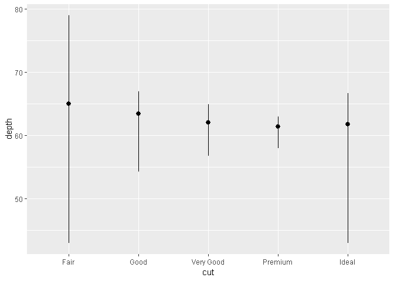
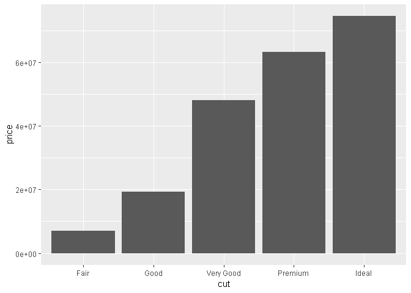
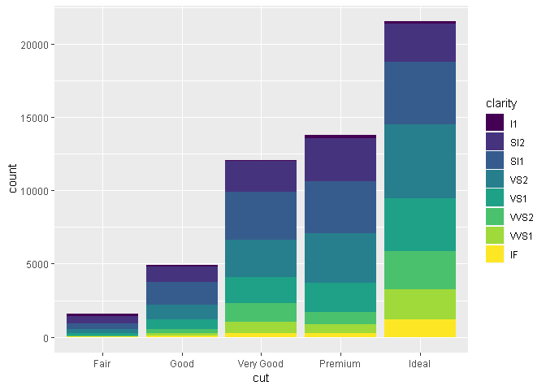

1장 : 데이터 시각화
================
huimin
2019년 3월 14일

라이브러리
==========

``` r
library(tidyverse)
```

    ## -- Attaching packages ----------------- tidyverse 1.2.1 --

    ## √ ggplot2 3.1.0       √ purrr   0.3.1  
    ## √ tibble  2.0.1       √ dplyr   0.8.0.1
    ## √ tidyr   0.8.3       √ stringr 1.4.0  
    ## √ readr   1.3.1       √ forcats 0.4.0

    ## -- Conflicts -------------------- tidyverse_conflicts() --
    ## x dplyr::filter() masks stats::filter()
    ## x dplyr::lag()    masks stats::lag()

간단한 그래프는 데이터 분석가에게 다른 어떤 것보다도 많은 정보를 제공한다.<br> 이 장에서는 ggplot2를 이용하여 데이터를 시각화하는 법을 배울 것이다.<br>

ggplot2의 mpg 데이터프레임
==========================

``` r
ggplot2::mpg
```

    ## # A tibble: 234 x 11
    ##    manufacturer model displ  year   cyl trans drv     cty   hwy fl    class
    ##    <chr>        <chr> <dbl> <int> <int> <chr> <chr> <int> <int> <chr> <chr>
    ##  1 audi         a4      1.8  1999     4 auto~ f        18    29 p     comp~
    ##  2 audi         a4      1.8  1999     4 manu~ f        21    29 p     comp~
    ##  3 audi         a4      2    2008     4 manu~ f        20    31 p     comp~
    ##  4 audi         a4      2    2008     4 auto~ f        21    30 p     comp~
    ##  5 audi         a4      2.8  1999     6 auto~ f        16    26 p     comp~
    ##  6 audi         a4      2.8  1999     6 manu~ f        18    26 p     comp~
    ##  7 audi         a4      3.1  2008     6 auto~ f        18    27 p     comp~
    ##  8 audi         a4 q~   1.8  1999     4 manu~ 4        18    26 p     comp~
    ##  9 audi         a4 q~   1.8  1999     4 auto~ 4        16    25 p     comp~
    ## 10 audi         a4 q~   2    2008     4 manu~ 4        20    28 p     comp~
    ## # ... with 224 more rows

``` r
# displ : 엔진 크기
# hwy : 고속도로에서의 자동차 연비. 같은 거리를 주행할 때, 연비가 낮은 차는 연비가 높은 차보다 연료를 더 많이 소비한다.
```

ggplot 생성하기
===============

``` r
ggplot(data = mpg) +
  geom_point(mapping = aes(x = displ,
                           y = hwy))
```


<br>이 플롯은 엔진 크기(displ)와 연비(hwy) 사이에 음의 관계가 있음을 보여준다. 다른 말로 하면 엔진이 큰 차들은 연료를 더 많이 소비한다. 이제 연비와 엔진 크기에 대한 가설을 확인하거나 반증하였을 것이다.<br>

연습문제 (6p)
=============

``` r
ggplot(data = mpg) # 플롯이 생성된다.
```


``` r
nrow(mpg) # 행의 개수
```

    ## [1] 234

``` r
ncol(mpg) # 열의 개수
```

    ## [1] 11

``` r
# hwy 대 cyl의 산점도
ggplot(data = mpg) +
  geom_point(mapping = aes(x = hwy,
                           y = cyl))
```


``` r
# class 대 drv 산점도
ggplot(data = mpg) +
  geom_point(mapping = aes(x = class,
                           y = drv))
```


심미성 매핑
===========

그래프의 가장 큰 가치는 전혀 예상하지 못한 것을 보여줄 때이다. 기존의 산점도 그래프에서 class와 같은 세 번째 변수를 *심미성(aesthetic)*에 매핑하여 이차원 산점도에 추가할 수도 있다.<br> 심미성에는 점의 *크기, 모양, 색상* 같은 것들이 포함된다. 심미성의 속성은 *수준(level)*이라는 용어를 사용하자.

``` r
ggplot(data = mpg) +
  geom_point(mapping = aes(x = displ,
                           y = hwy,
                           color = class)) # colour 라고 해도 된다.
```


여러가지 심미성에 매핑해보기
============================

``` r
# 크기 심미성
ggplot(data = mpg) +
  geom_point(mapping = aes(x = displ,
                           y = hwy,
                           size = class))
```

    ## Warning: Using size for a discrete variable is not advised.


``` r
# 투명도를 제어하는 알파 심미성
ggplot(data = mpg) +
  geom_point(mapping = aes(x = displ,
                           y = hwy,
                           alpha = class))
```

    ## Warning: Using alpha for a discrete variable is not advised.


``` r
# 모양 심미성
ggplot(data = mpg) +
  geom_point(mapping = aes(x = displ,
                           y = hwy,
                           shape = class))
```

    ## Warning: The shape palette can deal with a maximum of 6 discrete values
    ## because more than 6 becomes difficult to discriminate; you have 7.
    ## Consider specifying shapes manually if you must have them.

    ## Warning: Removed 62 rows containing missing values (geom_point).


geom 심미성의 속성을 수동으로 설정하기
======================================

``` r
ggplot(data = mpg) +
  geom_point(mapping = aes(x = displ,
                           y = hwy),
             color = 'blue')
```


``` r
# 테두리 색은 color 안쪽 색은 fill 이다.

# aes 외부에 심미성을 설정한 경우다.
# 문자열 형태의 색상 이름
# mm 단위의 점 크기
# 수치형 형태의 점 모양
```

연습문제 (12p)
==============

``` r
# 바깥에서 심미성을 설정해야 한다.
ggplot(data = mpg) +
  geom_point(mapping = aes(x = displ,
                           y = hwy),
             color = 'blue')
```


``` r
str(mpg) # year가 연속형 변수 중 하나이다.
```

    ## Classes 'tbl_df', 'tbl' and 'data.frame':    234 obs. of  11 variables:
    ##  $ manufacturer: chr  "audi" "audi" "audi" "audi" ...
    ##  $ model       : chr  "a4" "a4" "a4" "a4" ...
    ##  $ displ       : num  1.8 1.8 2 2 2.8 2.8 3.1 1.8 1.8 2 ...
    ##  $ year        : int  1999 1999 2008 2008 1999 1999 2008 1999 1999 2008 ...
    ##  $ cyl         : int  4 4 4 4 6 6 6 4 4 4 ...
    ##  $ trans       : chr  "auto(l5)" "manual(m5)" "manual(m6)" "auto(av)" ...
    ##  $ drv         : chr  "f" "f" "f" "f" ...
    ##  $ cty         : int  18 21 20 21 16 18 18 18 16 20 ...
    ##  $ hwy         : int  29 29 31 30 26 26 27 26 25 28 ...
    ##  $ fl          : chr  "p" "p" "p" "p" ...
    ##  $ class       : chr  "compact" "compact" "compact" "compact" ...

``` r
# 연속형 변수로 심미성을 설정하는 경우 색의 채도가 점점 바뀐다.
ggplot(data = mpg) +
  geom_point(mapping = aes(x = displ,
                           y = hwy,
                           color = year))
```


``` r
# 하나의 변수를 여러 심미성에 매핑하는 경우
ggplot(data = mpg) +
  geom_point(mapping = aes(x = displ,
                           y = hwy,
                           color = class,
                           size = class))
```

    ## Warning: Using size for a discrete variable is not advised.


``` r
# stroke 심미성은 포인트 경계의 두께를 조절한다.

# 심미성을 변수 이름이 아닌 다른 것에 매핑한 경우
ggplot(data = mpg) +
  geom_point(mapping = aes(x = displ,
                           y = hwy,
                           color = displ < 5))
```


``` r
# 다른 것의 결과에 따라서 심미성을 설정한다.
```

facet
=====

플롯을 면분할(facet, 데이터 각 서브셋을 표시하는 하위 플롯)로 나누는 것이다.<br> 플롯을 하나의 변수에 대해 면분할하기 위해서는, facet\_wrap()을 이용하면 된다.<br> facet\_wrap()의 첫 번째 인수로는 ~와 뒤에 변수 이름이 따라오는 공식이어야 한다.(formula)<br> facet\_wrap()에 전달하는 변수는 이산형(문자, 정수처럼 서로 떨어져 있는 유형)이어야만 한다.

``` r
ggplot(data = mpg) +
  geom_point(mapping = aes(x = displ,
                           y = hwy)) +
  facet_wrap(~ class, nrow = 2)
```

 <br>폴롯을 두 변수 조합으로 면분할하기 위해서는 facet\_grid()를 플롯 호출에 추가하면 된다.<br> 이번에는 공식이 두 개의 변수가 ~로 분리되어 있는 형태이어야 한다.<br> 열이나 행으로 면분할하고 싶지 않다면 변수 이름 대신 .를 이용하라.(예 .~cyl)

``` r
ggplot(data = mpg) +
  geom_point(mapping = aes(x = displ,
                           y = hwy)) +
  facet_grid(drv ~ cyl)
```


연습문제 (15p)
==============

``` r
# 연속형 변수로 면불할할 경우
str(mpg)
```

    ## Classes 'tbl_df', 'tbl' and 'data.frame':    234 obs. of  11 variables:
    ##  $ manufacturer: chr  "audi" "audi" "audi" "audi" ...
    ##  $ model       : chr  "a4" "a4" "a4" "a4" ...
    ##  $ displ       : num  1.8 1.8 2 2 2.8 2.8 3.1 1.8 1.8 2 ...
    ##  $ year        : int  1999 1999 2008 2008 1999 1999 2008 1999 1999 2008 ...
    ##  $ cyl         : int  4 4 4 4 6 6 6 4 4 4 ...
    ##  $ trans       : chr  "auto(l5)" "manual(m5)" "manual(m6)" "auto(av)" ...
    ##  $ drv         : chr  "f" "f" "f" "f" ...
    ##  $ cty         : int  18 21 20 21 16 18 18 18 16 20 ...
    ##  $ hwy         : int  29 29 31 30 26 26 27 26 25 28 ...
    ##  $ fl          : chr  "p" "p" "p" "p" ...
    ##  $ class       : chr  "compact" "compact" "compact" "compact" ...

``` r
ggplot(data = mpg) +
  geom_point(mapping = aes(x = displ,
                           y = hwy)) +
  facet_wrap(~ cty)
```


``` r
# .의 의미
ggplot(data = mpg) +
  geom_point(mapping = aes(x = displ,
                           y = hwy)) +
  facet_grid(drv ~ .)
```


``` r
ggplot(data = mpg) +
  geom_point(mapping = aes(x = displ,
                           y = hwy)) +
  facet_grid(. ~ cyl)
```


기하 객체
=========

지옴(geom)은 데이터를 나타내기 위해 플롯이 사용하는 기하 객체(geometric object)를 의미한다.<br> 사람들은 플롯이 사용하는 지옴의 유형으로 플롯을 기술한다. 예를 들어 막대 그래프는 *막대 지옴*을 이용하고, 선 그래프는 *라인 지옴*을, 박스 플롯은 *박스 플롯 지옴*을 이용한다.<br> 플롯에서 지옴을 바꾸기 위해서는 ggplot()에 추가하는 지옴 함수를 변경하면 된다.<br>

``` r
# geom_smooth()는 linetype으로 매핑된 변수의 고윳값마다 다른 형태의 선을 그린다.
ggplot(data = mpg) +
  geom_smooth(mapping = aes(x = displ,
                            y = hwy,
                            linetype = drv))
```

    ## `geom_smooth()` using method = 'loess' and formula 'y ~ x'


``` r
# 자동차의 동력전달장치를 의미하는 drv 값에 기초하여 모델들을 3개의 선으로 분리한다.
```

<br>ggplot2 패키지에는 30개가 넘는 지옴이 있고, 확장 패키지에는 더 많은 지옴들이 있다. ggplot2 치트시트를 참고하라.<br> 지옴들에 대하여 *그룹(group) 심미성*을 설정하여 다중 객체를 그릴 수 있다.

``` r
ggplot(data =mpg) +
  geom_smooth(mapping = aes(x = displ,
                            y = hwy,
                            group = drv))
```

    ## `geom_smooth()` using method = 'loess' and formula 'y ~ x'

 <br>같은 플롯에 여러 지옴을 표시하려면 ggplot()에 여러 지옴 함수를 추가한다.

``` r
ggplot(data = mpg) +
  geom_point(mapping = aes(x = displ,
                           y = hwy)) +
  geom_smooth(mapping = aes(x = displ,
                            y = hwy))
```

    ## `geom_smooth()` using method = 'loess' and formula 'y ~ x'


``` r
# 더 간결하게 표현하는 방법
# 매핑을 전역으로 처리하기
ggplot(data = mpg, mapping = aes(x = displ, y = hwy)) +
  geom_point() +
  geom_smooth()
```

    ## `geom_smooth()` using method = 'loess' and formula 'y ~ x'

 <br>전역 매핑을 사용한다면, 각 레이어마다 다양한 심미성을 표시하는 것이 쉬워진다.

``` r
ggplot(data = mpg, mapping = aes(x = displ, y = hwy)) +
  geom_point(mapping = aes(color = class)) +
  geom_smooth()
```

    ## `geom_smooth()` using method = 'loess' and formula 'y ~ x'


``` r
# se = FALSE를 할 경우, 주변 부의 회색 면을 제거한다.
ggplot(data = mpg, mapping = aes(x = displ, y = hwy)) +
  geom_point(mapping = aes(color = class)) +
  geom_smooth(data = filter(mpg, class == 'subcompact'),
              se = FALSE)
```

    ## `geom_smooth()` using method = 'loess' and formula 'y ~ x'


통계적 변환
===========

막대 그래프를 살펴보자. geom\_bar()로 그려진다.<br> 이번에는 diamonds 데이터셋을 사용해보자.

``` r
ggplot(data = diamonds) +
  geom_bar(mapping = aes(x = cut))
```

 <br>이 차트는 x축으로 diamonds의 변수 중 하나인 cut을 표시한다. y축으로 카운트를 표시하는데 카운트는 diamonds의 변수가 아니다. 빈도이다.

-   막대 그래프, 히스토그램, 빈도 다각형은 데이터를 *빈(bin)* 계급으로 만든 후, 각 빈에 떨어지는 점들의 개수인 도수를 플롯한다.
-   평활 차트들은 데이터에 모델을 적합한 후 모델을 이용한 예측값을 플롯한다.
-   박스 플롯은 분포의 로버스트(robust)한 요약값을 계산한 후 특수한 형태의 박스로 표시한다.

<br>stat 인수의 기본값을 조사하여 한 지옴이 어떤 스탯을 사용하는지 알 수 있다. 예를 들어 ?geom\_bar를 하면 stat이 *'count'*임을 보여주는데, 이는 *geom\_bar()가 stat\_count()*를 이용함을 의미한다.<br> 지옴과 스탯은 서로 바꿔서 사용할 수 있다.

``` r
ggplot(data = diamonds) +
  stat_count(mapping = aes(x = cut))
```

 <br>모든 지옴은 기본 스탯이 있고, 모든 스탯은 기본 지옴이 있기 때문에 이것이 가능하다.<br> 명시적으로 스탯을 사용해야 하는 이유는 세 가지이다.<br> 기본 스탯 변경하기

``` r
demo <- tribble(~cut,~freq,"Fair",1610,"Good",4906,"Very Good",
                12082,"Premium",13791,"Ideal",21551)

# count(기본값)에서 identity로 스탯을 변경하였다.
ggplot(data = demo) +
  geom_bar(mapping = aes(x = cut,
                         y = freq),
           stat = "identity")
```


변환된 변수에서 심미성으로 기본 매핑을 덮어쓰기

``` r
ggplot(data = diamonds) +
  geom_bar(mapping = aes(x = cut,
                         y = ..prop..,
                         group = 1))
```


코드에서 통계적 변환에 주의를 집중시키고자 하는 경우

``` r
# stat_summary를 사용하여 고유한 x값 각각에 대해 y값을 요약하여 나타낸다.
ggplot(data = diamonds) +
  stat_summary(mapping = aes(x = cut, y = depth),
               fun.ymin = min,
               fun.ymax = max,
               fun.y = median)
```



연습문제 (27p)
==============

``` r
# geom_col
ggplot(data = diamonds) +
  geom_col(mapping = aes(x = cut,
                         y = price))
```



``` r
# 두 그래프의 문제점과 group = 1로 지정하는 이유
ggplot(data = diamonds) +
  geom_bar(mapping = aes(x = cut,
                         y = ..prop..))
```


``` r
ggplot(data = diamonds) +
  geom_bar(mapping = aes(x = cut,
                         y = ..prop..,
                         fill = color))
```


``` r
ggplot(data = diamonds) +
  geom_bar(mapping = aes(x = cut,
                         y = ..prop..,
                         group = 1))
```


위치 조정
=========

막대 그래프에 색상을 입힐 수 있는데, color 심미성을 이용하거나 좀 더 유용하게는 fill을 이용하면 된다.

``` r
ggplot(data = diamonds) +
  geom_bar(mapping = aes(x = cut,
                         color = cut))
```


``` r
ggplot(data = diamonds) +
  geom_bar(mapping = aes(x = cut,
                         fill = cut))
```

 <br>fill 심미성을 다른 변수에 매핑할 경우

``` r
ggplot(data = diamonds) +
  geom_bar(mapping = aes(x = cut,
                         fill = clarity))
```

 <br>position 인수로 지정하는 위치 조정에 의해 막대 누적이 자동으로 수행된다. 누적 막대 그래프를 원하지 않는다면 다음의 "identity", "dodge", "fill" 세 옵션 중 하나를 선택하면 된다.<br><br> **position = "identity"** 인 경우 각 객체를 그래프 문맥에 해당되는 곳에 정확히 배치한다. 막대와 겹치기 때문에 막대에 대해서는 그다지 유용하지 않다. 겹치는 것을 구별하려면 alpha를 작은 값으로 설정하여 막대들을 약간 투명하게 하거나, fill = NA로 설정하여 완전히 투명하게 해야 한다.

``` r
# alpha값 조정
ggplot(data = diamonds,
       mapping = aes(x = cut, fill = clarity)) +
  geom_bar(alpha = 1/5, position = 'identity')
```


``` r
# fill = NA
ggplot(data = diamonds,
       mapping = aes(x = cut, fill = clarity)) +
  geom_bar(fill = NA, position = 'identity')
```

 <br>**position = "fill"** 인 경우 누적 막대처럼 동작하지만, 누적 막대들이 동일한 높이가 되도록 한다. 이렇게 하면 *그룹들 사이에 비율을 비교*하기 쉬워진다.

``` r
ggplot(data = diamonds,
       mapping = aes(x = cut, fill = clarity)) +
  geom_bar(position = 'fill')
```

 <br>**position = "dodge"** 인 경우 겹치는 객체가 서로 옆에 배치된다. 이렇게 하면 *개별 값*들을 비교하기 쉬워진다.

``` r
ggplot(data = diamonds,
       mapping = aes(x = cut, fill = clarity)) +
  geom_bar(position = 'dodge')
```

 <br>번외 : 막대그래프에서 유용하지 않지만, 산점도에서 position = 'jitter'를 할 경우에 겹치는 점들을 약간 떼어놓아서 더 표현력이 있어보인다.<br><br> geom\_jitter()라는 함수도 있다.

``` r
ggplot(data = mpg) +
  geom_point(mapping = aes(x = displ,
                           y = hwy),
             position = 'jitter')
```


좌표계
======

기본 좌표계는 각 점의 위치를 결정할 때 x와 y 위치가 독립적으로 움직이는 데카르트(Cartesian)좌표계이다. 이것 이외의 다른 좌표계들이 많은데, 대표적으로 3개만 알아보자.<br><br> **coord\_flip()**은 x와 y축을 바꾼다.

``` r
ggplot(data = mpg, mapping = aes(x = class, y = hwy)) +
  geom_boxplot() +
  coord_flip()
```

 <br>**coord\_quickmap()**을 하면 지도에 맞게 가로세로 비율이 설정된다. ggplot2로 공간 데이터를 플롯할 때 매우 중요하다. 본 책에서는 다루지 않는다.<br><br> **coord\_polar()**는 극좌표를 사용한다. 사용하면 막대 그래프와 Cox-comb 차트 사이의 흥미로운 관계를 볼 수 있다.

``` r
bar <- ggplot(data = diamonds) +
  geom_bar(mapping = aes(x = cut, fill = cut),
           show.legend = FALSE,
           width = 1) +
  theme(aspect.ratio = 1) +
  labs(x = NULL, y = NULL)

bar + coord_flip()
```


``` r
bar + coord_polar()
```


그래프 레이어 문법
==================

ggplot(data = <데이터>) +<br> <지옴 함수>(<br> mapping = aes(<매핑모음>),<br> stat = <스탯>,<br> position = <위치><br> ) +<br> <좌표계 함수> +<br> <면불할 함수><br><br> 이 방법을 사용하여 기본적으로 상상하는 어떤 플롯도 만들 수 있다.
