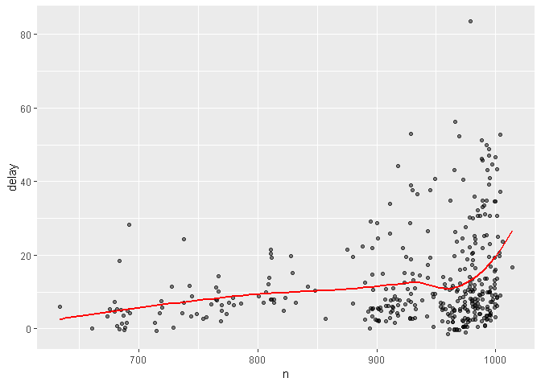

3장 : 데이터 변형
================
huimin
2019년 3월 19일

필요 패키지 로딩하기
====================

``` r
library(nycflights13) # flights 데이터 프레임을 이용하기 위해서
library(tidyverse)
```

    ## -- Attaching packages ---------------- tidyverse 1.2.1 --

    ## √ ggplot2 3.1.0       √ purrr   0.3.1  
    ## √ tibble  2.0.1       √ dplyr   0.8.0.1
    ## √ tidyr   0.8.3       √ stringr 1.4.0  
    ## √ readr   1.3.1       √ forcats 0.4.0

    ## -- Conflicts ------------------- tidyverse_conflicts() --
    ## x dplyr::filter() masks stats::filter()
    ## x dplyr::lag()    masks stats::lag()

준비하기
========

**티블(tibble)**은 **데이터프레임**이지만, tidyverse에서 더 잘 작동하도록 조정된 형식이다.<br>

**콘솔창 상에서의 출력물 형식표시**<br>

| 형식 |               의미              |
|:----:|:-------------------------------:|
|  int |               정수              |
|  dbl |         더블형 또는 실수        |
|  chr |     문자형 벡터 혹은 문자열     |
| dttm |     데이트-타임형(날짜+시간)    |
|  lgl | TRUE 나 FALSE만 포함하는 논리형 |
| fctr |              팩터형             |
| date |             데이트형            |

dplyr 기초
==========

**핵심 함수** 기능 설명<br>

|    함수명   |                            기능 설명                            |
|:-----------:|:---------------------------------------------------------------:|
|   filter()  |                    값을 기준으로 행 선택하기                    |
|   select()  |                   이름으로 열(변수)을 선택하기                  |
|   mutate()  |           기존 변수들의 함수로 새로운 변수를 생성하기           |
|  arrange()  |                         행을 재정렬하기                         |
| summarize() |                     하나의 요약값으로 합치기                    |
| group\_by() | 그룹마다 동작하도록 범위 지정. 위 함수들과 함께 사용할 수 있음. |

위의 함수들은 다음과 같은 공통점이 있다.<br> (1) 첫 인수는 데이터프레임이다.<br> (2) 그 이후의 인수들은 따옴표없이 변수 이름을 사용한다.<br> (3) 데이터프레임을 반환한다.<br>

filter()로 행 필터링하기
========================

``` r
dplyr::filter(flights, month == 1, day == 1)
```

    ## # A tibble: 842 x 19
    ##     year month   day dep_time sched_dep_time dep_delay arr_time
    ##    <int> <int> <int>    <int>          <int>     <dbl>    <int>
    ##  1  2013     1     1      517            515         2      830
    ##  2  2013     1     1      533            529         4      850
    ##  3  2013     1     1      542            540         2      923
    ##  4  2013     1     1      544            545        -1     1004
    ##  5  2013     1     1      554            600        -6      812
    ##  6  2013     1     1      554            558        -4      740
    ##  7  2013     1     1      555            600        -5      913
    ##  8  2013     1     1      557            600        -3      709
    ##  9  2013     1     1      557            600        -3      838
    ## 10  2013     1     1      558            600        -2      753
    ## # ... with 832 more rows, and 12 more variables: sched_arr_time <int>,
    ## #   arr_delay <dbl>, carrier <chr>, flight <int>, tailnum <chr>,
    ## #   origin <chr>, dest <chr>, air_time <dbl>, distance <dbl>, hour <dbl>,
    ## #   minute <dbl>, time_hour <dttm>

``` r
# 참고 : near()함수를 통한 근사치 비교하기
1/49*49 == 1
```

    ## [1] FALSE

``` r
near(1 / 49 * 49, 1)
```

    ## [1] TRUE

``` r
#,를 하면 &(and)역할, |를 사용하면 or역할
dplyr::filter(flights, month == 11 | month == 12)
```

    ## # A tibble: 55,403 x 19
    ##     year month   day dep_time sched_dep_time dep_delay arr_time
    ##    <int> <int> <int>    <int>          <int>     <dbl>    <int>
    ##  1  2013    11     1        5           2359         6      352
    ##  2  2013    11     1       35           2250       105      123
    ##  3  2013    11     1      455            500        -5      641
    ##  4  2013    11     1      539            545        -6      856
    ##  5  2013    11     1      542            545        -3      831
    ##  6  2013    11     1      549            600       -11      912
    ##  7  2013    11     1      550            600       -10      705
    ##  8  2013    11     1      554            600        -6      659
    ##  9  2013    11     1      554            600        -6      826
    ## 10  2013    11     1      554            600        -6      749
    ## # ... with 55,393 more rows, and 12 more variables: sched_arr_time <int>,
    ## #   arr_delay <dbl>, carrier <chr>, flight <int>, tailnum <chr>,
    ## #   origin <chr>, dest <chr>, air_time <dbl>, distance <dbl>, hour <dbl>,
    ## #   minute <dbl>, time_hour <dttm>

``` r
# %in% : 집합에 포함되는 것만 반환
dplyr::filter(flights, month %in% c(11,12))
```

    ## # A tibble: 55,403 x 19
    ##     year month   day dep_time sched_dep_time dep_delay arr_time
    ##    <int> <int> <int>    <int>          <int>     <dbl>    <int>
    ##  1  2013    11     1        5           2359         6      352
    ##  2  2013    11     1       35           2250       105      123
    ##  3  2013    11     1      455            500        -5      641
    ##  4  2013    11     1      539            545        -6      856
    ##  5  2013    11     1      542            545        -3      831
    ##  6  2013    11     1      549            600       -11      912
    ##  7  2013    11     1      550            600       -10      705
    ##  8  2013    11     1      554            600        -6      659
    ##  9  2013    11     1      554            600        -6      826
    ## 10  2013    11     1      554            600        -6      749
    ## # ... with 55,393 more rows, and 12 more variables: sched_arr_time <int>,
    ## #   arr_delay <dbl>, carrier <chr>, flight <int>, tailnum <chr>,
    ## #   origin <chr>, dest <chr>, air_time <dbl>, distance <dbl>, hour <dbl>,
    ## #   minute <dbl>, time_hour <dttm>

``` r
# 아래의 두 코드는 같은 뜻이다. (드모르간 법칙 적용됨)
filter(flights, !(arr_delay > 120 | dep_delay > 120))
```

    ## # A tibble: 316,050 x 19
    ##     year month   day dep_time sched_dep_time dep_delay arr_time
    ##    <int> <int> <int>    <int>          <int>     <dbl>    <int>
    ##  1  2013     1     1      517            515         2      830
    ##  2  2013     1     1      533            529         4      850
    ##  3  2013     1     1      542            540         2      923
    ##  4  2013     1     1      544            545        -1     1004
    ##  5  2013     1     1      554            600        -6      812
    ##  6  2013     1     1      554            558        -4      740
    ##  7  2013     1     1      555            600        -5      913
    ##  8  2013     1     1      557            600        -3      709
    ##  9  2013     1     1      557            600        -3      838
    ## 10  2013     1     1      558            600        -2      753
    ## # ... with 316,040 more rows, and 12 more variables: sched_arr_time <int>,
    ## #   arr_delay <dbl>, carrier <chr>, flight <int>, tailnum <chr>,
    ## #   origin <chr>, dest <chr>, air_time <dbl>, distance <dbl>, hour <dbl>,
    ## #   minute <dbl>, time_hour <dttm>

``` r
filter(flights, arr_delay <= 120, dep_delay <= 120)
```

    ## # A tibble: 316,050 x 19
    ##     year month   day dep_time sched_dep_time dep_delay arr_time
    ##    <int> <int> <int>    <int>          <int>     <dbl>    <int>
    ##  1  2013     1     1      517            515         2      830
    ##  2  2013     1     1      533            529         4      850
    ##  3  2013     1     1      542            540         2      923
    ##  4  2013     1     1      544            545        -1     1004
    ##  5  2013     1     1      554            600        -6      812
    ##  6  2013     1     1      554            558        -4      740
    ##  7  2013     1     1      555            600        -5      913
    ##  8  2013     1     1      557            600        -3      709
    ##  9  2013     1     1      557            600        -3      838
    ## 10  2013     1     1      558            600        -2      753
    ## # ... with 316,040 more rows, and 12 more variables: sched_arr_time <int>,
    ## #   arr_delay <dbl>, carrier <chr>, flight <int>, tailnum <chr>,
    ## #   origin <chr>, dest <chr>, air_time <dbl>, distance <dbl>, hour <dbl>,
    ## #   minute <dbl>, time_hour <dttm>

``` r
# filter()는 조건이 TRUE인 열만 포함한다. FALSE와 NA값들은 제외한다. 결측값을 남기려면 명시적으로 요청한다.
df <- tibble(x = c(1, NA, 3))

filter(df, x>1)
```

    ## # A tibble: 1 x 1
    ##       x
    ##   <dbl>
    ## 1     3

``` r
filter(df, is.na(x) | x>1)
```

    ## # A tibble: 2 x 1
    ##       x
    ##   <dbl>
    ## 1    NA
    ## 2     3

연습문제
--------

``` r
# 2시간 이상 도착 지연
dplyr::filter(flights, dep_delay > 2)
```

    ## # A tibble: 114,149 x 19
    ##     year month   day dep_time sched_dep_time dep_delay arr_time
    ##    <int> <int> <int>    <int>          <int>     <dbl>    <int>
    ##  1  2013     1     1      533            529         4      850
    ##  2  2013     1     1      608            600         8      807
    ##  3  2013     1     1      611            600        11      945
    ##  4  2013     1     1      613            610         3      925
    ##  5  2013     1     1      623            610        13      920
    ##  6  2013     1     1      632            608        24      740
    ##  7  2013     1     1      644            636         8      931
    ##  8  2013     1     1      709            700         9      852
    ##  9  2013     1     1      732            729         3     1041
    ## 10  2013     1     1      732            645        47     1011
    ## # ... with 114,139 more rows, and 12 more variables: sched_arr_time <int>,
    ## #   arr_delay <dbl>, carrier <chr>, flight <int>, tailnum <chr>,
    ## #   origin <chr>, dest <chr>, air_time <dbl>, distance <dbl>, hour <dbl>,
    ## #   minute <dbl>, time_hour <dttm>

``` r
# IAH 또는 HOU으로 운항
dplyr::filter(flights, dest == "IAH" | dest == "HOU")
```

    ## # A tibble: 9,313 x 19
    ##     year month   day dep_time sched_dep_time dep_delay arr_time
    ##    <int> <int> <int>    <int>          <int>     <dbl>    <int>
    ##  1  2013     1     1      517            515         2      830
    ##  2  2013     1     1      533            529         4      850
    ##  3  2013     1     1      623            627        -4      933
    ##  4  2013     1     1      728            732        -4     1041
    ##  5  2013     1     1      739            739         0     1104
    ##  6  2013     1     1      908            908         0     1228
    ##  7  2013     1     1     1028           1026         2     1350
    ##  8  2013     1     1     1044           1045        -1     1352
    ##  9  2013     1     1     1114            900       134     1447
    ## 10  2013     1     1     1205           1200         5     1503
    ## # ... with 9,303 more rows, and 12 more variables: sched_arr_time <int>,
    ## #   arr_delay <dbl>, carrier <chr>, flight <int>, tailnum <chr>,
    ## #   origin <chr>, dest <chr>, air_time <dbl>, distance <dbl>, hour <dbl>,
    ## #   minute <dbl>, time_hour <dttm>

``` r
# United(UA), American(AA), Delta(DL)이 운항
dplyr::filter(flights, carrier %in% c("UA","AA","DL"))
```

    ## # A tibble: 139,504 x 19
    ##     year month   day dep_time sched_dep_time dep_delay arr_time
    ##    <int> <int> <int>    <int>          <int>     <dbl>    <int>
    ##  1  2013     1     1      517            515         2      830
    ##  2  2013     1     1      533            529         4      850
    ##  3  2013     1     1      542            540         2      923
    ##  4  2013     1     1      554            600        -6      812
    ##  5  2013     1     1      554            558        -4      740
    ##  6  2013     1     1      558            600        -2      753
    ##  7  2013     1     1      558            600        -2      924
    ##  8  2013     1     1      558            600        -2      923
    ##  9  2013     1     1      559            600        -1      941
    ## 10  2013     1     1      559            600        -1      854
    ## # ... with 139,494 more rows, and 12 more variables: sched_arr_time <int>,
    ## #   arr_delay <dbl>, carrier <chr>, flight <int>, tailnum <chr>,
    ## #   origin <chr>, dest <chr>, air_time <dbl>, distance <dbl>, hour <dbl>,
    ## #   minute <dbl>, time_hour <dttm>

``` r
# between() 함수의 용법 : 7보다 같거나 크고 9보다 작거나 같은 것 TRUE
between(1:12, 7, 9)
```

    ##  [1] FALSE FALSE FALSE FALSE FALSE FALSE  TRUE  TRUE  TRUE FALSE FALSE
    ## [12] FALSE

``` r
# NA에 대하여
NA^0
```

    ## [1] 1

``` r
NA|TRUE
```

    ## [1] TRUE

``` r
FALSE&NA
```

    ## [1] FALSE

``` r
NA*0
```

    ## [1] NA

arrange()로 행 정렬하기
=======================

arrange()는 행을 선택하는 대신, **순서를 바꾼다는 것**만 제외하고는 filter()와 유사하게 작동한다.<br> 데이터프레임과 정렬기준으로 지정할 열 이름 집합을 입력으로 한다.<br> **결측값(NA)은 마지막에 정렬된다.**

``` r
# 기본 용법
arrange(flights, year, month, day)
```

    ## # A tibble: 336,776 x 19
    ##     year month   day dep_time sched_dep_time dep_delay arr_time
    ##    <int> <int> <int>    <int>          <int>     <dbl>    <int>
    ##  1  2013     1     1      517            515         2      830
    ##  2  2013     1     1      533            529         4      850
    ##  3  2013     1     1      542            540         2      923
    ##  4  2013     1     1      544            545        -1     1004
    ##  5  2013     1     1      554            600        -6      812
    ##  6  2013     1     1      554            558        -4      740
    ##  7  2013     1     1      555            600        -5      913
    ##  8  2013     1     1      557            600        -3      709
    ##  9  2013     1     1      557            600        -3      838
    ## 10  2013     1     1      558            600        -2      753
    ## # ... with 336,766 more rows, and 12 more variables: sched_arr_time <int>,
    ## #   arr_delay <dbl>, carrier <chr>, flight <int>, tailnum <chr>,
    ## #   origin <chr>, dest <chr>, air_time <dbl>, distance <dbl>, hour <dbl>,
    ## #   minute <dbl>, time_hour <dttm>

``` r
# desc()을 통한 내림차순 정렬
arrange(flights, year, desc(month))
```

    ## # A tibble: 336,776 x 19
    ##     year month   day dep_time sched_dep_time dep_delay arr_time
    ##    <int> <int> <int>    <int>          <int>     <dbl>    <int>
    ##  1  2013    12     1       13           2359        14      446
    ##  2  2013    12     1       17           2359        18      443
    ##  3  2013    12     1      453            500        -7      636
    ##  4  2013    12     1      520            515         5      749
    ##  5  2013    12     1      536            540        -4      845
    ##  6  2013    12     1      540            550       -10     1005
    ##  7  2013    12     1      541            545        -4      734
    ##  8  2013    12     1      546            545         1      826
    ##  9  2013    12     1      549            600       -11      648
    ## 10  2013    12     1      550            600       -10      825
    ## # ... with 336,766 more rows, and 12 more variables: sched_arr_time <int>,
    ## #   arr_delay <dbl>, carrier <chr>, flight <int>, tailnum <chr>,
    ## #   origin <chr>, dest <chr>, air_time <dbl>, distance <dbl>, hour <dbl>,
    ## #   minute <dbl>, time_hour <dttm>

``` r
# 모든 결측값을 앞에 오도록 설정하기
arrange(flights, desc(is.na(dep_time)))
```

    ## # A tibble: 336,776 x 19
    ##     year month   day dep_time sched_dep_time dep_delay arr_time
    ##    <int> <int> <int>    <int>          <int>     <dbl>    <int>
    ##  1  2013     1     1       NA           1630        NA       NA
    ##  2  2013     1     1       NA           1935        NA       NA
    ##  3  2013     1     1       NA           1500        NA       NA
    ##  4  2013     1     1       NA            600        NA       NA
    ##  5  2013     1     2       NA           1540        NA       NA
    ##  6  2013     1     2       NA           1620        NA       NA
    ##  7  2013     1     2       NA           1355        NA       NA
    ##  8  2013     1     2       NA           1420        NA       NA
    ##  9  2013     1     2       NA           1321        NA       NA
    ## 10  2013     1     2       NA           1545        NA       NA
    ## # ... with 336,766 more rows, and 12 more variables: sched_arr_time <int>,
    ## #   arr_delay <dbl>, carrier <chr>, flight <int>, tailnum <chr>,
    ## #   origin <chr>, dest <chr>, air_time <dbl>, distance <dbl>, hour <dbl>,
    ## #   minute <dbl>, time_hour <dttm>

select()로 열 선택하기
======================

| select안에서 사용할 수 있는 함수 |             기능 설명            |
|:--------------------------------:|:--------------------------------:|
|       starts\_with("char")       | 해당 문자로 시작하는 변수에 매칭 |
|        ends\_with("char")        |  해당 문자로 끝나는 변수에 매칭  |
|         contains("char")         | 해당 문자를 포함하는 변수에 매칭 |
|        matches("(.)\\\\1")       |  정규표현식에 매칭되는 변수 선택 |
|       num\_range("x", 1:3)       |         x1, x2, x3에 매칭        |

``` r
# 기본 용법
select(flights, year, month, day)
```

    ## # A tibble: 336,776 x 3
    ##     year month   day
    ##    <int> <int> <int>
    ##  1  2013     1     1
    ##  2  2013     1     1
    ##  3  2013     1     1
    ##  4  2013     1     1
    ##  5  2013     1     1
    ##  6  2013     1     1
    ##  7  2013     1     1
    ##  8  2013     1     1
    ##  9  2013     1     1
    ## 10  2013     1     1
    ## # ... with 336,766 more rows

``` r
# 슬라이싱 가능
select(flights, year:day)
```

    ## # A tibble: 336,776 x 3
    ##     year month   day
    ##    <int> <int> <int>
    ##  1  2013     1     1
    ##  2  2013     1     1
    ##  3  2013     1     1
    ##  4  2013     1     1
    ##  5  2013     1     1
    ##  6  2013     1     1
    ##  7  2013     1     1
    ##  8  2013     1     1
    ##  9  2013     1     1
    ## 10  2013     1     1
    ## # ... with 336,766 more rows

``` r
# 선택 열만 제외하기
select(flights, -c(year:day))
```

    ## # A tibble: 336,776 x 16
    ##    dep_time sched_dep_time dep_delay arr_time sched_arr_time arr_delay
    ##       <int>          <int>     <dbl>    <int>          <int>     <dbl>
    ##  1      517            515         2      830            819        11
    ##  2      533            529         4      850            830        20
    ##  3      542            540         2      923            850        33
    ##  4      544            545        -1     1004           1022       -18
    ##  5      554            600        -6      812            837       -25
    ##  6      554            558        -4      740            728        12
    ##  7      555            600        -5      913            854        19
    ##  8      557            600        -3      709            723       -14
    ##  9      557            600        -3      838            846        -8
    ## 10      558            600        -2      753            745         8
    ## # ... with 336,766 more rows, and 10 more variables: carrier <chr>,
    ## #   flight <int>, tailnum <chr>, origin <chr>, dest <chr>, air_time <dbl>,
    ## #   distance <dbl>, hour <dbl>, minute <dbl>, time_hour <dttm>

select()의 변형인 **rename()**을 사용하면 명시적으로 **언급하지 않은 모든 변수를 유지**한다.

``` r
# tailnum이라는 변수를 tail_num이라는 이름으로 바꿈.
rename(flights, tail_num = tailnum)
```

    ## # A tibble: 336,776 x 19
    ##     year month   day dep_time sched_dep_time dep_delay arr_time
    ##    <int> <int> <int>    <int>          <int>     <dbl>    <int>
    ##  1  2013     1     1      517            515         2      830
    ##  2  2013     1     1      533            529         4      850
    ##  3  2013     1     1      542            540         2      923
    ##  4  2013     1     1      544            545        -1     1004
    ##  5  2013     1     1      554            600        -6      812
    ##  6  2013     1     1      554            558        -4      740
    ##  7  2013     1     1      555            600        -5      913
    ##  8  2013     1     1      557            600        -3      709
    ##  9  2013     1     1      557            600        -3      838
    ## 10  2013     1     1      558            600        -2      753
    ## # ... with 336,766 more rows, and 12 more variables: sched_arr_time <int>,
    ## #   arr_delay <dbl>, carrier <chr>, flight <int>, tail_num <chr>,
    ## #   origin <chr>, dest <chr>, air_time <dbl>, distance <dbl>, hour <dbl>,
    ## #   minute <dbl>, time_hour <dttm>

``` r
# select()에서도 언급하지 않은 변수를 유지하는 방법
select(flights, time_hour, air_time, everything())
```

    ## # A tibble: 336,776 x 19
    ##    time_hour           air_time  year month   day dep_time sched_dep_time
    ##    <dttm>                 <dbl> <int> <int> <int>    <int>          <int>
    ##  1 2013-01-01 05:00:00      227  2013     1     1      517            515
    ##  2 2013-01-01 05:00:00      227  2013     1     1      533            529
    ##  3 2013-01-01 05:00:00      160  2013     1     1      542            540
    ##  4 2013-01-01 05:00:00      183  2013     1     1      544            545
    ##  5 2013-01-01 06:00:00      116  2013     1     1      554            600
    ##  6 2013-01-01 05:00:00      150  2013     1     1      554            558
    ##  7 2013-01-01 06:00:00      158  2013     1     1      555            600
    ##  8 2013-01-01 06:00:00       53  2013     1     1      557            600
    ##  9 2013-01-01 06:00:00      140  2013     1     1      557            600
    ## 10 2013-01-01 06:00:00      138  2013     1     1      558            600
    ## # ... with 336,766 more rows, and 12 more variables: dep_delay <dbl>,
    ## #   arr_time <int>, sched_arr_time <int>, arr_delay <dbl>, carrier <chr>,
    ## #   flight <int>, tailnum <chr>, origin <chr>, dest <chr>, distance <dbl>,
    ## #   hour <dbl>, minute <dbl>

연습문제
--------

``` r
# select()호출에서 한 변수 이름을 여러 번 포함할 경우
select(flights, year, year)
```

    ## # A tibble: 336,776 x 1
    ##     year
    ##    <int>
    ##  1  2013
    ##  2  2013
    ##  3  2013
    ##  4  2013
    ##  5  2013
    ##  6  2013
    ##  7  2013
    ##  8  2013
    ##  9  2013
    ## 10  2013
    ## # ... with 336,766 more rows

``` r
# one_of(): Matches variable names in a character vector.
vars <- c("year","month","day")
select(flights, one_of(vars))
```

    ## # A tibble: 336,776 x 3
    ##     year month   day
    ##    <int> <int> <int>
    ##  1  2013     1     1
    ##  2  2013     1     1
    ##  3  2013     1     1
    ##  4  2013     1     1
    ##  5  2013     1     1
    ##  6  2013     1     1
    ##  7  2013     1     1
    ##  8  2013     1     1
    ##  9  2013     1     1
    ## 10  2013     1     1
    ## # ... with 336,766 more rows

mutate()로 새로운 변수 추가하기
===============================

새로운 열을 항상 데이터셋 마지막에 추가한다.<br> **transmute()**함수의 경우, 언급한 것 이외의 변수는 제외한다.

``` r
# 새로운 샘플객체
sample.flights <- select(flights,
                         year:day,
                         ends_with("delay"),
                         distance,
                         air_time)

head(sample.flights)
```

    ## # A tibble: 6 x 7
    ##    year month   day dep_delay arr_delay distance air_time
    ##   <int> <int> <int>     <dbl>     <dbl>    <dbl>    <dbl>
    ## 1  2013     1     1         2        11     1400      227
    ## 2  2013     1     1         4        20     1416      227
    ## 3  2013     1     1         2        33     1089      160
    ## 4  2013     1     1        -1       -18     1576      183
    ## 5  2013     1     1        -6       -25      762      116
    ## 6  2013     1     1        -4        12      719      150

``` r
# mutate를 통해서 새로운 변수 추가해보기
dplyr::mutate(sample.flights,
              gain = arr_delay - dep_delay,
              speed = distance / air_time * 60,
              hours = air_time / 60,
              gain_per_hour = gain / hours) # 방금 생성한 열을 참조할 수 있음
```

    ## # A tibble: 336,776 x 11
    ##     year month   day dep_delay arr_delay distance air_time  gain speed
    ##    <int> <int> <int>     <dbl>     <dbl>    <dbl>    <dbl> <dbl> <dbl>
    ##  1  2013     1     1         2        11     1400      227     9  370.
    ##  2  2013     1     1         4        20     1416      227    16  374.
    ##  3  2013     1     1         2        33     1089      160    31  408.
    ##  4  2013     1     1        -1       -18     1576      183   -17  517.
    ##  5  2013     1     1        -6       -25      762      116   -19  394.
    ##  6  2013     1     1        -4        12      719      150    16  288.
    ##  7  2013     1     1        -5        19     1065      158    24  404.
    ##  8  2013     1     1        -3       -14      229       53   -11  259.
    ##  9  2013     1     1        -3        -8      944      140    -5  405.
    ## 10  2013     1     1        -2         8      733      138    10  319.
    ## # ... with 336,766 more rows, and 2 more variables: hours <dbl>,
    ## #   gain_per_hour <dbl>

``` r
# 언급한 변수만 남기고 나머지는 삭제하는 transmute()
dplyr::transmute(flights,
                 gain = arr_delay - dep_delay,
                 speed = distance / air_time * 60,
                 hours = air_time / 60,
                 gain_per_hour = gain / hours)
```

    ## # A tibble: 336,776 x 4
    ##     gain speed hours gain_per_hour
    ##    <dbl> <dbl> <dbl>         <dbl>
    ##  1     9  370. 3.78           2.38
    ##  2    16  374. 3.78           4.23
    ##  3    31  408. 2.67          11.6 
    ##  4   -17  517. 3.05          -5.57
    ##  5   -19  394. 1.93          -9.83
    ##  6    16  288. 2.5            6.4 
    ##  7    24  404. 2.63           9.11
    ##  8   -11  259. 0.883        -12.5 
    ##  9    -5  405. 2.33          -2.14
    ## 10    10  319. 2.3            4.35
    ## # ... with 336,766 more rows

유용한 생성 함수
----------------

mutate()와 함께 자주 사용되는 함수들을 소개한다.<br> **오프셋**

| 함수명 |                         기능                        |
|:------:|:---------------------------------------------------:|
| lead() |  데이터를 왼쪽에서 당긴다. 가장 끝 행은 NA가 된다.  |
|  lag() | 데이터를 오른쪽에서 당긴다. 가장 첫 행이 NA가 된다. |

**누적 및 롤링 집계**

|   함수명  |                    기능                    |
|:---------:|:------------------------------------------:|
|  cumsum() |                  누적 합계                 |
| cumprod() |                  누적 곱셈                 |
|  cummin() | 누적 최솟값 (계속해서 최솟값을 갱신해나감) |
|  cummax() | 누적 최댓값 (계속해서 최댓값을 갱신해나감) |
| cummean() |                  누적 평균                 |

**랭킹**<br> 기본적으로 min\_rank()함수를 이용한다.

이외의 **논리형 비교 연산자(&lt;,&lt;=,&gt;,&gt;=,!=)**와 **산술 연산자**, **모듈러 연산(%/%, %%)**, **로그** 등을 자유롭게 사용할 수 있다.

``` r
# 누적 최솟값과 누적 최댓값 예시
dplyr::mutate(sample.flights,
              cum_min = cummin(dep_delay),
              cum_max = cummax(dep_delay))
```

    ## # A tibble: 336,776 x 9
    ##     year month   day dep_delay arr_delay distance air_time cum_min cum_max
    ##    <int> <int> <int>     <dbl>     <dbl>    <dbl>    <dbl>   <dbl>   <dbl>
    ##  1  2013     1     1         2        11     1400      227       2       2
    ##  2  2013     1     1         4        20     1416      227       2       4
    ##  3  2013     1     1         2        33     1089      160       2       4
    ##  4  2013     1     1        -1       -18     1576      183      -1       4
    ##  5  2013     1     1        -6       -25      762      116      -6       4
    ##  6  2013     1     1        -4        12      719      150      -6       4
    ##  7  2013     1     1        -5        19     1065      158      -6       4
    ##  8  2013     1     1        -3       -14      229       53      -6       4
    ##  9  2013     1     1        -3        -8      944      140      -6       4
    ## 10  2013     1     1        -2         8      733      138      -6       4
    ## # ... with 336,766 more rows

``` r
# 랭킹 예시
dplyr::mutate(sample.flights,
              ranking = min_rank(dep_delay),
              rvs_ranking = min_rank(desc(dep_delay)))
```

    ## # A tibble: 336,776 x 9
    ##     year month   day dep_delay arr_delay distance air_time ranking
    ##    <int> <int> <int>     <dbl>     <dbl>    <dbl>    <dbl>   <int>
    ##  1  2013     1     1         2        11     1400      227  208140
    ##  2  2013     1     1         4        20     1416      227  219823
    ##  3  2013     1     1         2        33     1089      160  208140
    ##  4  2013     1     1        -1       -18     1576      183  164763
    ##  5  2013     1     1        -6       -25      762      116   48888
    ##  6  2013     1     1        -4        12      719      150   94410
    ##  7  2013     1     1        -5        19     1065      158   69589
    ##  8  2013     1     1        -3       -14      229       53  119029
    ##  9  2013     1     1        -3        -8      944      140  119029
    ## 10  2013     1     1        -2         8      733      138  143247
    ## # ... with 336,766 more rows, and 1 more variable: rvs_ranking <int>

summarize()로 그룹화 요약하기
=============================

데이터프레임을 하나의 행으로 축약할 수 있는 함수다.<br> **group\_by()**함수와 같이 사용하면, 매우 유용하다.<br> group\_by를 통해서 **분석의 단위를 전체 데이터셋에서 개별 그룹으로 변경**할 수 있는데, 이를 통하여 그룹마다 함수를 적용할 수 있는 것이다.

``` r
# summarise의 기본 용법 탐색
dplyr::summarise(flights,
                 n = n(),
                 delay = mean(dep_delay, na.rm = TRUE))
```

    ## # A tibble: 1 x 2
    ##        n delay
    ##    <int> <dbl>
    ## 1 336776  12.6

``` r
# summarise와 group_by의 활용
flights %>% 
  dplyr::group_by(year, month, day) %>% 
  dplyr::summarise(n = n(),
                   delay = mean(dep_delay, na.rm = TRUE))
```

    ## # A tibble: 365 x 5
    ## # Groups:   year, month [12]
    ##     year month   day     n delay
    ##    <int> <int> <int> <int> <dbl>
    ##  1  2013     1     1   842 11.5 
    ##  2  2013     1     2   943 13.9 
    ##  3  2013     1     3   914 11.0 
    ##  4  2013     1     4   915  8.95
    ##  5  2013     1     5   720  5.73
    ##  6  2013     1     6   832  7.15
    ##  7  2013     1     7   933  5.42
    ##  8  2013     1     8   899  2.55
    ##  9  2013     1     9   902  2.28
    ## 10  2013     1    10   932  2.84
    ## # ... with 355 more rows

``` r
# 그래프도 그려보기
flights %>% 
  dplyr::group_by(year, month, day) %>% 
  dplyr::summarise(n = n(),
                   delay = mean(dep_delay, na.rm = TRUE)) %>% 
  ggplot(mapping = aes(x = n, y = delay)) +
  geom_point(alpha = 0.5) +
  geom_smooth(se = FALSE,
              color = "red")
```

    ## `geom_smooth()` using method = 'loess' and formula 'y ~ x'



유용한 요약 함수들
==================

**위치 측정값**<br> median() : 중위수<br> **산포 측정값**<br> sd() : 평균제곱편차, 표준편차<br> IQR() : 사분위 범위<br> mad() : 이상값이 있을 때 더 유용할 수 있는 중위절대편차<br> **순위 측정값**<br> quntile(x, 0.25) : 25%보다는 크고 나머지 75%보다는 작은 값을 찾는다.<br> **자리(position) 측정값**<br> first(), last(), nth(x, 2)<br> **카운트**<br> n() : 인수가 없고 현재 그룹의 크기를 반환<br> n\_distinct() : 유일값 개수를 카운트하여 반환<br> **그룹화 해제하기**<br> ungroup()

``` r
# first, last 사용 예시
flights %>% 
  dplyr::select(year, month, day, dep_time) %>% 
  dplyr::filter(is.na(dep_time) == FALSE) %>% 
  dplyr::group_by(year, month, day) %>% 
  dplyr::summarise(first_dep = first(dep_time),
                   last_dep = last(dep_time))
```

    ## # A tibble: 365 x 5
    ## # Groups:   year, month [12]
    ##     year month   day first_dep last_dep
    ##    <int> <int> <int>     <int>    <int>
    ##  1  2013     1     1       517     2356
    ##  2  2013     1     2        42     2354
    ##  3  2013     1     3        32     2349
    ##  4  2013     1     4        25     2358
    ##  5  2013     1     5        14     2357
    ##  6  2013     1     6        16     2355
    ##  7  2013     1     7        49     2359
    ##  8  2013     1     8       454     2351
    ##  9  2013     1     9         2     2252
    ## 10  2013     1    10         3     2320
    ## # ... with 355 more rows

``` r
# count 예시
flights %>% 
  dplyr::select(year, month, day, dep_time) %>% 
  dplyr::filter(is.na(dep_time) == FALSE) %>% 
  dplyr::group_by(year, month, day) %>% 
  dplyr::count(month)
```

    ## # A tibble: 365 x 4
    ## # Groups:   year, month, day [365]
    ##     year month   day     n
    ##    <int> <int> <int> <int>
    ##  1  2013     1     1   838
    ##  2  2013     1     2   935
    ##  3  2013     1     3   904
    ##  4  2013     1     4   909
    ##  5  2013     1     5   717
    ##  6  2013     1     6   831
    ##  7  2013     1     7   930
    ##  8  2013     1     8   895
    ##  9  2013     1     9   897
    ## 10  2013     1    10   929
    ## # ... with 355 more rows

``` r
# count 예시2 : 비행한 마일 수를 카운트하기
flights %>% 
  dplyr::count(tailnum, wt = distance)
```

    ## # A tibble: 4,044 x 2
    ##    tailnum       n
    ##    <chr>     <dbl>
    ##  1 <NA>    1784167
    ##  2 D942DN     3418
    ##  3 N0EGMQ   250866
    ##  4 N10156   115966
    ##  5 N102UW    25722
    ##  6 N103US    24619
    ##  7 N104UW    25157
    ##  8 N10575   150194
    ##  9 N105UW    23618
    ## 10 N107US    21677
    ## # ... with 4,034 more rows

``` r
# ungroup 예시
flights %>% 
  dplyr::group_by(year, month, day) %>% 
  dplyr::summarise(n = n()) %>% 
  dplyr::ungroup() %>% 
  dplyr::summarise(n = n())
```

    ## # A tibble: 1 x 1
    ##       n
    ##   <int>
    ## 1   365

그룹화 뮤테이트와 필터링
========================

그룹화는 summarize()와 조합하여 사용하면 가장 유용하지만 **mutate()**와 **filter()**로 편리한 작업을 할 수도 있다.<br>

``` r
# 그룹화 후, 필터링의 예시
flights %>%
  dplyr::select(year, month, day, arr_delay) %>% 
  dplyr::group_by(year, month, day) %>% 
  filter(rank(desc(arr_delay)) < 10)
```

    ## # A tibble: 3,306 x 4
    ## # Groups:   year, month, day [365]
    ##     year month   day arr_delay
    ##    <int> <int> <int>     <dbl>
    ##  1  2013     1     1       851
    ##  2  2013     1     1       338
    ##  3  2013     1     1       263
    ##  4  2013     1     1       174
    ##  5  2013     1     1       222
    ##  6  2013     1     1       250
    ##  7  2013     1     1       246
    ##  8  2013     1     1       191
    ##  9  2013     1     1       456
    ## 10  2013     1     2       207
    ## # ... with 3,296 more rows
