5장 : 탐색적 데이터 분석(EDA)
================
huimin
2019년 4월 8일

기초 설정하기
=============

``` r
library(tidyverse)
```

    ## -- Attaching packages ---------------- tidyverse 1.2.1 --

    ## √ ggplot2 3.1.0       √ purrr   0.3.1  
    ## √ tibble  2.0.1       √ dplyr   0.8.0.1
    ## √ tidyr   0.8.3       √ stringr 1.4.0  
    ## √ readr   1.3.1       √ forcats 0.4.0

    ## -- Conflicts ------------------- tidyverse_conflicts() --
    ## x dplyr::filter() masks stats::filter()
    ## x dplyr::lag()    masks stats::lag()

``` r
library(purrr)
```

**EDA**는 엄격한 규칙을 가진 형식적인 과정이 아니다. 무엇보다도 EDA는 사고하는 상태이다.<br> EDA는 데이터 분석에서 중요한 부분을 차지한다.<br> EDA의 목표는 데이터를 이해하는 것이다.<br>

변동
====

변동(variation)은 변수의 측정값이 변하는 경향을 말한다.<br> 모든 변수는 흥미로운 정보를 나타낼 수 있는 **고유한 변동 패턴**을 가지고 있으며, 이러한 패턴을 이해하는 가장 좋은 방법은 **변수들 값의 분포를 시각화**하는 것이다.

1.  범주형 변수는 분포를 확인하기 위해서 **막대 그래프**를 사용한다.<br>
2.  연속형 변수는 분포를 확인하기 위해서 **히스토그램**을 사용한다.

실습1 - 분포 시각화를 통한 변동 확인하기
----------------------------------------

``` r
# (1) dplyr::count()함수를 통한 관측값의 수 계산하기
diamonds %>% 
  dplyr::count(cut)
```

    ## # A tibble: 5 x 2
    ##   cut           n
    ##   <ord>     <int>
    ## 1 Fair       1610
    ## 2 Good       4906
    ## 3 Very Good 12082
    ## 4 Premium   13791
    ## 5 Ideal     21551

``` r
# (2) geom_histogram을 통한 연속형 변수 분포 확인하기
ggplot(data = diamonds) +
  geom_histogram(mapping = aes(x = carat),
                 bins = 1000)
```

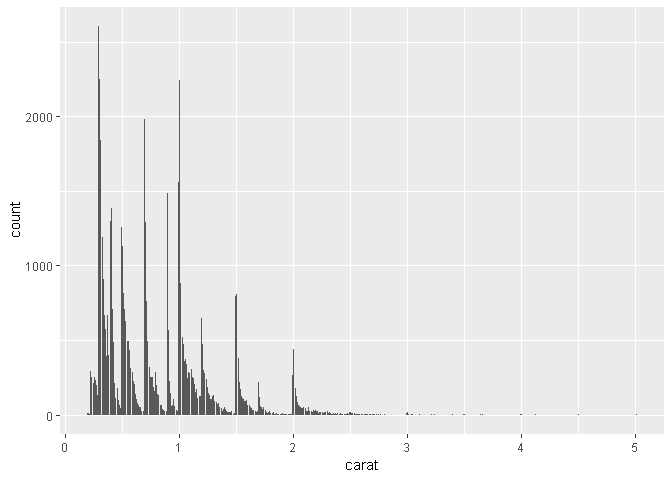

``` r
# (3) cut_width를 함께 활용하여 데이터 분포 확인하기
diamonds %>% 
  dplyr::count(cut_width(carat, 0.5))
```

    ## # A tibble: 11 x 2
    ##    `cut_width(carat, 0.5)`     n
    ##    <fct>                   <int>
    ##  1 [-0.25,0.25]              785
    ##  2 (0.25,0.75]             29498
    ##  3 (0.75,1.25]             15977
    ##  4 (1.25,1.75]              5313
    ##  5 (1.75,2.25]              2002
    ##  6 (2.25,2.75]               322
    ##  7 (2.75,3.25]                32
    ##  8 (3.25,3.75]                 5
    ##  9 (3.75,4.25]                 4
    ## 10 (4.25,4.75]                 1
    ## 11 (4.75,5.25]                 1

``` r
# (4) carat 값이 3보다 작은 것들을 객체로 저장하기
smaller <- diamonds %>% 
  filter(carat < 3)
# 그 후, 히스토그램으로 데이터 분포 확인하기
ggplot(data = smaller, mapping = aes(x = carat)) +
  geom_histogram(binwidth = 0.1)
```

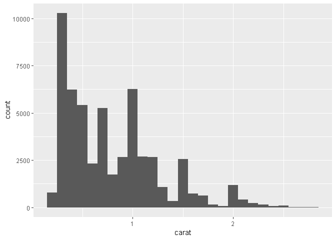

``` r
# (5) geom_freqpoly()를 사용하여 여러 개의 히스토그램을 겹쳐서 그리기
ggplot(data = diamonds, mapping = aes(x = carat, color = cut)) +
  geom_freqpoly(binwidth = 0.1)
```

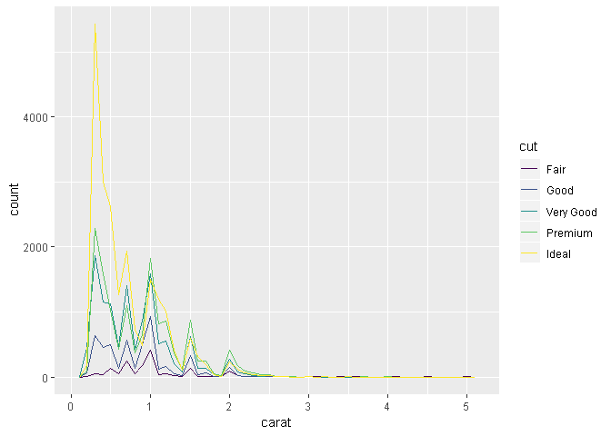

``` r
# 그냥 내가 만들어본 그래프
# aes안에 심미성을 지역할당하면, 범례가 자동으로 생긴다.
ggplot(data = diamonds) +
  geom_bar(mapping = aes(x = cut, fill = "red"),
           alpha = 0.5) +
  geom_bar(mapping = aes(x = color, fill = "blue"),
           alpha = 0.5)
```

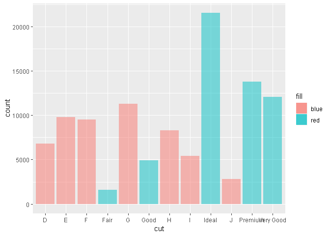

실습2 - 변동의 이상값
---------------------

이상값은 패턴과 맞지 않는 데이터 값으로 **비정상적인 관측값**을 일컫는다.<br> **이상값을 포함하거나 제외하여 분석을 반복**하는 것은 좋은 연습이다.<br> 이상값이 결과에 최소한의 영향을 미치고 왜 이상값이 발생했는지 그 이유를 알 수 없다면 **결측값으로 대체한 후 계속 진행하는 것도 합리적이다.**<br> **coord\_cartesian(xlim = NULL, ylim = NULL, expand = TRUE)**

**expand** : TRUE일 경우, 데이터와 축이 겹치지 않는 상태에서 작은 확장 인수를 추가한다. FALSE일 경우, 정확히 xlim,ylim값까지만 가져온다.

``` r
# coord_cartesian()을 사용하여 y축 범위를 축소하면, 비정상적인 관측값을 확인할 수 있다. 
ggplot(data = diamonds) +
  geom_histogram(mapping = aes(x = y),
                 binwidth = 0.5) +
  coord_cartesian(ylim = c(0,50))
```

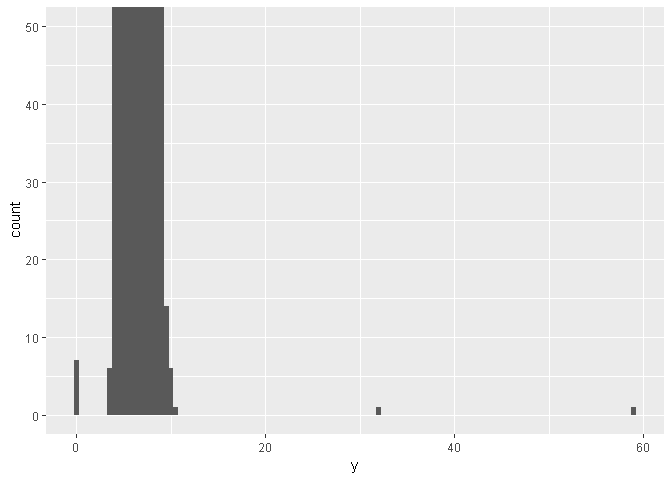

실습3 - 연습문제
----------------

``` r
# (1) diamonds의 x,y,z 변수의 분포를 탐색하자. 
# 어떤 치수가 길이 너비 깊이인지 결정해보자.
str(diamonds[, c("x","y","z")])
```

    ## Classes 'tbl_df', 'tbl' and 'data.frame':    53940 obs. of  3 variables:
    ##  $ x: num  3.95 3.89 4.05 4.2 4.34 3.94 3.95 4.07 3.87 4 ...
    ##  $ y: num  3.98 3.84 4.07 4.23 4.35 3.96 3.98 4.11 3.78 4.05 ...
    ##  $ z: num  2.43 2.31 2.31 2.63 2.75 2.48 2.47 2.53 2.49 2.39 ...

``` r
ggplot(data = diamonds) +
  geom_histogram(mapping = aes(x = x, fill = "green"),
                 alpha = 0.5,
                 bins = 1000) +
  geom_histogram(mapping = aes(x = y, fill = "red"),
                 alpha = 0.5,
                 bins = 1000) +
  geom_histogram(mapping = aes(x = z, fill = "blue"),
                 alpha = 0.5,
                 bins = 1000) +
  coord_cartesian(xlim = c(0,20))
```

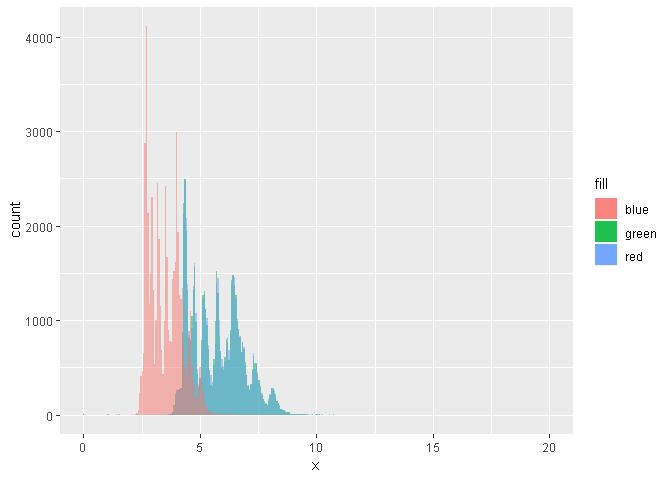

``` r
# (2) price의 분포를 확인하기 (binwidth 사용)
ggplot(data = diamonds) +
  geom_freqpoly(mapping = aes(x = price, color = cut),
                 binwidth = 10)
```

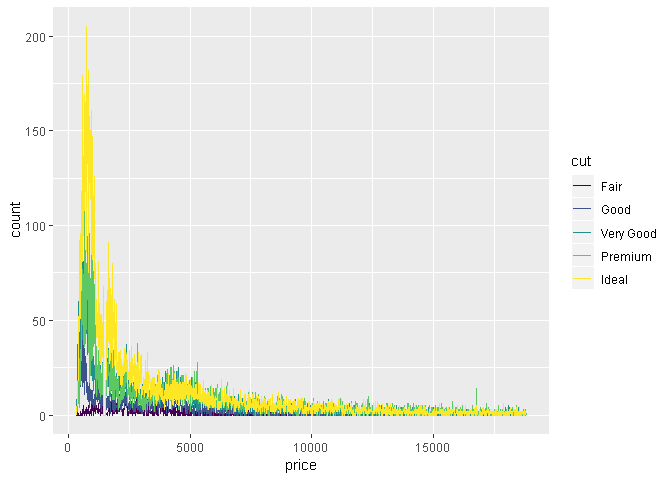

``` r
# (3) 0.99캐럿인 다이아몬드의 개수와 1캐럿인 다이아몬드의 개수 확인하기
diamonds %>% 
  dplyr::filter(carat == 0.99 | carat == 1) %>%
  dplyr::group_by(carat) %>% 
  dplyr::summarise(n = n())
```

    ## # A tibble: 2 x 2
    ##   carat     n
    ##   <dbl> <int>
    ## 1  0.99    23
    ## 2  1     1558

``` r
nrow(diamonds[diamonds$carat == 0.99, ])
```

    ## [1] 23

``` r
nrow(diamonds[diamonds$carat == 1, ])
```

    ## [1] 1558

``` r
# (4) xlim, ylim 함수와 coord_cartesian 함수 비교해보기
ggplot(data = diamonds) +
  geom_histogram(mapping = aes(x = price)) +
  ggplot2::xlim(0, 10000)
```

    ## `stat_bin()` using `bins = 30`. Pick better value with `binwidth`.

    ## Warning: Removed 5222 rows containing non-finite values (stat_bin).

    ## Warning: Removed 2 rows containing missing values (geom_bar).

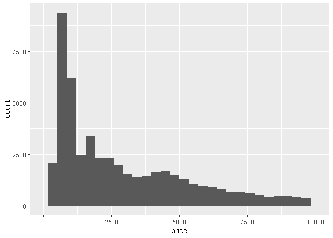

``` r
ggplot(data = diamonds) +
  geom_histogram(mapping = aes(x = price)) +
  coord_cartesian(xlim = c(0, 10000))
```

    ## `stat_bin()` using `bins = 30`. Pick better value with `binwidth`.

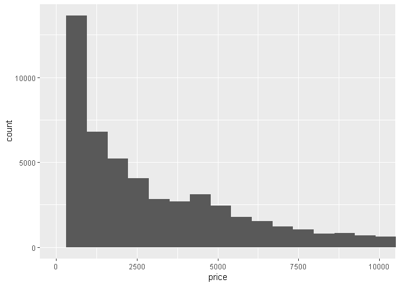

``` r
# 막대의 절반만 확대해서 보여주기
ggplot(data = diamonds) +
  geom_histogram(mapping = aes(x = price)) +
  coord_cartesian(xlim = c(0, max(diamonds$price) / 2))
```

    ## `stat_bin()` using `bins = 30`. Pick better value with `binwidth`.

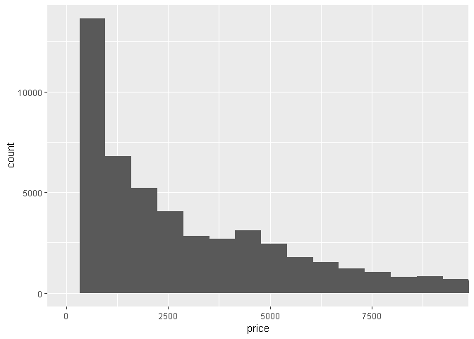

결측값
======

데이터셋에서 **이상값을 발견하고 다음 분석으로 넘어가고자 할 때**, 다음의 두 가지 옵션이 있다.<br>

**(1) 이상값이 포함된 행 전체를 삭제한다.**<br> **(2) 이상값을 결측값으로 변경한다.**

실습 + 연습문제 : 결측값에 대하여
---------------------------------

``` r
# 이상값이 포함된 행 전체를 제외하고, 다른 객체에 저장하기
diamonds2 <- diamonds %>%
  filter(between(y,3,20))

# 이상값을 단순히 결측치로 변환하기
diamonds2 <- diamonds %>% 
  mutate(y = ifelse(y<3|y>20, NA, y))

# na.rm으로 결측치는 제외하고 그래프로 그려보기
ggplot(data = diamonds2, mapping = aes(x = x, y = y)) +
  geom_point(na.rm = TRUE)
```

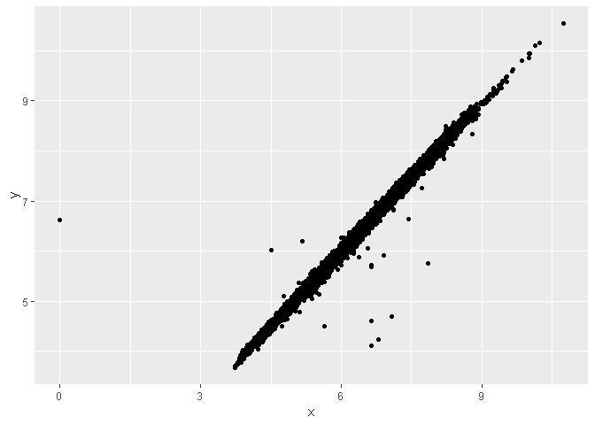

``` r
# (1) 히스토그램에서 결측값을 어떻게 처리하는가? 막대 그래프에서는 어떻게 처리하는가?
# 처리 방법이 다른 이유는 히스토그램은 양적 자료고, 막대 그래프는 질적 자료니까 그렇겠지.

ggplot(data = diamonds2, mapping = aes(x = carat)) +
  geom_histogram(na.rm = TRUE,
                 bins = 30)
```

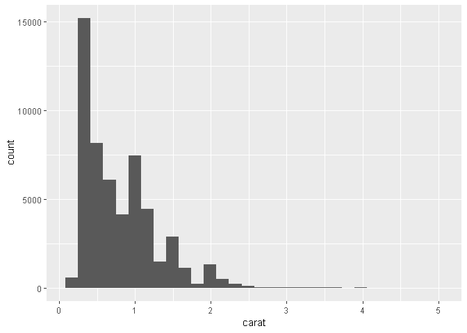

``` r
ggplot(data = diamonds2, mapping = aes(x = cut)) +
  geom_bar(na.rm = TRUE)
```


공변동
======

변동이 변수 내의 움직임을 설명한다면 **공변동은 변수들 간의 움직임을 설명한다.**<br> 공변동은 **둘 이상의 변숫값이 연관되어 동시에 변하는 경향**을 말한다.<br> 마치 **공분산**과도 같다.

**공변동을 발견하는 가장 좋은 방법은 시각화하는 것이다.**

공변동 - 범주형 변수와 연속형 변수
----------------------------------

``` r
# 다이아몬드의 가격이 품질에 따라 어떻게 달라질까?

# (1) 전체적인 빈도수가 다르므로 분포의 차이를 파악하기는 어려울 것이다.
ggplot(data = diamonds, mapping = aes(x = price)) +
  geom_freqpoly(mapping = aes(color = cut), binwidth = 500)
```

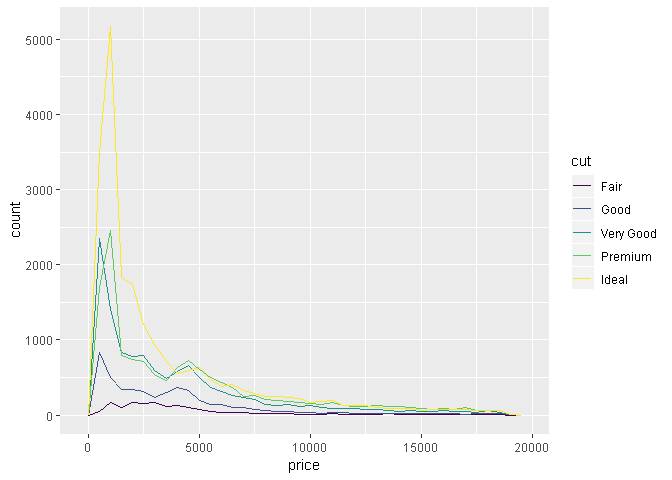

``` r
# (2) 비교를 쉽게 하기 위해 y축에 표시된 내용을 변경할 필요가 있다.
ggplot(data = diamonds, mapping = aes(cut)) +
  geom_bar()
```


``` r
# (3) 빈도수로 나타내는 대신 빈도 다각형 아래의 영역이 1이 되도록 빈도수를 표준화한 밀도로 나타낼 경우
ggplot(data = diamonds, mapping = aes(x = price, y = ..density..)) +
  geom_freqpoly(mapping = aes(color = cut), binwidth = 500)
```


놀랍게도, **fair의 평균가격이 가장 높게 나왔다.** 이것은 아마도, 데이터에서 **전처리를 해야하는 부분이 조금 남아있기 때문일 것이다.**

범주형 변수로 구분된 연속형 변수의 분포를 나타내는 또 다른 방법은 **박스 플롯**이다.

**boxplot의 구성요소**

1.  **사분위 수 범위(IQR)**라고 알려진 길이의 25번째 백분위 수에서 75번째 백분위 수까지 이어진 상자. 분포의 중앙값(즉, 50번째 백분위 수)을 표시하는 상자의 가운데 위치한 선. **이 세 개의 선은 분포의 대략적인 범위와 분포의 중앙값이 대칭인지 또는 한쪽으로 치우쳤는지를 나타낸다.**<br>
2.  상자의 가장자리에서 **1.5배 이상 떨어진 관측값을 나타내는 점.** 이렇게 멀리 떨어진 점들은 일반적이지 않기 때문에 개별적으로 표시된다.<br>
3.  상자의 양끝에서 뻗어 나와 가장 멀리 떨어진 **이상값이 아닌 점까지 이어진 선.**

``` r
# 상자그림 그려보기
ggplot(data = diamonds, mapping = aes(x = cut, y = price)) +
  geom_boxplot()
```

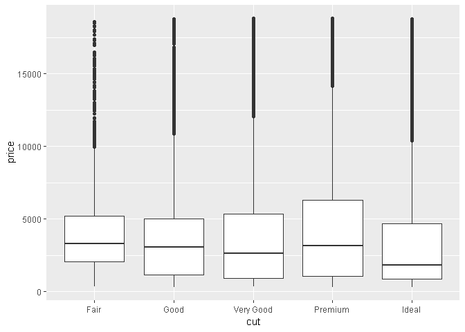

``` r
# 정렬해서 상자그림 그려보기
ggplot(data = diamonds, mapping = aes(x = reorder(cut, price, FUN = median),
                                      y = price)) +
  geom_boxplot()
```

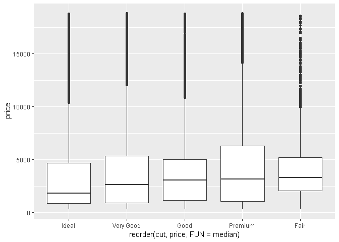

``` r
# 변수명이 긴 경우, coord_flip()을 사용할 수 있다.
ggplot(data = diamonds, mapping = aes(x = reorder(cut, price, FUN = median),
                                      y = price)) +
  geom_boxplot() +
  coord_flip()
```

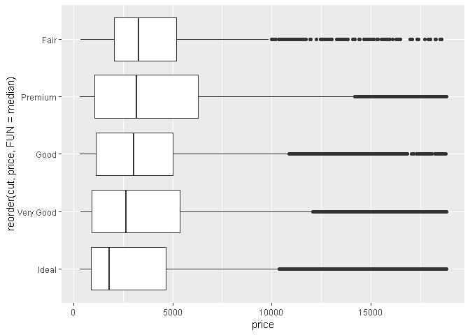

공변동 - 연습문제1 (95p)
------------------------

``` r
# (1) 다이아몬드 데이터셋의 어떤 변수가 다이아몬드의 가격을 예측화는 데 가장 중요한가? 그 변수가 cut 변수와 상관관계가 있는가? 이러한 상관관계의 조합은 품질이 낮은 다이아몬드를 왜 더 비싸게 만드는가?

# boxplot으로 보았을 때, 확실히 fair의 평균가격이 더 높다는 것을 확인할 수 있다.
ggplot(data = diamonds, mapping = aes(x = cut, y = price)) +
  geom_boxplot()
```


``` r
# 아마도, 저품질의 다이아몬드의 케럿이 더 많기 때문이 아닐까?
# 혹은 이상치 때문일 수도 있다.
ggplot(data = diamonds, mapping = aes(x = price, y = carat)) +
  geom_smooth(mapping = aes(group = cut,
                            color = cut))
```

    ## `geom_smooth()` using method = 'gam' and formula 'y ~ s(x, bs = "cs")'

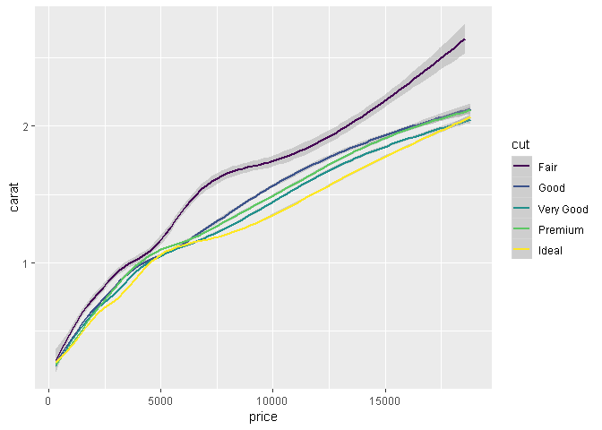

``` r
# (2) lvplot 패키지를 설치하고 geom_lv()를 사용하여 컷팅에 따른 가격의 분포를 나타내보자.
library(lvplot)

# 이상값이 줄어드는 것 같긴 하다.
ggplot(data = diamonds) +
  geom_lv(mapping = aes(x = cut, y = price))
```

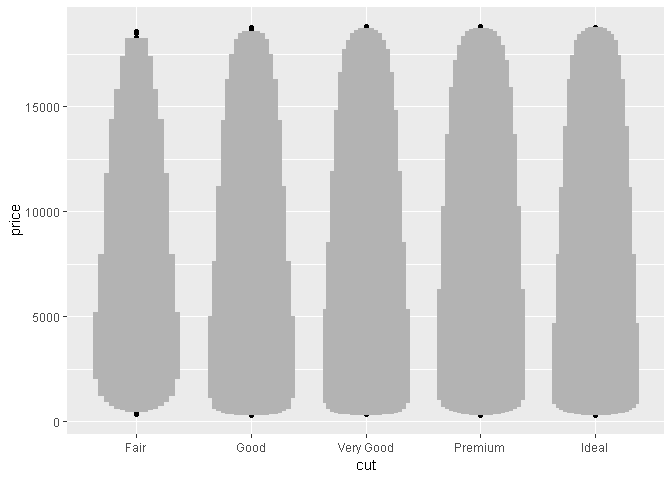

공변동 - 두 개의 범주형 변수 + 연습문제2 (97p)
----------------------------------------------

**geom\_count()함수**를 이용하여, 범주형 변수들의 각 조합에 대한 관측값의 수를 셀 수 있다.

``` r
# count를 통해서 두 범주형 변수의 공변동 확인하기
ggplot(data = diamonds) +
  geom_count(mapping = aes(x = cut, y = color))
```


``` r
# geom_tile()함수와 fill 심미성으로 시각화하기
# 기본 count()함수는 그냥 group_by()와 summarise()를 통해서 구현할 수도 있다.
diamonds %>% 
  count(color, cut) %>% 
  ggplot(mapping = aes(x = color, y = cut)) +
  geom_tile(mapping = aes(fill = n))
```

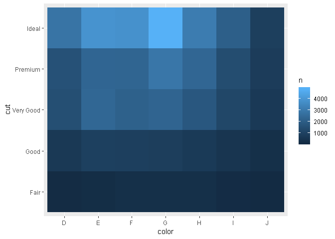

``` r
# (1) 컷팅의 분포 또는 컷팅 내에서 색상의 분포를 좀 더 명확하게 보여주기 위해서 데이터셋의 count값을 어떻게 조정할 수 있는가?
# 정렬을 하면 된다.
diamonds %>% 
  count(color, cut) %>% 
  ggplot(mapping = aes(x = reorder(color, 
                                   n, 
                                   FUN = function(x) desc(median(x))), 
                       y = cut)) +
  geom_tile(mapping = aes(fill = n))
```

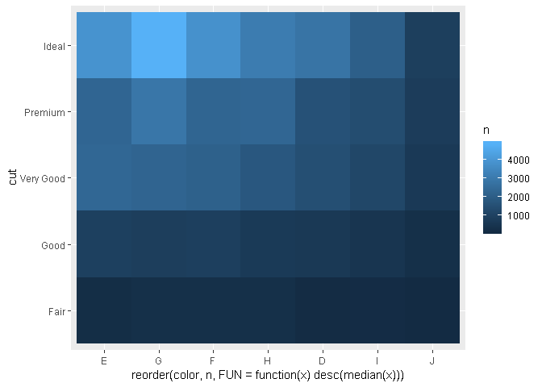

공변동 - 두 개의 연속형 변수
----------------------------

**두 개의 연속형 변수 사이의 공변동**을 시각화하는 좋은 방법 중 하나로, **산점도(geom\_point)**를 그리는 것은 앞서 배웠다.

1.  기본적인 **geom\_point** 사용하기<br>
2.  데이터의 수가 많아 구분이 어려울 때는, **geom\_bin2d** 혹은 **geom\_hex** 사용하기<br>
3.  **geom\_boxplot**을 사용하여 표현하기 (varwidth 심미성과 cut\_number()사용)

**cut\_number(x, n = NULL, ...)** : numeric type의 벡터 x를 n개만큼 나누어서 factor형으로 변환

**cut\_width(x, width)** : numeric type의 벡터 x를 width 단위로 나누어서 factor형으로 변환

``` r
# geom_point 사용해보기
ggplot(data = diamonds) +
  geom_point(mapping = aes(x = carat, 
                           y = price),
             position = "jitter")
```

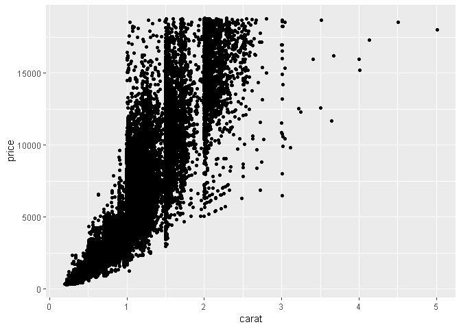

``` r
# 2차원 bin을 사용하여 더 쉽게 보이도록 하기
library(hexbin)

ggplot(data = diamonds) +
  geom_bin2d(mapping = aes(x = carat, y = price))
```

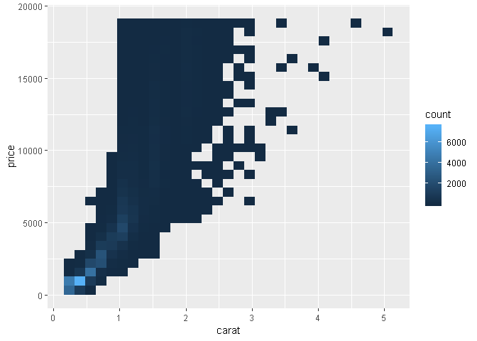

``` r
ggplot(data = diamonds) +
  geom_hex(mapping = aes(x = carat, y = price))
```


``` r
# 그룹화를 통해서 박스플롯으로 그리기
ggplot(data = diamonds, mapping = aes(x = carat, y = price)) +
  geom_boxplot(mapping = aes(group = cut_width(carat, 0.1)))
```


``` r
# 박스플롯의 너비를 점의 개수와 비례하도록 설정하기

# varwidth = TRUE를 할 경우, 박스플롯의 너비를 점의 개수와 비례하도록 설정할 수 있다.
ggplot(data = diamonds, mapping = aes(x = carat, y = price)) +
  geom_boxplot(mapping = aes(group = cut_width(carat, 0.1)),
               varwidth = TRUE)
```

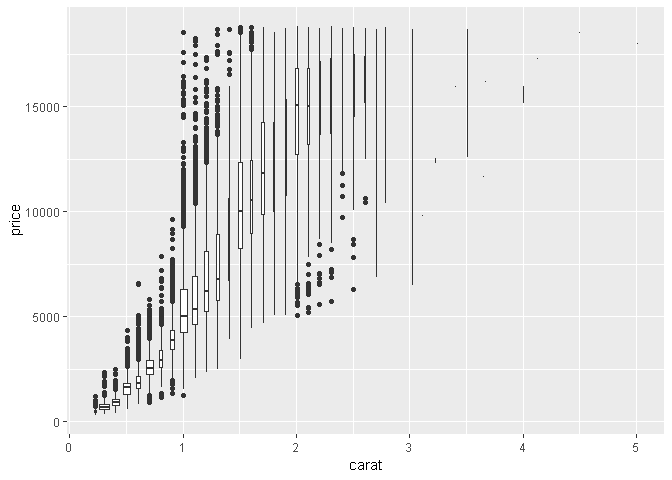

``` r
# 또는, cut_number를 사용할 수도 있다.
ggplot(data =diamonds, mapping = aes(x = carat, y = price)) +
  geom_boxplot(mapping = aes(group = cut_number(carat, 20)))
```

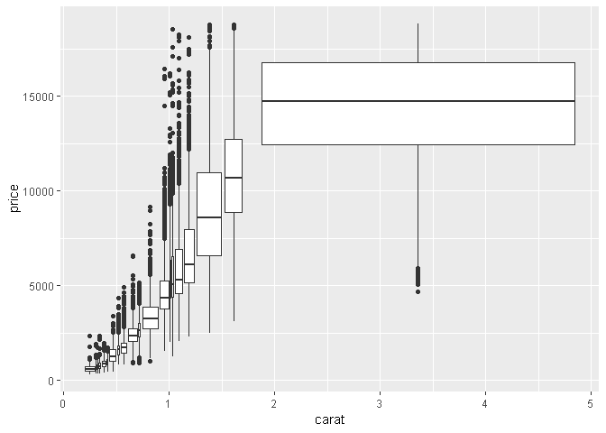

공변동 - 연습문제3 (101p)
-------------------------

``` r
# (1) price로 구분된 carat의 분포 시각화하기

# 방법1
ggplot(data = diamonds) +
  geom_point(mapping = aes(x = carat,
                           y = price,
                           color = cut_number(price, 10)))
```

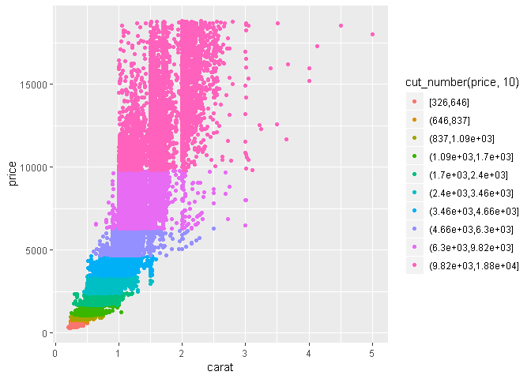

``` r
# 방법2
ggplot(data = diamonds) +
  geom_point(mapping = aes(x = carat,
                           y = price,
                           color = cut_number(price, 10))) +
  facet_grid(. ~ cut_number(price, 10))
```

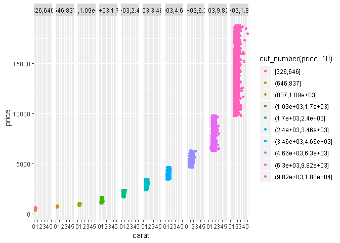

패턴과 모델
===========

데이터의 패턴은 상관관계에 대한 단서를 제공한다. **두 변수 사이에 규칙적인 관계가 존재하면 데이터의 패턴으로 나타난다.**

**패턴에 대한 질문**<br> (1) 이 패턴은 우연의 일치 때문인가?<br> (2) 패턴이 내포하는 상관관계를 어떻게 설명할 수 있는가?<br> (3) 패턴이 내포하는 상관관계는 얼마나 강한가?<br> (4) 다른 변수가 그 상관관계에 영향을 줄 수 있는가?<br> (5) 데이터의 개별 하위집단을 살펴보면 상관관계가 변경되는가?

패턴은 공변동을 나타내기 때문에 데이터 과학자에게 가장 유용한 도구 중 하나이다.<br> 두 개의 변수가 함께 변동하면 한 변수의 값을 사용하여 다른 변수의 값을 잘 예측할 수 있다.<br> **모델은 데이터에서 패턴을 추출하는 도구이다.** 회귀분석, 머신러닝 알고리즘 등 다양한 모델들을 활용한다.

**carat으로 price를 예측하는 모델을 적합**시킨 다음, **잔차(예측값과 실제값의 차이)를 계산**한다. 그 후, 이 **잔차를 통해서 가격에 대한 관점**을 얻을 수 있다.

**예측값은 carat의 효과라고 볼 수 있다.** **carat 하나만을 독립변수로 두고 예측한 값이기 때문이다.**

**그렇기 때문에 해당 잔차는 전체 변수의 효과 중 carat의 효과만 제거된 다이아몬드의 가격이라고 볼 수 있는 것이다.**

``` r
# 회귀모형 적합해보기
mod <- lm(log(price) ~ log(carat),
          data = diamonds)

# 결과 확인하기
summary(mod)
```

    ## 
    ## Call:
    ## lm(formula = log(price) ~ log(carat), data = diamonds)
    ## 
    ## Residuals:
    ##      Min       1Q   Median       3Q      Max 
    ## -1.50833 -0.16951 -0.00591  0.16637  1.33793 
    ## 
    ## Coefficients:
    ##             Estimate Std. Error t value Pr(>|t|)    
    ## (Intercept) 8.448661   0.001365  6190.9   <2e-16 ***
    ## log(carat)  1.675817   0.001934   866.6   <2e-16 ***
    ## ---
    ## Signif. codes:  0 '***' 0.001 '**' 0.01 '*' 0.05 '.' 0.1 ' ' 1
    ## 
    ## Residual standard error: 0.2627 on 53938 degrees of freedom
    ## Multiple R-squared:  0.933,  Adjusted R-squared:  0.933 
    ## F-statistic: 7.51e+05 on 1 and 53938 DF,  p-value: < 2.2e-16

``` r
library(modelr)

# 잔차를 추가하는 함수 add_residuals()
diamonds2 <- diamonds %>%
  add_residuals(mod) %>% 
  mutate(resid = exp(resid))

# carat과 잔차 시각화해보기
ggplot(data = diamonds2) +
  geom_point(mapping = aes(x = carat, y = resid))
```

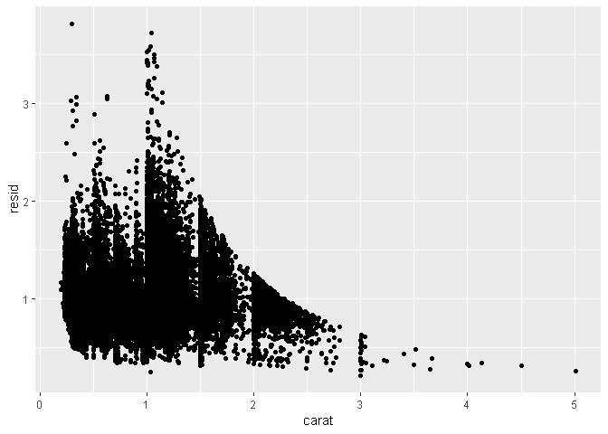

``` r
# 캐럿과 가격의 강한 상관관계를 제거하면, 예상할 수 있었던 커팅과 가격의 상관관계를 파악할 수 있다. ( 품질이 우수할수록 가격이 비싸다 )
ggplot(data = diamonds2) +
  geom_boxplot(mapping = aes(x = cut, y = resid))
```

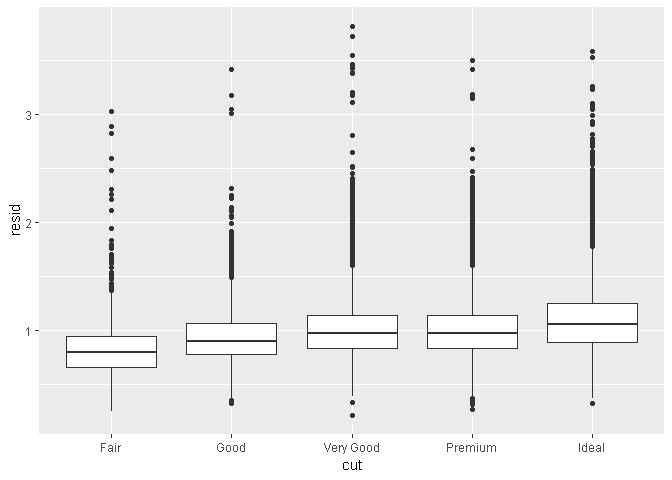
