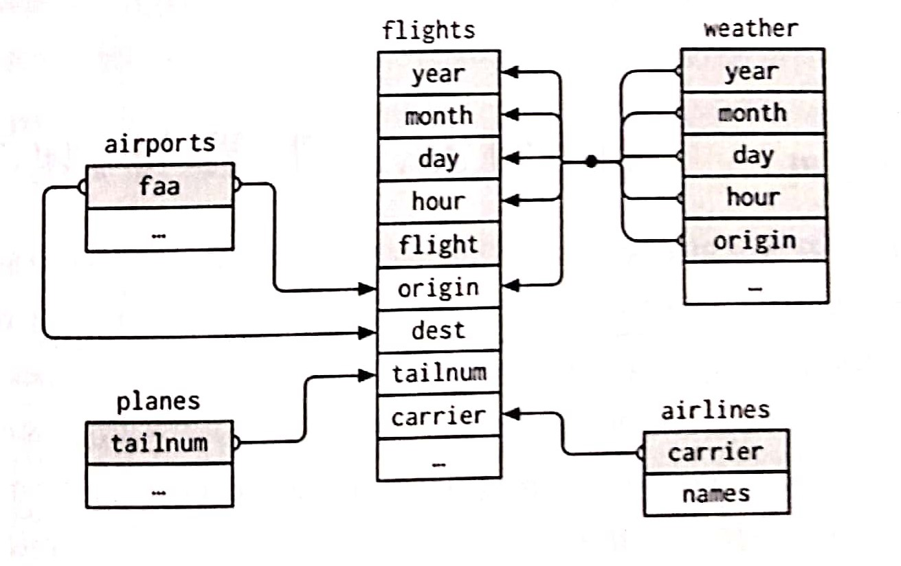
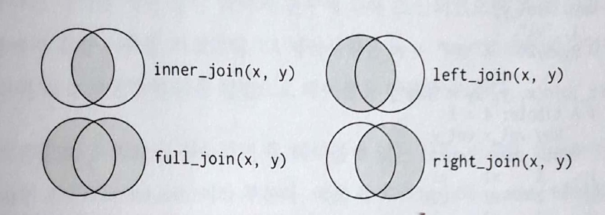

10장 : dplyr로 하는 관계형 데이터
================
huimin
2019년 5월 7일

기초설정
========

``` r
library(tidyverse)
```

    ## Registered S3 methods overwritten by 'ggplot2':
    ##   method         from 
    ##   [.quosures     rlang
    ##   c.quosures     rlang
    ##   print.quosures rlang

    ## Registered S3 method overwritten by 'rvest':
    ##   method            from
    ##   read_xml.response xml2

    ## -- Attaching packages --------------------- tidyverse 1.2.1 --

    ## √ ggplot2 3.1.1       √ purrr   0.3.2  
    ## √ tibble  2.1.1       √ dplyr   0.8.0.1
    ## √ tidyr   0.8.3       √ stringr 1.4.0  
    ## √ readr   1.3.1       √ forcats 0.4.0

    ## -- Conflicts ------------------------ tidyverse_conflicts() --
    ## x dplyr::filter() masks stats::filter()
    ## x dplyr::lag()    masks stats::lag()

``` r
library(readr)
library(nycflights13)
```

들어가기
========

기본적으로, **R은 데이터 분석 프로그램 언어**이기 때문에 일부 기능들은 데이터베이스를 관리하는 프로그램과 유사하고 관련이 있다.

데이터 분석에서 **데이터 테이블**이 단 하나만 관련된 경우는 거의 없다. 일반적으로 데이터 테이블이 많이 있고, 이들을 결합해서 원하는 결과를 도출한다.

**여러 데이터 테이블을 총칭하여 관계형 데이터**라고 한다. 개별 데이터셋이 아니라 이들의 관계가 중요한 것이기 때문이다.

**관계형 데이터로 작업하려면 두 개의 테이블이 작동하는 동사**가 필요하다. 관계형 데이터에 동작하도록 설계된 세 가지 계열의 동사가 있다.

-   **뮤테이팅 조인** : 다른 데이터프레임에 있는 해당 관측값에서 가져와 새로운 변수로 생성하여 추가
-   **필터링 조인** : 다른 테이블의 관측값과 일치하는지에 따라 관측값을 걸러냄
-   **집합 연산** : 관측값을 집합 원소로 취급

관계형 데이터가 있는 장소는 **관계형 데이터베이스 관리 시스템(RDBMS)**이다. dplyr에서는, SQL보다 약간 사용하기 쉽게 처리할 수 있을 것이다. **dplyr은 데이터 분석에 특화되어 있으면서도, 관계형 데이터를 다룰 수 있게 해준다.**

nycflights13
============

관계형 데이터에 배우기 위해 이 패키지의 데이터를 사용할 것이다.

``` r
# airlines를 사용하면 해당 약어 코드로 전체 항공사명을 찾아볼 수 있다.
airlines
```

    ## # A tibble: 16 x 2
    ##    carrier name                       
    ##    <chr>   <chr>                      
    ##  1 9E      Endeavor Air Inc.          
    ##  2 AA      American Airlines Inc.     
    ##  3 AS      Alaska Airlines Inc.       
    ##  4 B6      JetBlue Airways            
    ##  5 DL      Delta Air Lines Inc.       
    ##  6 EV      ExpressJet Airlines Inc.   
    ##  7 F9      Frontier Airlines Inc.     
    ##  8 FL      AirTran Airways Corporation
    ##  9 HA      Hawaiian Airlines Inc.     
    ## 10 MQ      Envoy Air                  
    ## 11 OO      SkyWest Airlines Inc.      
    ## 12 UA      United Air Lines Inc.      
    ## 13 US      US Airways Inc.            
    ## 14 VX      Virgin America             
    ## 15 WN      Southwest Airlines Co.     
    ## 16 YV      Mesa Airlines Inc.

``` r
# airports에는 각 공항에 대한 정보가 faa 공항 코드로 식별되어 있다.
airports
```

    ## # A tibble: 1,458 x 8
    ##    faa   name                    lat    lon   alt    tz dst   tzone        
    ##    <chr> <chr>                 <dbl>  <dbl> <int> <dbl> <chr> <chr>        
    ##  1 04G   Lansdowne Airport      41.1  -80.6  1044    -5 A     America/New_~
    ##  2 06A   Moton Field Municipa~  32.5  -85.7   264    -6 A     America/Chic~
    ##  3 06C   Schaumburg Regional    42.0  -88.1   801    -6 A     America/Chic~
    ##  4 06N   Randall Airport        41.4  -74.4   523    -5 A     America/New_~
    ##  5 09J   Jekyll Island Airport  31.1  -81.4    11    -5 A     America/New_~
    ##  6 0A9   Elizabethton Municip~  36.4  -82.2  1593    -5 A     America/New_~
    ##  7 0G6   Williams County Airp~  41.5  -84.5   730    -5 A     America/New_~
    ##  8 0G7   Finger Lakes Regiona~  42.9  -76.8   492    -5 A     America/New_~
    ##  9 0P2   Shoestring Aviation ~  39.8  -76.6  1000    -5 U     America/New_~
    ## 10 0S9   Jefferson County Intl  48.1 -123.    108    -8 A     America/Los_~
    ## # ... with 1,448 more rows

``` r
# planes에는 각 여객기에 대한 정보기 tailnum으로 식별되어 있다.
planes
```

    ## # A tibble: 3,322 x 9
    ##    tailnum  year type       manufacturer  model  engines seats speed engine
    ##    <chr>   <int> <chr>      <chr>         <chr>    <int> <int> <int> <chr> 
    ##  1 N10156   2004 Fixed win~ EMBRAER       EMB-1~       2    55    NA Turbo~
    ##  2 N102UW   1998 Fixed win~ AIRBUS INDUS~ A320-~       2   182    NA Turbo~
    ##  3 N103US   1999 Fixed win~ AIRBUS INDUS~ A320-~       2   182    NA Turbo~
    ##  4 N104UW   1999 Fixed win~ AIRBUS INDUS~ A320-~       2   182    NA Turbo~
    ##  5 N10575   2002 Fixed win~ EMBRAER       EMB-1~       2    55    NA Turbo~
    ##  6 N105UW   1999 Fixed win~ AIRBUS INDUS~ A320-~       2   182    NA Turbo~
    ##  7 N107US   1999 Fixed win~ AIRBUS INDUS~ A320-~       2   182    NA Turbo~
    ##  8 N108UW   1999 Fixed win~ AIRBUS INDUS~ A320-~       2   182    NA Turbo~
    ##  9 N109UW   1999 Fixed win~ AIRBUS INDUS~ A320-~       2   182    NA Turbo~
    ## 10 N110UW   1999 Fixed win~ AIRBUS INDUS~ A320-~       2   182    NA Turbo~
    ## # ... with 3,312 more rows

``` r
# weather에는 각 NYC공항의 매 시각 날씨 정보가 있다.
weather
```

    ## # A tibble: 26,115 x 15
    ##    origin  year month   day  hour  temp  dewp humid wind_dir wind_speed
    ##    <chr>  <dbl> <dbl> <int> <int> <dbl> <dbl> <dbl>    <dbl>      <dbl>
    ##  1 EWR     2013     1     1     1  39.0  26.1  59.4      270      10.4 
    ##  2 EWR     2013     1     1     2  39.0  27.0  61.6      250       8.06
    ##  3 EWR     2013     1     1     3  39.0  28.0  64.4      240      11.5 
    ##  4 EWR     2013     1     1     4  39.9  28.0  62.2      250      12.7 
    ##  5 EWR     2013     1     1     5  39.0  28.0  64.4      260      12.7 
    ##  6 EWR     2013     1     1     6  37.9  28.0  67.2      240      11.5 
    ##  7 EWR     2013     1     1     7  39.0  28.0  64.4      240      15.0 
    ##  8 EWR     2013     1     1     8  39.9  28.0  62.2      250      10.4 
    ##  9 EWR     2013     1     1     9  39.9  28.0  62.2      260      15.0 
    ## 10 EWR     2013     1     1    10  41    28.0  59.6      260      13.8 
    ## # ... with 26,105 more rows, and 5 more variables: wind_gust <dbl>,
    ## #   precip <dbl>, pressure <dbl>, visib <dbl>, time_hour <dttm>

그림으로 본다면, 다음과 같은 서로 다른 테이블 간의 관계를 알 수 있다.



-   flights는 단 하나의 변수 tailnum을 통해 planes와 연결된다.
-   flights는 carrier 변수를 통해 airlines에 연결된다.
-   flights는 origin(위치)과 dest(목적지) 변수를 통해 두 가지 방법으로 airports에 연결된다.
-   flights는 origin, year, month, day, hour를 통해 weather과 연결된다.

키
==

구조에 구애받지 않고, 고유하게 식별할 수 있는 **변수 또는 변수의 집합**을 키라고 부른다. 단일 변수만으로 관측값을 고유하게 식별할 수 있는 경우도 있지만, **다양한 변수를 조합해야 고유하게 식별할 수 있는 경우 또한 존재한다.**

키의 유형에는 다음 두 가지가 있다.

-   기본키(primary key) : 자신의 테이블에서 관측값을 고유하게 식별한다.
-   외래키(foreign key) : 다른 테이블의 관측값을 고유하게 식별한다.

**한 테이블의 변수가 다른 테이블에서 키의 역할을 할 수 있다면 다른 테이블에서 외래키라고 부른다.**

``` r
# 데이터를 고유하게 식별하는 지 확인하는 방법
planes %>% 
  count(tailnum) %>% 
  filter(n > 1)
```

    ## # A tibble: 0 x 2
    ## # ... with 2 variables: tailnum <chr>, n <int>

테이블에 기본키가 없으면 **mutate()와 row\_number()를 이용하여 기본키를 추가**한다. 이렇게 하면 필터링을 수행하고 난 후 원래 데이터와 다시 점검할 때 관측값을 쉽게 일치시킬 수 있다. 이를 **대체키(surrogate key)**라고 한다.

연습문제(168p)
--------------

``` r
# flights에 대체키 추가하기
flights %>% 
  dplyr::mutate(key = row_number()) %>% 
  dplyr::select(key, everything())
```

    ## # A tibble: 336,776 x 20
    ##      key  year month   day dep_time sched_dep_time dep_delay arr_time
    ##    <int> <int> <int> <int>    <int>          <int>     <dbl>    <int>
    ##  1     1  2013     1     1      517            515         2      830
    ##  2     2  2013     1     1      533            529         4      850
    ##  3     3  2013     1     1      542            540         2      923
    ##  4     4  2013     1     1      544            545        -1     1004
    ##  5     5  2013     1     1      554            600        -6      812
    ##  6     6  2013     1     1      554            558        -4      740
    ##  7     7  2013     1     1      555            600        -5      913
    ##  8     8  2013     1     1      557            600        -3      709
    ##  9     9  2013     1     1      557            600        -3      838
    ## 10    10  2013     1     1      558            600        -2      753
    ## # ... with 336,766 more rows, and 12 more variables: sched_arr_time <int>,
    ## #   arr_delay <dbl>, carrier <chr>, flight <int>, tailnum <chr>,
    ## #   origin <chr>, dest <chr>, air_time <dbl>, distance <dbl>, hour <dbl>,
    ## #   minute <dbl>, time_hour <dttm>

뮤테이팅 조인
=============

**뮤테이팅 조인을 통해서 두 테이블의 변수를 결합할 수 있다.** 관측값을 키로 매칭시킨 다음 한 테이블에서 다른 테이블로 변수들을 복사한다.

``` r
# 더 보기 쉽게 새로운 객체를 생성한다.
flights2 <- flights %>% 
  select(year:day, hour, origin, dest, tailnum, carrier)

# flights2 데이터에 항공사 전체 이름을 추가하기
airlines
```

    ## # A tibble: 16 x 2
    ##    carrier name                       
    ##    <chr>   <chr>                      
    ##  1 9E      Endeavor Air Inc.          
    ##  2 AA      American Airlines Inc.     
    ##  3 AS      Alaska Airlines Inc.       
    ##  4 B6      JetBlue Airways            
    ##  5 DL      Delta Air Lines Inc.       
    ##  6 EV      ExpressJet Airlines Inc.   
    ##  7 F9      Frontier Airlines Inc.     
    ##  8 FL      AirTran Airways Corporation
    ##  9 HA      Hawaiian Airlines Inc.     
    ## 10 MQ      Envoy Air                  
    ## 11 OO      SkyWest Airlines Inc.      
    ## 12 UA      United Air Lines Inc.      
    ## 13 US      US Airways Inc.            
    ## 14 VX      Virgin America             
    ## 15 WN      Southwest Airlines Co.     
    ## 16 YV      Mesa Airlines Inc.

``` r
flights2 %>% 
  select(-origin, -dest) %>% 
  left_join(airlines, by = "carrier")
```

    ## # A tibble: 336,776 x 7
    ##     year month   day  hour tailnum carrier name                    
    ##    <int> <int> <int> <dbl> <chr>   <chr>   <chr>                   
    ##  1  2013     1     1     5 N14228  UA      United Air Lines Inc.   
    ##  2  2013     1     1     5 N24211  UA      United Air Lines Inc.   
    ##  3  2013     1     1     5 N619AA  AA      American Airlines Inc.  
    ##  4  2013     1     1     5 N804JB  B6      JetBlue Airways         
    ##  5  2013     1     1     6 N668DN  DL      Delta Air Lines Inc.    
    ##  6  2013     1     1     5 N39463  UA      United Air Lines Inc.   
    ##  7  2013     1     1     6 N516JB  B6      JetBlue Airways         
    ##  8  2013     1     1     6 N829AS  EV      ExpressJet Airlines Inc.
    ##  9  2013     1     1     6 N593JB  B6      JetBlue Airways         
    ## 10  2013     1     1     6 N3ALAA  AA      American Airlines Inc.  
    ## # ... with 336,766 more rows

``` r
# NA 확인
flights2 %>% 
  select(-origin, -dest) %>% 
  left_join(airlines, by = "carrier") %>% 
  filter(is.na(name) == TRUE)
```

    ## # A tibble: 0 x 7
    ## # ... with 7 variables: year <int>, month <int>, day <int>, hour <dbl>,
    ## #   tailnum <chr>, carrier <chr>, name <chr>

내부 조인(inner-join)과 외부 조인(outer-join)
---------------------------------------------

가장 간단한 조인 유형은 내부 조인이다. **내부 조인은 키가 같을 때마다 두 관측값을 매칭한다.** 단, 매칭되지 않는 관측값을 잃어버리기 때문에 일반적으로 분석 목적으로 사용하기에 적합하지 않다.

``` r
x <- tibble(key = c(1,2,3),
            val_x = c("x1","x2","x3"))

y <- tibble(key = c(1,2,4),
            val_y = c("y1","y2","y3"))


inner_join(x,y,by = "key")
```

    ## # A tibble: 2 x 3
    ##     key val_x val_y
    ##   <dbl> <chr> <chr>
    ## 1     1 x1    y1   
    ## 2     2 x2    y2

**외부 조인에서는 적어도 하나의 테이블에 있는 관측값은 모두 보존된다.**

-   왼쪽 조인(left join)은 x의 모든 관측값을 보존한다.
-   오른쪽 조인(right join)은 y의 모든 관측값을 보존한다.
-   전체 조인(full join)은 x와 y의 모든 관측값을 보존한다.



중복키
------

키가 고유하지 않은 경우를 중복키라고 한다.

``` r
# 하나의 테이블에 중복키가 있다. 중복키는 추가적인 정보를 넣을 때 유용한데 일반적으로 일대다 관계가 있기 때문이다.
x <- tibble(key = c(1,2,2,1),
            val_x = c("x1","x2","x3","x4"))
y <- tibble(key = c(1,2),
            val_y = c("y1","y2"))

left_join(x, y, by = "key")
```

    ## # A tibble: 4 x 3
    ##     key val_x val_y
    ##   <dbl> <chr> <chr>
    ## 1     1 x1    y1   
    ## 2     2 x2    y2   
    ## 3     2 x3    y2   
    ## 4     1 x4    y1

``` r
# 두 테이블 모두 중복키가 있다. 조인하면 가능한 모든 조합인 데카르트곱을 얻는다.
x <- tibble(key = c(1,2,2,3),
            val_x = c("x1","x2","x3","x4"))
y <- tibble(key = c(1,2,2,3),
            val_y = c("y1","y2","y3","y4"))

left_join(x, y, by = "key")
```

    ## # A tibble: 6 x 3
    ##     key val_x val_y
    ##   <dbl> <chr> <chr>
    ## 1     1 x1    y1   
    ## 2     2 x2    y2   
    ## 3     2 x2    y3   
    ## 4     2 x3    y2   
    ## 5     2 x3    y3   
    ## 6     3 x4    y4

키 열 정의하기
--------------

지금까지는 by = "key"를 통하여 조인을 하였지만, 다른 값을 사용하여 다른 방법으로 테이블을 연결할 수 있다.

-   기본값 by = NULL을 사용하면, 두 테이블에 있는 모든 변수를 사용하며 이는 **자연 조인(natural join)**이라 부른다.
-   문자형 벡터 by = "x". 이것은 자연 조인과 같지만 일부 공통 변수만 사용한다.
-   이름 있는 문자 벡터, by = c("a" = "b"). 테이블 x의 변수 a와 테이블 y의 변수 b를 매칭시킨다. x의 변수가 출력에 사용된다.

``` r
# 자연 조인
flights2 %>% 
  left_join(weather)
```

    ## Joining, by = c("year", "month", "day", "hour", "origin")

    ## # A tibble: 336,776 x 18
    ##     year month   day  hour origin dest  tailnum carrier  temp  dewp humid
    ##    <dbl> <dbl> <int> <dbl> <chr>  <chr> <chr>   <chr>   <dbl> <dbl> <dbl>
    ##  1  2013     1     1     5 EWR    IAH   N14228  UA       39.0  28.0  64.4
    ##  2  2013     1     1     5 LGA    IAH   N24211  UA       39.9  25.0  54.8
    ##  3  2013     1     1     5 JFK    MIA   N619AA  AA       39.0  27.0  61.6
    ##  4  2013     1     1     5 JFK    BQN   N804JB  B6       39.0  27.0  61.6
    ##  5  2013     1     1     6 LGA    ATL   N668DN  DL       39.9  25.0  54.8
    ##  6  2013     1     1     5 EWR    ORD   N39463  UA       39.0  28.0  64.4
    ##  7  2013     1     1     6 EWR    FLL   N516JB  B6       37.9  28.0  67.2
    ##  8  2013     1     1     6 LGA    IAD   N829AS  EV       39.9  25.0  54.8
    ##  9  2013     1     1     6 JFK    MCO   N593JB  B6       37.9  27.0  64.3
    ## 10  2013     1     1     6 LGA    ORD   N3ALAA  AA       39.9  25.0  54.8
    ## # ... with 336,766 more rows, and 7 more variables: wind_dir <dbl>,
    ## #   wind_speed <dbl>, wind_gust <dbl>, precip <dbl>, pressure <dbl>,
    ## #   visib <dbl>, time_hour <dttm>

``` r
# 문자형 벡터로 조인할 경우
flights2 %>% 
  left_join(planes, by = "tailnum")
```

    ## # A tibble: 336,776 x 16
    ##    year.x month   day  hour origin dest  tailnum carrier year.y type 
    ##     <int> <int> <int> <dbl> <chr>  <chr> <chr>   <chr>    <int> <chr>
    ##  1   2013     1     1     5 EWR    IAH   N14228  UA        1999 Fixe~
    ##  2   2013     1     1     5 LGA    IAH   N24211  UA        1998 Fixe~
    ##  3   2013     1     1     5 JFK    MIA   N619AA  AA        1990 Fixe~
    ##  4   2013     1     1     5 JFK    BQN   N804JB  B6        2012 Fixe~
    ##  5   2013     1     1     6 LGA    ATL   N668DN  DL        1991 Fixe~
    ##  6   2013     1     1     5 EWR    ORD   N39463  UA        2012 Fixe~
    ##  7   2013     1     1     6 EWR    FLL   N516JB  B6        2000 Fixe~
    ##  8   2013     1     1     6 LGA    IAD   N829AS  EV        1998 Fixe~
    ##  9   2013     1     1     6 JFK    MCO   N593JB  B6        2004 Fixe~
    ## 10   2013     1     1     6 LGA    ORD   N3ALAA  AA          NA <NA> 
    ## # ... with 336,766 more rows, and 6 more variables: manufacturer <chr>,
    ## #   model <chr>, engines <int>, seats <int>, speed <int>, engine <chr>

``` r
# x의 변수 a와 y의 변수 b를 매칭시키는 경우
flights2 %>% 
  left_join(airports, by = c("dest" = "faa"))
```

    ## # A tibble: 336,776 x 15
    ##     year month   day  hour origin dest  tailnum carrier name    lat   lon
    ##    <int> <int> <int> <dbl> <chr>  <chr> <chr>   <chr>   <chr> <dbl> <dbl>
    ##  1  2013     1     1     5 EWR    IAH   N14228  UA      Geor~  30.0 -95.3
    ##  2  2013     1     1     5 LGA    IAH   N24211  UA      Geor~  30.0 -95.3
    ##  3  2013     1     1     5 JFK    MIA   N619AA  AA      Miam~  25.8 -80.3
    ##  4  2013     1     1     5 JFK    BQN   N804JB  B6      <NA>   NA    NA  
    ##  5  2013     1     1     6 LGA    ATL   N668DN  DL      Hart~  33.6 -84.4
    ##  6  2013     1     1     5 EWR    ORD   N39463  UA      Chic~  42.0 -87.9
    ##  7  2013     1     1     6 EWR    FLL   N516JB  B6      Fort~  26.1 -80.2
    ##  8  2013     1     1     6 LGA    IAD   N829AS  EV      Wash~  38.9 -77.5
    ##  9  2013     1     1     6 JFK    MCO   N593JB  B6      Orla~  28.4 -81.3
    ## 10  2013     1     1     6 LGA    ORD   N3ALAA  AA      Chic~  42.0 -87.9
    ## # ... with 336,766 more rows, and 4 more variables: alt <int>, tz <dbl>,
    ## #   dst <chr>, tzone <chr>

필터링 조인
===========

필터링 조인은 뮤테이팅 조인과 같은 방식으로 관측값을 매칭하지만, 변수가 아닌 관측값에 영향을 준다. 두 가지 유형이 있다.

-   semi\_join(x, y) : y와 매치되는 x의 모든 관측값을 보존한다.
-   anti\_join(x, y) : y와 매치되는 x의 모든 관측값을 삭제한다.

직접 필터를 만들면 필터링 조인을 할 필요가 없지 않느냐고 질문할 수 있지만, 그렇게 할 경우에는 여러 변수로 확장하는 것이 어렵다. (어렵다고 했지, 불가능한 것은 아니다.)

``` r
# 인기 있는 상위 10개 도착지
top_dest <- flights %>% 
  count(dest, sort = TRUE) %>% 
  head(10)

top_dest
```

    ## # A tibble: 10 x 2
    ##    dest      n
    ##    <chr> <int>
    ##  1 ORD   17283
    ##  2 ATL   17215
    ##  3 LAX   16174
    ##  4 BOS   15508
    ##  5 MCO   14082
    ##  6 CLT   14064
    ##  7 SFO   13331
    ##  8 FLL   12055
    ##  9 MIA   11728
    ## 10 DCA    9705

``` r
# 직접 필터를 만드는 경우
flights %>%
  dplyr::filter(dest %in% top_dest$dest)
```

    ## # A tibble: 141,145 x 19
    ##     year month   day dep_time sched_dep_time dep_delay arr_time
    ##    <int> <int> <int>    <int>          <int>     <dbl>    <int>
    ##  1  2013     1     1      542            540         2      923
    ##  2  2013     1     1      554            600        -6      812
    ##  3  2013     1     1      554            558        -4      740
    ##  4  2013     1     1      555            600        -5      913
    ##  5  2013     1     1      557            600        -3      838
    ##  6  2013     1     1      558            600        -2      753
    ##  7  2013     1     1      558            600        -2      924
    ##  8  2013     1     1      558            600        -2      923
    ##  9  2013     1     1      559            559         0      702
    ## 10  2013     1     1      600            600         0      851
    ## # ... with 141,135 more rows, and 12 more variables: sched_arr_time <int>,
    ## #   arr_delay <dbl>, carrier <chr>, flight <int>, tailnum <chr>,
    ## #   origin <chr>, dest <chr>, air_time <dbl>, distance <dbl>, hour <dbl>,
    ## #   minute <dbl>, time_hour <dttm>

``` r
# semi_join을 이용하는 방법
flights %>% 
  semi_join(top_dest)
```

    ## Joining, by = "dest"

    ## # A tibble: 141,145 x 19
    ##     year month   day dep_time sched_dep_time dep_delay arr_time
    ##    <int> <int> <int>    <int>          <int>     <dbl>    <int>
    ##  1  2013     1     1      542            540         2      923
    ##  2  2013     1     1      554            600        -6      812
    ##  3  2013     1     1      554            558        -4      740
    ##  4  2013     1     1      555            600        -5      913
    ##  5  2013     1     1      557            600        -3      838
    ##  6  2013     1     1      558            600        -2      753
    ##  7  2013     1     1      558            600        -2      924
    ##  8  2013     1     1      558            600        -2      923
    ##  9  2013     1     1      559            559         0      702
    ## 10  2013     1     1      600            600         0      851
    ## # ... with 141,135 more rows, and 12 more variables: sched_arr_time <int>,
    ## #   arr_delay <dbl>, carrier <chr>, flight <int>, tailnum <chr>,
    ## #   origin <chr>, dest <chr>, air_time <dbl>, distance <dbl>, hour <dbl>,
    ## #   minute <dbl>, time_hour <dttm>

``` r
# anti_join
flights %>%
  anti_join(planes, by = "tailnum") %>% 
  count(tailnum, sort = TRUE)
```

    ## # A tibble: 722 x 2
    ##    tailnum     n
    ##    <chr>   <int>
    ##  1 <NA>     2512
    ##  2 N725MQ    575
    ##  3 N722MQ    513
    ##  4 N723MQ    507
    ##  5 N713MQ    483
    ##  6 N735MQ    396
    ##  7 N0EGMQ    371
    ##  8 N534MQ    364
    ##  9 N542MQ    363
    ## 10 N531MQ    349
    ## # ... with 712 more rows

집합 연산
=========

이 필터는 가장 드물게 사용하지만, 복잡한 필터를 단순한 필터들로 분해하려는 경우에 종종 유용하다. 이 집합 연산은 x와 y 입력이 같은 변수를 가지는 것으로 간주하며 관측값을 집합으로 취급한다.

-   intersect(x, y) : x, y 모두에 있는 관측값만 반환
-   union(x, y) : x와 y의 고유한 관측값을 반환
-   setdiff(x, y) : x에 있지만, y에 없는 관측값을 반환

``` r
df1 <- tibble(x = c(1,2),
              y = c(1,1))

df2 <- tibble(x = c(1,1),
              y = c(1,2))

intersect(df1, df2)
```

    ## # A tibble: 1 x 2
    ##       x     y
    ##   <dbl> <dbl>
    ## 1     1     1

``` r
union(df1, df2)
```

    ## # A tibble: 3 x 2
    ##       x     y
    ##   <dbl> <dbl>
    ## 1     1     1
    ## 2     2     1
    ## 3     1     2

``` r
setdiff(df1, df2)
```

    ## # A tibble: 1 x 2
    ##       x     y
    ##   <dbl> <dbl>
    ## 1     2     1
