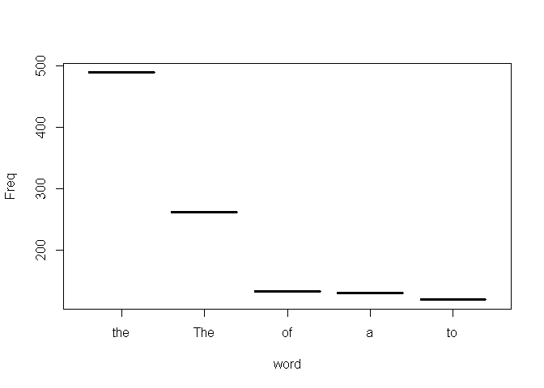

11장 : stringr로 하는 문자열
================
huimin
2019년 5월 13일

# 기초 설정

``` r
library(tidyverse)
```

    ## Registered S3 methods overwritten by 'ggplot2':
    ##   method         from 
    ##   [.quosures     rlang
    ##   c.quosures     rlang
    ##   print.quosures rlang

    ## Registered S3 method overwritten by 'rvest':
    ##   method            from
    ##   read_xml.response xml2

    ## -- Attaching packages --------------------------------- tidyverse 1.2.1 --

    ## √ ggplot2 3.1.1       √ purrr   0.3.2  
    ## √ tibble  2.1.1       √ dplyr   0.8.0.1
    ## √ tidyr   0.8.3       √ stringr 1.4.0  
    ## √ readr   1.3.1       √ forcats 0.4.0

    ## -- Conflicts ------------------------------------ tidyverse_conflicts() --
    ## x dplyr::filter() masks stats::filter()
    ## x dplyr::lag()    masks stats::lag()

``` r
library(stringr)
```

# 들어가기

이 장에서는 문자열 조작을 소개한다. 문자열이 동작하는 방식을 보고 문자열을 직접 생성하는 방법을 배우겠지만, 이 장의 초점은
**정규표현식**이다.

# 문자열 기초

**str\_length()**는 문자열의 문자 개수를 알려준다.

둘 이상의 문자열을 결합할 때는 **str\_c()**를 사용한다. str\_c()는 벡터화되고 짧은 벡터가 긴 벡터와 길이가
같도록 자동으로 재사용한다.**(recycling rule)** 단, 길이가 0인 객체는 조용히 삭제된다.

결측값을 NA로 출력하길 원하면 **str\_replace\_na()**를 사용하라.

문자열의 일부는 **str\_sub()**를 사용하여 추출할 수 있다. 이 함수는 start와 end 인수를 취한다.

로케일에 대해서는, 각각의 언어는 대소문자 규칙이 다르다. 이럴 때는 **로케일을 지정**하여 어떤 규칙 집합을 사용할 지 정할
수 있다.

``` r
str_length(c("a","R for data science",NA))
```

    ## [1]  1 18 NA

``` r
str_c("x","y")
```

    ## [1] "xy"

``` r
str_c("x","y",sep = ", ")
```

    ## [1] "x, y"

``` r
# str_replace_na
x <- c("abc",NA)
str_c("|-", str_replace_na(x), "-|")
```

    ## [1] "|-abc-|" "|-NA-|"

``` r
# 길이가 0인 객체
name <- "Hadley"
time_of_day <- "morning"
birthday <- FALSE
str_c("good ", time_of_day, " ", name, if(birthday)"and Happy Birthday")
```

    ## [1] "good morning Hadley"

``` r
# 문자열 서브셋하기
x <- c("apple","banana","pear")
str_sub(x, start = 1, end = 3)
```

    ## [1] "app" "ban" "pea"

``` r
str_sub(x, start = -3, end = -1)
```

    ## [1] "ple" "ana" "ear"

``` r
# str_sub()의 할당 형식을 사용하여 문자열을 수정하기
str_sub(x, start = 1, end = 1) <- str_to_upper(str_sub(x,1,1))
x
```

    ## [1] "Apple"  "Banana" "Pear"

``` r
# 로케일 지정하기
str_to_upper(x, locale = "tr")
```

    ## [1] "APPLE"  "BANANA" "PEAR"

``` r
str_sort(x, locale = "en")
```

    ## [1] "Apple"  "Banana" "Pear"

## 연습문제(189p)

``` r
# 1. paste()와 paste0() 함수 사용하기

x <- c("apple","banana","pear")
y <- c(1,2,3)
z <- c("one","two","three")
paste(x, y, z, sep = "")
```

    ## [1] "apple1one"  "banana2two" "pear3three"

``` r
paste0(x, y, z)
```

    ## [1] "apple1one"  "banana2two" "pear3three"

``` r
str_c(x,y,z) # str_c와 거의 동일하다.
```

    ## [1] "apple1one"  "banana2two" "pear3three"

``` r
# 2. str_c()의 sep인수와 collapse 인수의 차이점
str_c(x, y, sep = " ") # sep인수를 기준으로 separate를 한다.
```

    ## [1] "apple 1"  "banana 2" "pear 3"

``` r
str_c(x, y, collapse = " ") # collapse인수를 기준으로 하나로 합친다.
```

    ## [1] "apple1 banana2 pear3"

``` r
# 3. str_length()와 str_sub()을 이용하여 문자열 중앙 문자를 추출하기
example.str1 <- "hello" # 홀수인 경우
example.str2 <- "helloman" # 짝수인 경우

str_sub(example.str1, 
        start = round(str_length(example.str1)/2, digits = 0)+1,
        end = round(str_length(example.str1)/2, digits = 0)+1)
```

    ## [1] "l"

``` r
str_sub(example.str2, 
        start = round(str_length(example.str2)/2, digits = 0),
        end = round(str_length(example.str2)/2, digits = 0)+1)
```

    ## [1] "lo"

``` r
# 4. str_wrap()의 기능
example.str3 <- "hello hello hello hello hello hello hello hello hello hello hello hello hello hello hello hello hello hello hello hello hello hello hello hello hello hello hello hello hello hello hello hello hello hello hello hello hello hello hello hello hello hello hello hello hello hello hello hello hello hello hello hello hello hello hello hello hello hello hello hello hello hello hello"

# width는 줄바꿈의 기준인 것 같다. indent는 문장 처음의 띄어쓰기, exdent는 줄바꿈 후, 문장 처음의 띄어쓰기. 긴 글에서 유용한 옵션인 것 같다.
str_wrap(example.str3, width = 100, indent = 2, exdent = 0)
```

    ## [1] "  hello hello hello hello hello hello hello hello hello hello hello hello hello hello hello hello\nhello hello hello hello hello hello hello hello hello hello hello hello hello hello hello hello\nhello hello hello hello hello hello hello hello hello hello hello hello hello hello hello hello\nhello hello hello hello hello hello hello hello hello hello hello hello hello hello hello"

``` r
# 5. str_trim()의 기능
example.str4 <- "    hello     "
str_trim(example.str4)
```

    ## [1] "hello"

``` r
# 6. 문자형 벡터를 문자열로 만들어보자.
example.str5 <- c("a","b","c")
str_c(example.str5, collapse = "")
```

    ## [1] "abc"

# 정규표현식을 이용한 패턴 매칭

정규표현식은 문자열 패턴을 기술하는 매우 간결한 언어이다. 정규표현식을 배우기 위해 **str\_view()와
str\_view\_all()**을 사용할 것이다.

## 기초 매칭

가장 간단한 패턴은 문자열 전체(exact) 매칭이다.

**“.”은 줄바꿈을 제외한 임의의 문자와 매칭한다.** “.”이라는 문자 자체를 매칭하고 싶을 때는, \\.를 사용한다.
하지만, r에서는 \\또한 이스케이프 문자이기 때문에 \\.를 작성하기 위해서는 \\\\.를 사용해야한다.

``` r
x <- c("apple","banana","pear")
str_match(x, "an")
```

    ##      [,1]
    ## [1,] NA  
    ## [2,] "an"
    ## [3,] NA

``` r
str_match(x, ".a.")
```

    ##      [,1] 
    ## [1,] NA   
    ## [2,] "ban"
    ## [3,] "ear"

## 앵커(anchor)

정규표현식은 문자열의 어떤 부분과도 매칭될 수 있다. 정규표현식을 앵커로 고정하여 문자열의 시작 또는 끝과 매칭하면 유용한 경우가
많다.

  - ^ : 문자열의 시작과 매칭
  - $ : 문자열의 끝과 매칭
  - \\b : 단어사이의 경계를 매칭(공백)

정규표현식을 문자열 전체와 강제로 매칭하도록 하려면 **^와 $로 고정**한다.

``` r
x <- c("apple","banana","pear")
str_detect(x, "^a")
```

    ## [1]  TRUE FALSE FALSE

``` r
str_detect(x, "a$")
```

    ## [1] FALSE  TRUE FALSE

``` r
# 앵커로 고정하기
x <- c("applepie","apple","applecake")
str_detect(x, "apple")
```

    ## [1] TRUE TRUE TRUE

``` r
str_detect(x, "^apple$")
```

    ## [1] FALSE  TRUE FALSE

## 연습문제(192p)

``` r
# 1. 문자열 "$^$"는 어떻게 매칭하는가?
x <- c("$^$", "$^$ ", "$^$123")
str_detect(x, "^\\$\\^\\$$")
```

    ## [1]  TRUE FALSE FALSE

``` r
# 2.stringr::words에 담긴 말뭉치에서 다음을 찾는 정규표현식을 구하라.
head(stringr::words)
```

    ## [1] "a"        "able"     "about"    "absolute" "accept"   "account"

``` r
# a. "y"로 끝남
head(str_detect(stringr::words, "y$"))
```

    ## [1] FALSE FALSE FALSE FALSE FALSE FALSE

``` r
# b. "x"로 끝남
head(str_detect(stringr::words, "x$"))
```

    ## [1] FALSE FALSE FALSE FALSE FALSE FALSE

``` r
# c. 정확히 세 글자.
head(str_detect(stringr::words, "^...$"))
```

    ## [1] FALSE FALSE FALSE FALSE FALSE FALSE

``` r
# d. 7개 이상의 글자
head(str_detect(stringr::words, "^......."))
```

    ## [1] FALSE FALSE FALSE  TRUE FALSE  TRUE

## 문자 클래스와 대체 구문

  - \\d : 임의의 숫자와 매치한다.
  - \\s : 임의의 여백 문자(공백, 탭, 줄바꿈 등)와 매치한다.
  - \[abc\] : a,b 또는 c와 매치한다.
  - \[^abc\] : **a,b 또는 c를 제외한** 임의의 문자와 매치한다.
  - abc|xyz : abc 또는 xyz 와 매칭한다.
  - 연산의 우선순위가 헷갈린다면, **괄호**를 사용하라.

## 연습문제(193p)

``` r
# 1. 정규표현식을 작성하라.
# a. ing 혹은 ize로 끝남
x <- c("ding","dina","dize")
y <- c("ing_inz", "dddinininiging")

str_detect(x, "((ing)|(ize))$")
```

    ## [1]  TRUE FALSE  TRUE

``` r
str_detect(y, "((ing)|(ize))$")
```

    ## [1] FALSE  TRUE

``` r
# b. ed로 끝나지만 eed로 끝나지는 않음.
x <- c("aeed","seed","sed","aed")
str_detect(x, "[^e]ed$")
```

    ## [1] FALSE FALSE  TRUE  TRUE

``` r
# 2. c 뒤를 제외하고는 i가 e 앞에 온다는 것을 데이터 기반으로 증명하라.

# 일단 c 뒤에도 i가 e 앞에 올 수 있다.
words[str_detect(stringr::words, "cie")]
```

    ## [1] "science" "society"

``` r
# e가 i 앞에 오는 경우
words[str_detect(stringr::words, "ei")]
```

    ## [1] "eight"   "either"  "receive" "weigh"

``` r
# 3. q다음은 항상 u인가?
words[str_detect(stringr::words, "q[^u]")]
```

    ## character(0)

``` r
words[str_detect(stringr::words, "qu")]
```

    ##  [1] "equal"    "quality"  "quarter"  "question" "quick"    "quid"    
    ##  [7] "quiet"    "quite"    "require"  "square"

``` r
# 4. 전화번호를 매칭하는 정규표현식을 작성하라.
x <- c("010-3299-1351","010-xxxx-1231","011-3333-5555")
str_detect(x, "010\\-\\d\\d\\d\\d\\-\\d\\d\\d\\d")
```

    ## [1]  TRUE FALSE FALSE

``` r
str_detect(x, "\\d\\d\\d\\-\\d\\d\\d\\d\\-\\d\\d\\d\\d")
```

    ## [1]  TRUE FALSE  TRUE

## 반복

다음 단계는 패턴이 몇 회 매칭하는지를 조정하는 것이다.

  - “?” : 0또는 1회
  - “+” : 1회 이상
  - "\*" : 0회 이상
  - {n, m} : n회 이상, 최대 m회

우선순위가 높기 때문에 대부분의 경우 괄호가 필요할 것이다.

이러한 반복 매칭은 기본적으로 **그리디(greedy) 매칭**이다. **만들어 놓은 반복 조건에서 가능한 한 가장 긴 문자열과
매칭시키려고 한다.** 이를 게으르게(lazy) 만들 수 있다. 뒤에 “?”를 추가하면 주어진 조건에서 가장 짧은 문자열과
매칭된다.

``` r
x <- "1888 is the longest year in Roman numerals : MDCCCLXXXVIII"
str_match(x, "CC?")
```

    ##      [,1]
    ## [1,] "CC"

``` r
str_match(x, "CC+")
```

    ##      [,1] 
    ## [1,] "CCC"

``` r
str_match(x, "C[LX]+")
```

    ##      [,1]   
    ## [1,] "CLXXX"

``` r
str_match(x, "C{1}")
```

    ##      [,1]
    ## [1,] "C"

``` r
str_match(x, "C{2,}")
```

    ##      [,1] 
    ## [1,] "CCC"

``` r
str_match(x, "C{1,3}")
```

    ##      [,1] 
    ## [1,] "CCC"

``` r
str_match(x, "C{2,3}")
```

    ##      [,1] 
    ## [1,] "CCC"

``` r
# 게으른 매칭
str_match(x, "C{2,3}?")
```

    ##      [,1]
    ## [1,] "CC"

``` r
str_match(x, "C[LX]+?")
```

    ##      [,1]
    ## [1,] "CL"

## 연습문제(195p)

``` r
# ?, +, *와 같은 의미의 정규표현식을 {m,n} 형식을 사용하여 기술하기
str_match(x, "CC{0,1}")
```

    ##      [,1]
    ## [1,] "CC"

``` r
str_match(x, "CC{1,}")
```

    ##      [,1] 
    ## [1,] "CCC"

``` r
str_match(x, "CC{0,}")
```

    ##      [,1] 
    ## [1,] "CCC"

``` r
# 다음의 정규표현식이 어떤 것과 매칭하는지 말로 설명하시오.
x <- "\\\\\\\\"
str_match(x, "\\\\{4}")
```

    ##      [,1]      
    ## [1,] "\\\\\\\\"

## 그룹화와 역참조

괄호는 \\1, \\2 등과 같이 번호를 사용해 역참조할 수 있는 그룹을 정의하기도 한다.

괄호안에 표현식을 입력하는 것은, **하위 표현식**으로 그룹화한다는 뜻이다. 이 하위 표현식은 차례대로 **임시 버퍼**에
저장된다. \\숫자는 임시 버퍼에 저장된 표현식들을 번호를 통해서 참조(사용)한다는 뜻이다.

## 연습문제(196p)

``` r
# 두 글자가 반복되는 과일 이름과 매칭하는 정규표현식
fruit[str_detect(fruit, "(..)\\1")]
```

    ## [1] "banana"      "coconut"     "cucumber"    "jujube"      "papaya"     
    ## [6] "salal berry"

``` r
# 그룹화와 역참조를 활용한 표현식들
x <- c("axxx", "abba", "caca", "cacvc", "abcqqwwcba")
str_match(x, "(.)\\1\\1")
```

    ##      [,1]  [,2]
    ## [1,] "xxx" "x" 
    ## [2,] NA    NA  
    ## [3,] NA    NA  
    ## [4,] NA    NA  
    ## [5,] NA    NA

``` r
str_match(x, "(.)(.)\\2\\1")
```

    ##      [,1]   [,2] [,3]
    ## [1,] NA     NA   NA  
    ## [2,] "abba" "a"  "b" 
    ## [3,] NA     NA   NA  
    ## [4,] NA     NA   NA  
    ## [5,] NA     NA   NA

``` r
str_match(x, "(..)\\1")
```

    ##      [,1]   [,2]
    ## [1,] NA     NA  
    ## [2,] NA     NA  
    ## [3,] "caca" "ca"
    ## [4,] NA     NA  
    ## [5,] NA     NA

``` r
str_match(x, "(.).\\1.\\1")
```

    ##      [,1]    [,2]
    ## [1,] NA      NA  
    ## [2,] NA      NA  
    ## [3,] NA      NA  
    ## [4,] "cacvc" "c" 
    ## [5,] NA      NA

``` r
str_match(x, "(.)(.)(.).*\\3\\2\\1")
```

    ##      [,1]         [,2] [,3] [,4]
    ## [1,] NA           NA   NA   NA  
    ## [2,] NA           NA   NA   NA  
    ## [3,] NA           NA   NA   NA  
    ## [4,] NA           NA   NA   NA  
    ## [5,] "abcqqwwcba" "a"  "b"  "c"

``` r
# 같은 문자로 시작하고 끝나는 단어 매칭
x <- c("abbbccwsda","aggdfgsdhtsdn")
str_match(x, "^(.).*\\1$")
```

    ##      [,1]         [,2]
    ## [1,] "abbbccwsda" "a" 
    ## [2,] NA           NA

``` r
# 두 문자 반복이 있는 단어 매칭
x <- c("church","afbdfgd", "fdhiogudhjkuy")
str_match(x, ".*(.{2}).*\\1.*")
```

    ##      [,1]            [,2]
    ## [1,] "church"        "ch"
    ## [2,] NA              NA  
    ## [3,] "fdhiogudhjkuy" "dh"

``` r
# 적어도 세 곳에서 반복되는 문자가 있음
x <- c("eleven", "abcd", "churchurch")
str_match(x, ".*(.+).*\\1.*\\1")
```

    ##      [,1]         [,2]
    ## [1,] "eleve"      "e" 
    ## [2,] NA           NA  
    ## [3,] "churchurch" "h"

# 도구

정규표현식의 기초를 배웠으므로, 실제 문제에 적용하는 도구에 대해서 알아보자. 다음과 같은 기능을 하는 다양한 **stringr
함수**들을 사용할 것이다.

  - 어떤 문자열이 패턴과 매칭하는지 결정
  - 매칭의 위치 찾기
  - 매칭의 내용 추출
  - 매칭된 것을 새 값으로 교체
  - 매칭 기반으로 문자열 분할

모든 문제를 정규표현식으로 접근할 경우, 매우 복잡한 표현식을 만들어야하는 문제에 직면할 수 있다. 그럴 경우에는, **문제를
작은 조각으로 분해하여 작은 문제들을 하나씩 해결하는 방법을 생각해볼 필요도 있는 것이다.**

## 매칭 탐지

문자형 벡터가 패턴과 매칭하는지 확인하려면 **str\_detect**를 사용한다.

FALSE = 0, TRUE = 1이기 때문에 긴 벡터에서 매치의 수를 확인하거나 비율을 파악할 수도 있다.

**str\_detect()는 일반적으로 패턴과 매칭하는 요소를 선택하는데 사용한다.** 논리형 서브셋을 하거나 또는 편리한
래퍼인 **str\_subset**으로 이 작업을 수행할 수 있다.

``` r
# str_detect의 기본 사용법
x <- c("apple", "banana", "pear")
str_detect(x, "e")
```

    ## [1]  TRUE FALSE  TRUE

``` r
# t로 시작하는 단어의 개수 찾기
sum(str_detect(words, "^t"))
```

    ## [1] 65

``` r
# t로 시작하는 단어의 비율
mean(str_detect(words, "^t"))
```

    ## [1] 0.06632653

``` r
# t로 시작하는 단어의 역을 취한 비율
mean(!str_detect(words, "^t"))
```

    ## [1] 0.9336735

``` r
# str_subset을 활용한 방법
words[str_detect(words, "x$")]
```

    ## [1] "box" "sex" "six" "tax"

``` r
str_subset(words, "x$")
```

    ## [1] "box" "sex" "six" "tax"

**str\_count**는 str\_detect()의 변형 함수로, 단순히 FALSE TRUE 대신, 하나의 문자열에서 몇 번
매칭되는지를 알려준다.

``` r
# x 객체에 들어가는 a의 개수
str_count(x, "a")
```

    ## [1] 1 3 1

``` r
# 단어 당 t의 평균 개수
mean(str_count(words, "t"))
```

    ## [1] 0.4081633

## 연습 문제

``` r
# x로 끝나거나 시작하는 모든 단어
words[str_detect(words, "^x") | str_detect(words, "x$")]
```

    ## [1] "box" "sex" "six" "tax"

``` r
str_subset(words, "^x|x$")
```

    ## [1] "box" "sex" "six" "tax"

``` r
# 영어 알파벳 모음으로 시작하고 자음으로 끝나는 모든 단어
str_subset(words, "^[aeiou].*[^aeiou]$")
```

    ##   [1] "about"       "accept"      "account"     "across"      "act"        
    ##   [6] "actual"      "add"         "address"     "admit"       "affect"     
    ##  [11] "afford"      "after"       "afternoon"   "again"       "against"    
    ##  [16] "agent"       "air"         "all"         "allow"       "almost"     
    ##  [21] "along"       "already"     "alright"     "although"    "always"     
    ##  [26] "amount"      "and"         "another"     "answer"      "any"        
    ##  [31] "apart"       "apparent"    "appear"      "apply"       "appoint"    
    ##  [36] "approach"    "arm"         "around"      "art"         "as"         
    ##  [41] "ask"         "at"          "attend"      "authority"   "away"       
    ##  [46] "awful"       "each"        "early"       "east"        "easy"       
    ##  [51] "eat"         "economy"     "effect"      "egg"         "eight"      
    ##  [56] "either"      "elect"       "electric"    "eleven"      "employ"     
    ##  [61] "end"         "english"     "enjoy"       "enough"      "enter"      
    ##  [66] "environment" "equal"       "especial"    "even"        "evening"    
    ##  [71] "ever"        "every"       "exact"       "except"      "exist"      
    ##  [76] "expect"      "explain"     "express"     "identify"    "if"         
    ##  [81] "important"   "in"          "indeed"      "individual"  "industry"   
    ##  [86] "inform"      "instead"     "interest"    "invest"      "it"         
    ##  [91] "item"        "obvious"     "occasion"    "odd"         "of"         
    ##  [96] "off"         "offer"       "often"       "okay"        "old"        
    ## [101] "on"          "only"        "open"        "opportunity" "or"         
    ## [106] "order"       "original"    "other"       "ought"       "out"        
    ## [111] "over"        "own"         "under"       "understand"  "union"      
    ## [116] "unit"        "university"  "unless"      "until"       "up"         
    ## [121] "upon"        "usual"

``` r
# 가장 많은 모음을 갖는 단어
words[str_count(words, "[aeiou]") == max(str_count(words, "[aeiou]"))]
```

    ## [1] "appropriate" "associate"   "available"   "colleague"   "encourage"  
    ## [6] "experience"  "individual"  "television"

``` r
# 가장 모음의 비율이 높은 단어
words[which.max(str_count(words, "[aeiou]") / str_count(words))]
```

    ## [1] "a"

## 매칭 추출

매칭한 실제 텍스트를 추출하려면, **str\_extract**를 사용하라. 이를 보기 위해 좀 더 복잡한 예제가 필요하다.

str\_extract는 한 문장에 매칭이 두 개 이상인 경우, 첫 번째 매칭만을 추출한다. 매칭을 모두 얻으려면
**str\_extract\_all 함수**를 사용한다.

``` r
# 하버드 문장 예제
length(sentences)
```

    ## [1] 720

``` r
head(sentences)
```

    ## [1] "The birch canoe slid on the smooth planks." 
    ## [2] "Glue the sheet to the dark blue background."
    ## [3] "It's easy to tell the depth of a well."     
    ## [4] "These days a chicken leg is a rare dish."   
    ## [5] "Rice is often served in round bowls."       
    ## [6] "The juice of lemons makes fine punch."

``` r
# 색상 이름 벡터를 생성한 다음, 이를 정규표현식으로 변환한다.
color <- c("red", "orange", "yellow", "green", "blue", "purple")
color.match <- str_c(color, collapse = "|")
color.match
```

    ## [1] "red|orange|yellow|green|blue|purple"

``` r
# 이제 색상을 포함하는 문장을 선택할 수 있고, 그런 다음 매칭된 색상이 무엇인지 추출할 수 있다.
has.color <- str_subset(sentences, color.match)
matches <- str_extract(has.color, color.match)
head(matches)
```

    ## [1] "blue" "blue" "red"  "red"  "red"  "blue"

``` r
# str_extract_all() : 리스트로 반환한다.
str_extract_all(has.color, color.match)
```

    ## [[1]]
    ## [1] "blue"
    ## 
    ## [[2]]
    ## [1] "blue"
    ## 
    ## [[3]]
    ## [1] "red"
    ## 
    ## [[4]]
    ## [1] "red"
    ## 
    ## [[5]]
    ## [1] "red"
    ## 
    ## [[6]]
    ## [1] "blue"
    ## 
    ## [[7]]
    ## [1] "yellow"
    ## 
    ## [[8]]
    ## [1] "red"
    ## 
    ## [[9]]
    ## [1] "red"
    ## 
    ## [[10]]
    ## [1] "green"
    ## 
    ## [[11]]
    ## [1] "red"
    ## 
    ## [[12]]
    ## [1] "red"
    ## 
    ## [[13]]
    ## [1] "blue"
    ## 
    ## [[14]]
    ## [1] "red"
    ## 
    ## [[15]]
    ## [1] "red"
    ## 
    ## [[16]]
    ## [1] "red"
    ## 
    ## [[17]]
    ## [1] "red"
    ## 
    ## [[18]]
    ## [1] "blue"
    ## 
    ## [[19]]
    ## [1] "red"
    ## 
    ## [[20]]
    ## [1] "blue" "red" 
    ## 
    ## [[21]]
    ## [1] "red"
    ## 
    ## [[22]]
    ## [1] "green"
    ## 
    ## [[23]]
    ## [1] "red"
    ## 
    ## [[24]]
    ## [1] "red"
    ## 
    ## [[25]]
    ## [1] "red"
    ## 
    ## [[26]]
    ## [1] "red"
    ## 
    ## [[27]]
    ## [1] "red"
    ## 
    ## [[28]]
    ## [1] "red"
    ## 
    ## [[29]]
    ## [1] "green"
    ## 
    ## [[30]]
    ## [1] "red"
    ## 
    ## [[31]]
    ## [1] "green"
    ## 
    ## [[32]]
    ## [1] "red"
    ## 
    ## [[33]]
    ## [1] "purple"
    ## 
    ## [[34]]
    ## [1] "green"
    ## 
    ## [[35]]
    ## [1] "red"
    ## 
    ## [[36]]
    ## [1] "red"
    ## 
    ## [[37]]
    ## [1] "red"
    ## 
    ## [[38]]
    ## [1] "red"
    ## 
    ## [[39]]
    ## [1] "red"
    ## 
    ## [[40]]
    ## [1] "blue"
    ## 
    ## [[41]]
    ## [1] "red"
    ## 
    ## [[42]]
    ## [1] "blue"
    ## 
    ## [[43]]
    ## [1] "red"
    ## 
    ## [[44]]
    ## [1] "red"
    ## 
    ## [[45]]
    ## [1] "red"
    ## 
    ## [[46]]
    ## [1] "red"
    ## 
    ## [[47]]
    ## [1] "green"
    ## 
    ## [[48]]
    ## [1] "green"
    ## 
    ## [[49]]
    ## [1] "green" "red"  
    ## 
    ## [[50]]
    ## [1] "red"
    ## 
    ## [[51]]
    ## [1] "red"
    ## 
    ## [[52]]
    ## [1] "yellow"
    ## 
    ## [[53]]
    ## [1] "red"
    ## 
    ## [[54]]
    ## [1] "orange" "red"   
    ## 
    ## [[55]]
    ## [1] "red"
    ## 
    ## [[56]]
    ## [1] "red"
    ## 
    ## [[57]]
    ## [1] "red"

``` r
# simplify = TRUE를 할 경우, 정리된 행렬이 반환된다.
str_extract_all(has.color, color.match, simplify = TRUE)
```

    ##       [,1]     [,2] 
    ##  [1,] "blue"   ""   
    ##  [2,] "blue"   ""   
    ##  [3,] "red"    ""   
    ##  [4,] "red"    ""   
    ##  [5,] "red"    ""   
    ##  [6,] "blue"   ""   
    ##  [7,] "yellow" ""   
    ##  [8,] "red"    ""   
    ##  [9,] "red"    ""   
    ## [10,] "green"  ""   
    ## [11,] "red"    ""   
    ## [12,] "red"    ""   
    ## [13,] "blue"   ""   
    ## [14,] "red"    ""   
    ## [15,] "red"    ""   
    ## [16,] "red"    ""   
    ## [17,] "red"    ""   
    ## [18,] "blue"   ""   
    ## [19,] "red"    ""   
    ## [20,] "blue"   "red"
    ## [21,] "red"    ""   
    ## [22,] "green"  ""   
    ## [23,] "red"    ""   
    ## [24,] "red"    ""   
    ## [25,] "red"    ""   
    ## [26,] "red"    ""   
    ## [27,] "red"    ""   
    ## [28,] "red"    ""   
    ## [29,] "green"  ""   
    ## [30,] "red"    ""   
    ## [31,] "green"  ""   
    ## [32,] "red"    ""   
    ## [33,] "purple" ""   
    ## [34,] "green"  ""   
    ## [35,] "red"    ""   
    ## [36,] "red"    ""   
    ## [37,] "red"    ""   
    ## [38,] "red"    ""   
    ## [39,] "red"    ""   
    ## [40,] "blue"   ""   
    ## [41,] "red"    ""   
    ## [42,] "blue"   ""   
    ## [43,] "red"    ""   
    ## [44,] "red"    ""   
    ## [45,] "red"    ""   
    ## [46,] "red"    ""   
    ## [47,] "green"  ""   
    ## [48,] "green"  ""   
    ## [49,] "green"  "red"
    ## [50,] "red"    ""   
    ## [51,] "red"    ""   
    ## [52,] "yellow" ""   
    ## [53,] "red"    ""   
    ## [54,] "orange" "red"
    ## [55,] "red"    ""   
    ## [56,] "red"    ""   
    ## [57,] "red"    ""

## 연습문제

``` r
# 각 문장의 첫 번째 단어 추출하기
head(str_extract(sentences, "^."), n = 10)
```

    ##  [1] "T" "G" "I" "T" "R" "T" "T" "T" "F" "L"

``` r
# ing로 끝나는 모든 단어 추출하기
has.ing <- str_subset(sentences, "ing")
str_extract_all(has.ing, "[^\\s]*ing[^\\s]*")
```

    ## [[1]]
    ## [1] "stockings"
    ## 
    ## [[2]]
    ## [1] "spring."
    ## 
    ## [[3]]
    ## [1] "evening."
    ## 
    ## [[4]]
    ## [1] "morning."
    ## 
    ## [[5]]
    ## [1] "winding"
    ## 
    ## [[6]]
    ## [1] "living."
    ## 
    ## [[7]]
    ## [1] "king"
    ## 
    ## [[8]]
    ## [1] "Adding"
    ## 
    ## [[9]]
    ## [1] "making"
    ## 
    ## [[10]]
    ## [1] "raging"
    ## 
    ## [[11]]
    ## [1] "playing"
    ## 
    ## [[12]]
    ## [1] "sleeping"
    ## 
    ## [[13]]
    ## [1] "ring."
    ## 
    ## [[14]]
    ## [1] "glaring"
    ## 
    ## [[15]]
    ## [1] "sinking."
    ## 
    ## [[16]]
    ## [1] "things."
    ## 
    ## [[17]]
    ## [1] "dying"
    ## 
    ## [[18]]
    ## [1] "Bring"
    ## 
    ## [[19]]
    ## [1] "lodging"
    ## 
    ## [[20]]
    ## [1] "filing"
    ## 
    ## [[21]]
    ## [1] "making"
    ## 
    ## [[22]]
    ## [1] "morning"
    ## 
    ## [[23]]
    ## [1] "wearing"
    ## 
    ## [[24]]
    ## [1] "Bring"
    ## 
    ## [[25]]
    ## [1] "wading"
    ## 
    ## [[26]]
    ## [1] "swing"
    ## 
    ## [[27]]
    ## [1] "nothing."
    ## 
    ## [[28]]
    ## [1] "Whitings"
    ## 
    ## [[29]]
    ## [1] "rings"
    ## 
    ## [[30]]
    ## [1] "ring"
    ## 
    ## [[31]]
    ## [1] "morning"
    ## 
    ## [[32]]
    ## [1] "sing"
    ## 
    ## [[33]]
    ## [1] "sleeping"
    ## 
    ## [[34]]
    ## [1] "brings"
    ## 
    ## [[35]]
    ## [1] "painting."
    ## 
    ## [[36]]
    ## [1] "king's"
    ## 
    ## [[37]]
    ## [1] "rings"
    ## 
    ## [[38]]
    ## [1] "walking"
    ## 
    ## [[39]]
    ## [1] "bring"
    ## 
    ## [[40]]
    ## [1] "lingers."
    ## 
    ## [[41]]
    ## [1] "bring"
    ## 
    ## [[42]]
    ## [1] "shipping."
    ## 
    ## [[43]]
    ## [1] "spring"
    ## 
    ## [[44]]
    ## [1] "ring"
    ## 
    ## [[45]]
    ## [1] "winding"
    ## 
    ## [[46]]
    ## [1] "hinge"
    ## 
    ## [[47]]
    ## [1] "puzzling"
    ## 
    ## [[48]]
    ## [1] "spring"
    ## 
    ## [[49]]
    ## [1] "things."
    ## 
    ## [[50]]
    ## [1] "landing."
    ## 
    ## [[51]]
    ## [1] "thing"
    ## 
    ## [[52]]
    ## [1] "waiting"
    ## 
    ## [[53]]
    ## [1] "rings."
    ## 
    ## [[54]]
    ## [1] "whistling"
    ## 
    ## [[55]]
    ## [1] "nothing."
    ## 
    ## [[56]]
    ## [1] "timing"
    ## 
    ## [[57]]
    ## [1] "thing"
    ## 
    ## [[58]]
    ## [1] "spring"
    ## 
    ## [[59]]
    ## [1] "tinged"
    ## 
    ## [[60]]
    ## [1] "changing."
    ## 
    ## [[61]]
    ## [1] "drenching"
    ## 
    ## [[62]]
    ## [1] "moving"
    ## 
    ## [[63]]
    ## [1] "working"
    ## 
    ## [[64]]
    ## [1] "ring"

## 그룹화 매칭

앞에서는 **연산 우선순위**를 명확히 할 목적과 **역참조** 목적의 괄호 사용에 대해 이야기했었다. 이 외에도 **복잡한
매치의 일부를 추출하기 위해서도 괄호를 사용할 수 있다.**

예를 들어 문장에서 명사를 추출하고 싶다고 가정하자.

``` r
# 휴리스틱 기법을 활용한 명사 검출하기
noun <- "(a|the) ([^ ]+)"

has_noun <- sentences %>% 
  str_subset(noun) %>% 
  head(10)

has_noun %>% 
  str_extract(noun)
```

    ##  [1] "the smooth" "the sheet"  "the depth"  "a chicken"  "the parked"
    ##  [6] "the sun"    "the huge"   "the ball"   "the woman"  "a helps"

``` r
has_noun %>% 
  str_match(noun)
```

    ##       [,1]         [,2]  [,3]     
    ##  [1,] "the smooth" "the" "smooth" 
    ##  [2,] "the sheet"  "the" "sheet"  
    ##  [3,] "the depth"  "the" "depth"  
    ##  [4,] "a chicken"  "a"   "chicken"
    ##  [5,] "the parked" "the" "parked" 
    ##  [6,] "the sun"    "the" "sun"    
    ##  [7,] "the huge"   "the" "huge"   
    ##  [8,] "the ball"   "the" "ball"   
    ##  [9,] "the woman"  "the" "woman"  
    ## [10,] "a helps"    "a"   "helps"

예상했지만, 이 방법은 효율적이지 못하다. smooth나 parked같은 형용사도 검출하고 있다. **데이터가 티블인 경우,
tidyr::extract를 사용하는 것이 더 쉽다.** 이 함수는 str\_match()처럼 동작하지만 매치의 이름을 사용자가
지정하도록 하고, 그 각각을 새로운 열로 배치한다.

``` r
tibble(sentence = sentences) %>% 
  tidyr::extract(sentence,
                 c("article", "noun"),
                 "(a|the) ([^ ]+)",
                 remove = FALSE)
```

    ## # A tibble: 720 x 3
    ##    sentence                                    article noun   
    ##    <chr>                                       <chr>   <chr>  
    ##  1 The birch canoe slid on the smooth planks.  the     smooth 
    ##  2 Glue the sheet to the dark blue background. the     sheet  
    ##  3 It's easy to tell the depth of a well.      the     depth  
    ##  4 These days a chicken leg is a rare dish.    a       chicken
    ##  5 Rice is often served in round bowls.        <NA>    <NA>   
    ##  6 The juice of lemons makes fine punch.       <NA>    <NA>   
    ##  7 The box was thrown beside the parked truck. the     parked 
    ##  8 The hogs were fed chopped corn and garbage. <NA>    <NA>   
    ##  9 Four hours of steady work faced us.         <NA>    <NA>   
    ## 10 Large size in stockings is hard to sell.    <NA>    <NA>   
    ## # ... with 710 more rows

## 매칭 치환

**str\_replace와 str\_replace\_all을 이용하여 매치를 새로운 문자열로 치환**할 수 있다. 가장 간단한
용법은 패턴을 고정된 문자열로 치환하는 것이다.

``` r
x <- c("apple", "pear", "banana")

str_replace(x, "[aeiou]", "-")
```

    ## [1] "-pple"  "p-ar"   "b-nana"

``` r
str_replace_all(x, "[aeiou]", "-")
```

    ## [1] "-ppl-"  "p--r"   "b-n-n-"

``` r
# str_replace_all을 통한 다중 치환 수행하기
x <- c("1 house", "2 cars", "3 people")
str_replace_all(x, c("1","2","3"), c("one","two","three"))
```

    ## [1] "one house"    "two cars"     "three people"

## 문자열 분할

**문자열을 조각으로 분할하려면 str\_split을 사용하면 된다.**

``` r
# 문장을 단어들로 분할하기
sentences %>% 
  head(5) %>% 
  str_split(" ")
```

    ## [[1]]
    ## [1] "The"     "birch"   "canoe"   "slid"    "on"      "the"     "smooth" 
    ## [8] "planks."
    ## 
    ## [[2]]
    ## [1] "Glue"        "the"         "sheet"       "to"          "the"        
    ## [6] "dark"        "blue"        "background."
    ## 
    ## [[3]]
    ## [1] "It's"  "easy"  "to"    "tell"  "the"   "depth" "of"    "a"     "well."
    ## 
    ## [[4]]
    ## [1] "These"   "days"    "a"       "chicken" "leg"     "is"      "a"      
    ## [8] "rare"    "dish."  
    ## 
    ## [[5]]
    ## [1] "Rice"   "is"     "often"  "served" "in"     "round"  "bowls."

``` r
# str_split은 리스트로 반환한다.
"a|b|c|d" %>% 
  str_split("\\|") %>% 
  .[[1]]
```

    ## [1] "a" "b" "c" "d"

``` r
# 다른 stringr 함수처럼, simplify = TRUE를 할 경우 행렬로 반환한다.
sentences %>% 
  head(5) %>% 
  str_split(" ", simplify = TRUE)
```

    ##      [,1]    [,2]    [,3]    [,4]      [,5]  [,6]    [,7]    
    ## [1,] "The"   "birch" "canoe" "slid"    "on"  "the"   "smooth"
    ## [2,] "Glue"  "the"   "sheet" "to"      "the" "dark"  "blue"  
    ## [3,] "It's"  "easy"  "to"    "tell"    "the" "depth" "of"    
    ## [4,] "These" "days"  "a"     "chicken" "leg" "is"    "a"     
    ## [5,] "Rice"  "is"    "often" "served"  "in"  "round" "bowls."
    ##      [,8]          [,9]   
    ## [1,] "planks."     ""     
    ## [2,] "background." ""     
    ## [3,] "a"           "well."
    ## [4,] "rare"        "dish."
    ## [5,] ""            ""

``` r
# boundary()함수를 사용하여 문자, 줄, 문장 혹은 단어를 경계로 분할할 수도 있다.
x <- "this is a sentence. this is another sentence"
str_split(x, " ")
```

    ## [[1]]
    ## [1] "this"      "is"        "a"         "sentence." "this"      "is"       
    ## [7] "another"   "sentence"

``` r
str_split(x, boundary("word"))
```

    ## [[1]]
    ## [1] "this"     "is"       "a"        "sentence" "this"     "is"      
    ## [7] "another"  "sentence"

## 연습문제(207p)

``` r
# 다음 문자열을 개별 구성요소로 분할하기
x <- "apples, pears, and bananas"

str_split(x, " ")
```

    ## [[1]]
    ## [1] "apples," "pears,"  "and"     "bananas"

``` r
str_split(x, boundary("word"))
```

    ## [[1]]
    ## [1] "apples"  "pears"   "and"     "bananas"

``` r
# 왜 " "보다 boundary("word")로 분할하는 것이 좋은가?

# 그 이유는 " "로 분할할 경우, 쉼표가 포함된 상태의 지저분한 구성요소로 분할되기 때문이다. 그 외에 빈 문자열 ""로 분할할 경우, 문자 하나 단위로 분할된다.
```

## 매칭 찾기

**str\_locate와 str\_locate\_all을 사용하면 각 매치의 시작과 종료 위치를 알 수 있다.** 이는 원하는
바를 완벽하게 수행하는 함수가 없을 때 특히 유용하다. str\_locate를 사용하여 매칭 패턴을 찾을 수 있으며
str\_sub을 사용하여 매칭 패턴을 추출하거나 수정할 수 있다.

``` r
# locate와 sub
str_locate(x, boundary("word"))
```

    ##      start end
    ## [1,]     1   6

``` r
str_sub(x, start = 1, end = 6)
```

    ## [1] "apples"

``` r
# str_sub을 이용하여 수정하기
str_sub(x, start = 1, end = 6) <- str_to_upper(str_sub(x,1,6))
x
```

    ## [1] "APPLES, pears, and bananas"

# 기타 패턴 유형

regex함수의 옵션

``` r
# 문자열로 된 패턴을 사용하면, 자동으로 regex() 호출로 래핑된다.
# 아래의 두 코드는 결과가 동일하다.
str_subset(fruit, "nana")
```

    ## [1] "banana"

``` r
str_subset(fruit, regex("nana"))
```

    ## [1] "banana"

``` r
# regex에서 ignore_case =  TRUE를 하면 문자가 대문자나 소문자 형태 모두로 매칭
x <- c("banana", "Banana", "BANANA")
str_subset(x, regex("banana", ignore_case = TRUE))
```

    ## [1] "banana" "Banana" "BANANA"

``` r
# regex에서 multiline = TRUE를 하면 ^와 $이 전체 문자열의 시작, 끝이 아니라 각 라인의 시작과 끝이 매칭된다.
x <- "Line 1\nLine 2\nLine 3"
str_extract_all(x, "^Line")[[1]]
```

    ## [1] "Line"

``` r
str_extract_all(x, regex("^Line", multiline = TRUE))[[1]]
```

    ## [1] "Line" "Line" "Line"

``` r
# regex에서 comments = TRUE을 할 경우, 정규표현식에 주석을 입력할 수도 있다.
phone <- regex("
               \\(? # 여는 괄호
               (\\d{3}) # 지역 번호
               [)- ]? # 닫는 괄호, 대시 혹은 빈칸
               (\\d{3}) # 세 자리 숫자
               [ -]? # 빈칸 혹은 대시
               (\\d{3}) # 세 자리 숫자",
               comments = TRUE)

str_match("514-791-8141", phone)
```

    ##      [,1]          [,2]  [,3]  [,4] 
    ## [1,] "514-791-814" "514" "791" "814"

``` r
# 추가적으로, regex에서 dotall = TRUE를 하면 .이 \n을 포함한 모든 문자에 매칭된다.
```

regex 대신 사용할 수 있는 3가지 함수

  - **fixed** : 지정된 일련의 바이트와 정확히 매치한다. 모든 특수 정규표현식을 무시하고 매우 낮은 수준에서 동작하는
    함수이다. 이를 사용하면 복잡한 이스케이프를 피할 수 있으며 정규표현식보다 빠르다. 단, **영어가 아닌 언어에 사용할
    때는 조심**해야 한다. 같은 문자를 나타내는 방법이 여러 가지이기 때문에 문제가 된다.
  - **coll** : 표준 대조(collation) 규칙을 사용하여 문자열을 비교한다. **대소문자를 구분하지 않는 매치를
    수행할 때 유용**하다. 문자 비교 규칙을 제어하는 **로캘 파라미터를 취한다는 것**을 주의해야 한다. 세계의 각
    지역은 다른 규칙을 사용한다. 단점은 속도이다. regex와 fixed에 비해 상대적으로 느리다.
  - **boundary** : str\_split에서 보았듯이 이 함수를 사용하여 경계를 매치할 수 있다.

## 연습문제(210p)

**sentence에서 가장 자주 나오는 다섯 가지 단어는 무엇인가?**

``` r
# 우선, sentence에서 모든 단어들을 쪼개기
split.sentence <- str_split(sentences, boundary("word"))

# 새롭게 저장할 벡터 객체
split.vector <- c()

# 반복문을 통해 split.vector에 단어들 저장하기
for (i in 1:length(split.sentence)) {
  
  for (j in 1:length(split.sentence[[i]])) {
    
    split.vector <- rbind(split.vector, split.sentence[[i]][j])
    
  }
  
}

# 행렬로 형변환 되어 있길래, 다시 벡터로 바꿈
split.vector <- as.vector(split.vector)

# 가장 많이 쓰인 단어 5개를, 오름차순으로 정렬하여 확인하기
split.vector %>% table() %>% sort(decreasing = TRUE) %>% head(5)
```

    ## .
    ## the The  of   a  to 
    ## 489 262 132 130 119

``` r
# 그래프로 나타내기
top5.word <- split.vector %>% table() %>% sort(decreasing = TRUE) %>% head(5)
top5.word <- as.data.frame(top5.word)
colnames(top5.word) <- c("word", "Freq")
plot(top5.word)
```

<!-- -->

# 정규표현식의 기타 용도

베이스 R에서 다음의 두 함수가 정규표현식을 이용한다.

  - apropos : 전역 환경에서 사용할 수 있는 모든 객체를 검색한다. 함수의 이름을 기억할 수 없는 경우에 유용하다.
  - dir : 디렉터리에 있는 모든 파일을 나열한다. pattern 인수는 정규표현식을 취해, 매치하는 파일 이름만 반환한다.

<!-- end list -->

``` r
# 객체 검색
apropos("replace")
```

    ## [1] "%+replace%"       "replace"          "replace_na"      
    ## [4] "setReplaceMethod" "str_replace"      "str_replace_all" 
    ## [7] "str_replace_na"   "theme_replace"

``` r
# 디렉터리의 파일 검색
dir(pattern = "\\.Rmd$")
```

    ## [1] "step4.Rmd" "step5.Rmd" "step6.Rmd" "step7.Rmd" "step8.Rmd"

# stringi 패키지

stringr 패키지는 stringi 패키지를 기반으로 만들어졌다. stringr 패키지에는 문자열 조작 함수들을 다루기 위해
엄선된 최소한의 함수들만을 보여준다. 반면에 stringi는 전체를 포괄하도록 설계되었고, 필요한 거의 모든 함수를
포함한다.

**따라서 stringr에서 잘 안 될 경우, stringi에서 찾아보는 것이 좋다.**
