12장, 13장 : forcats, lubridate 패키지
================
huimin
2019 7 31

# 기초 설정

``` r
library(tidyverse)
```

    ## Registered S3 methods overwritten by 'ggplot2':
    ##   method         from 
    ##   [.quosures     rlang
    ##   c.quosures     rlang
    ##   print.quosures rlang

    ## Registered S3 method overwritten by 'rvest':
    ##   method            from
    ##   read_xml.response xml2

    ## -- Attaching packages -------------------------------- tidyverse 1.2.1 --

    ## √ ggplot2 3.1.1       √ purrr   0.3.2  
    ## √ tibble  2.1.1       √ dplyr   0.8.0.1
    ## √ tidyr   0.8.3       √ stringr 1.4.0  
    ## √ readr   1.3.1       √ forcats 0.4.0

    ## -- Conflicts ----------------------------------- tidyverse_conflicts() --
    ## x dplyr::filter() masks stats::filter()
    ## x dplyr::lag()    masks stats::lag()

``` r
library(readr)
```

# 12장 : forcats으로 하는 팩터형

# 1\. 들어가기

이번 장에서는, 팩터형의 특징과 관련 패키지에 대한 함수들을 다루는데, 기존에 내가 알고 있는 내용은 모두 생략하거나 간소화할
생각이다.

이미 알고 있는 부분은 빠르게 넘어가겠다.

# 2\. 팩터형 생성하기

``` r
# 팩터형 생성하기
x1 <- c("Dec", "Apr", "Jam", "Mar")
y1 <- factor(x1, levels = c("Dec","Apr","jan","Mar"))

# 해당 레벨 집합에 포함되지 않는 값은 NA로 반환된다.
str(y1)
```

    ##  Factor w/ 4 levels "Dec","Apr","jan",..: 1 2 NA 4

``` r
# 경고가 발생되길 원하는 경우에는 parse_factor()를 사용한다.
y2 <- parse_factor(x1, levels = c("Dec","Apr","jan","Mar"))
```

    ## Warning: 1 parsing failure.
    ## row col           expected actual
    ##   3  -- value in level set    Jam

``` r
# level을 생략하면 자동으로 생성된다.
as.factor(x1)
```

    ## [1] Dec Apr Jam Mar
    ## Levels: Apr Dec Jam Mar

``` r
# 레벨의 순서가 데이터에서 처음으로 등장하는 순서와 일치되길 원할 수 있다.
# unique()로 설정하거나 사후적으로 fct_inorder()를 사용하면 된다.
factor(x1, levels = unique(x1))
```

    ## [1] Dec Apr Jam Mar
    ## Levels: Dec Apr Jam Mar

``` r
factor(x1) %>% fct_inorder()
```

    ## [1] Dec Apr Jam Mar
    ## Levels: Dec Apr Jam Mar

# 3\. 종합사회조사

forcats::gss\_cat은 미국 내 설문조사의 샘플 데이터이다. 이 설문조사에는 수천 개의 문항이 있는데, 이 중에서
팩터형과 작업할 때 자주 발생하는 문제를 보여주는 것들을 gss\_cat으로 선택했다.

``` r
# 데이터 파악하기
head(gss_cat, n = 10)
```

    ## # A tibble: 10 x 9
    ##     year marital     age race  rincome   partyid    relig   denom   tvhours
    ##    <int> <fct>     <int> <fct> <fct>     <fct>      <fct>   <fct>     <int>
    ##  1  2000 Never ma~    26 White $8000 to~ Ind,near ~ Protes~ Southe~      12
    ##  2  2000 Divorced     48 White $8000 to~ Not str r~ Protes~ Baptis~      NA
    ##  3  2000 Widowed      67 White Not appl~ Independe~ Protes~ No den~       2
    ##  4  2000 Never ma~    39 White Not appl~ Ind,near ~ Orthod~ Not ap~       4
    ##  5  2000 Divorced     25 White Not appl~ Not str d~ None    Not ap~       1
    ##  6  2000 Married      25 White $20000 -~ Strong de~ Protes~ Southe~      NA
    ##  7  2000 Never ma~    36 White $25000 o~ Not str r~ Christ~ Not ap~       3
    ##  8  2000 Divorced     44 White $7000 to~ Ind,near ~ Protes~ Luther~      NA
    ##  9  2000 Married      44 White $25000 o~ Not str d~ Protes~ Other         0
    ## 10  2000 Married      47 White $25000 o~ Strong re~ Protes~ Southe~       3

``` r
str(gss_cat)
```

    ## Classes 'tbl_df', 'tbl' and 'data.frame':    21483 obs. of  9 variables:
    ##  $ year   : int  2000 2000 2000 2000 2000 2000 2000 2000 2000 2000 ...
    ##  $ marital: Factor w/ 6 levels "No answer","Never married",..: 2 4 5 2 4 6 2 4 6 6 ...
    ##  $ age    : int  26 48 67 39 25 25 36 44 44 47 ...
    ##  $ race   : Factor w/ 4 levels "Other","Black",..: 3 3 3 3 3 3 3 3 3 3 ...
    ##  $ rincome: Factor w/ 16 levels "No answer","Don't know",..: 8 8 16 16 16 5 4 9 4 4 ...
    ##  $ partyid: Factor w/ 10 levels "No answer","Don't know",..: 6 5 7 6 9 10 5 8 9 4 ...
    ##  $ relig  : Factor w/ 16 levels "No answer","Don't know",..: 15 15 15 6 12 15 5 15 15 15 ...
    ##  $ denom  : Factor w/ 30 levels "No answer","Don't know",..: 25 23 3 30 30 25 30 15 4 25 ...
    ##  $ tvhours: int  12 NA 2 4 1 NA 3 NA 0 3 ...

``` r
# count를 사용하여 레벨을 쉽게 파악할 수도 있다.
gss_cat %>% 
  dplyr::count(race)
```

    ## # A tibble: 3 x 2
    ##   race      n
    ##   <fct> <int>
    ## 1 Other  1959
    ## 2 Black  3129
    ## 3 White 16395

``` r
# 그림으로 파악할 수도 있다.
ggplot(data = gss_cat) +
  geom_bar(mapping = aes(x = race,
                         fill = race)) +
  scale_x_discrete(drop = FALSE) # 값이 없는 레벨을 강제적으로 표시하도록 하는 옵션
```

<!-- -->

## 3.2 연습문제(217p)

``` r
# 1. rincome(보고된 소득)의 분포를 탐색하라. 기본 막대 그래프가 이해하기 어려운 이유는 무엇인가? 어떻게 플롯을 개선하겠는가?
ggplot(data = gss_cat) +
  geom_bar(mapping = aes(x = rincome))
```

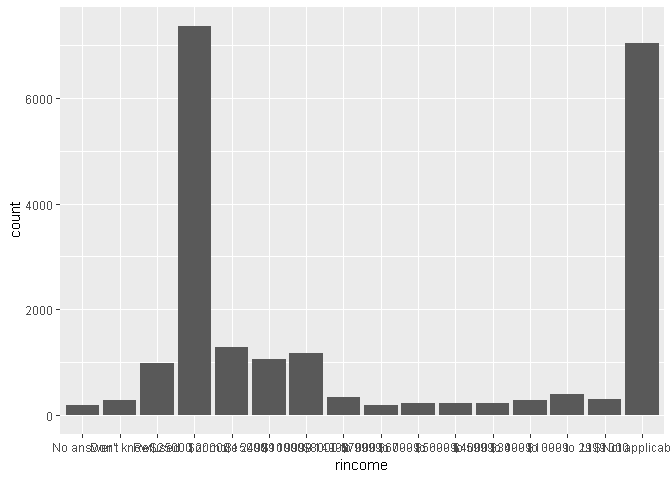<!-- -->

``` r
# 레벨이 너무 조밀하게 밀집되어서, 제대로 파악하기 어렵다. 팩터를 자르고 그래프를 그리면 더 보기 쉬울 것이다. 혹은 coord_flip()을 사용한다.
ggplot(data = gss_cat) +
  geom_bar(mapping = aes(x = rincome)) +
  coord_flip()
```

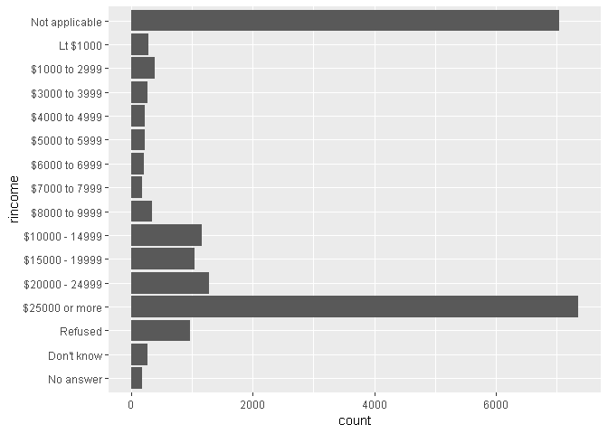<!-- -->

``` r
gss_cat %>% 
  dplyr::count(rincome)
```

    ## # A tibble: 16 x 2
    ##    rincome            n
    ##    <fct>          <int>
    ##  1 No answer        183
    ##  2 Don't know       267
    ##  3 Refused          975
    ##  4 $25000 or more  7363
    ##  5 $20000 - 24999  1283
    ##  6 $15000 - 19999  1048
    ##  7 $10000 - 14999  1168
    ##  8 $8000 to 9999    340
    ##  9 $7000 to 7999    188
    ## 10 $6000 to 6999    215
    ## 11 $5000 to 5999    227
    ## 12 $4000 to 4999    226
    ## 13 $3000 to 3999    276
    ## 14 $1000 to 2999    395
    ## 15 Lt $1000         286
    ## 16 Not applicable  7043

``` r
# 2. 이 설문에서 가장 많은 relig는 무엇인가? 가장 많은 partyid는 무엇인가?
table(gss_cat$relig) %>% sort(decreasing = TRUE) %>% head(3) %>% plot()
```

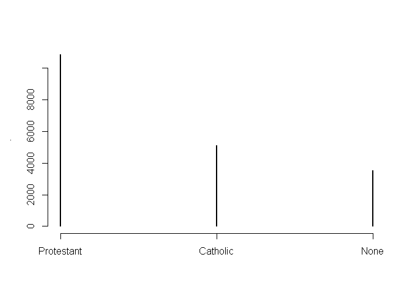<!-- -->

``` r
table(gss_cat$partyid) %>% sort(decreasing = TRUE) %>% head(3) %>% plot()
```

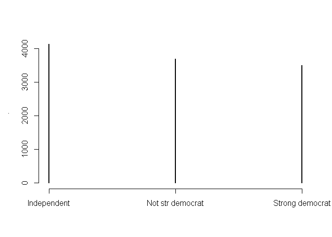<!-- -->

``` r
# 3. denom(교파)은 어떤 relig에 적용되는가? 테이블로 어떻게 알아낼 수 있는가?
gss_cat %>% 
  dplyr::count(relig, denom) %>% 
  head(n = 10)
```

    ## # A tibble: 10 x 3
    ##    relig                   denom               n
    ##    <fct>                   <fct>           <int>
    ##  1 No answer               No answer          93
    ##  2 Don't know              Not applicable     15
    ##  3 Inter-nondenominational Not applicable    109
    ##  4 Native american         Not applicable     23
    ##  5 Christian               No answer           2
    ##  6 Christian               Don't know         11
    ##  7 Christian               No denomination   452
    ##  8 Christian               Not applicable    224
    ##  9 Orthodox-christian      Not applicable     95
    ## 10 Moslem/islam            Not applicable    104

# 4\. 팩터 순서 수정하기

시각화에서 팩터 레벨의 순서를 변경하는 것이 유용할 때가 종종 있다. **fct\_reorder함수**를 사용하여 레벨을
재정렬해서 개선할 수 있다. fct\_reorder의 인자는 다음과 같다.

  - f : 레벨을 수정할 팩터
  - x : 레벨을 재정렬하기 위해 사용할 수치형 벡터
  - 선택적으로 fun : f의 각 값에 대해 x값이 여러 개가 있을 때 사용할 함수. 기본값은 median이다.

<!-- end list -->

``` r
# 하루 TV 시청시간의 평균 탐색해보기
gss_cat %>% 
  dplyr::group_by(relig) %>% 
  dplyr::summarise(age = mean(age, na.rm = TRUE),
                   tvhours = mean(tvhours, na.rm = TRUE),
                   n = n()) %>% 
  ggplot() +
  geom_point(mapping = aes(x = tvhours,
                           y = relig))
```

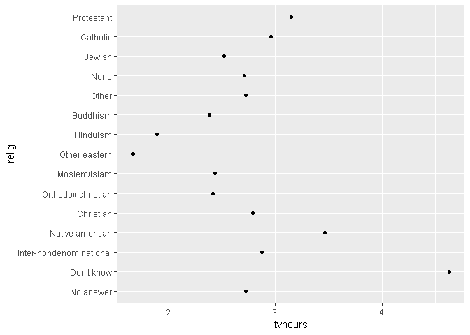<!-- -->

``` r
# 레벨을 재정렬한 그래프
# 잠깐만... 이거 그냥 reorder랑 차이가 뭐지?
gss_cat %>% 
  dplyr::group_by(relig) %>% 
  dplyr::summarise(age = mean(age, na.rm = TRUE),
                   tvhours = mean(tvhours, na.rm = TRUE),
                   n = n()) %>% 
  ggplot() +
  geom_point(mapping = aes(x = tvhours,
                           y = fct_reorder(relig, tvhours)))
```

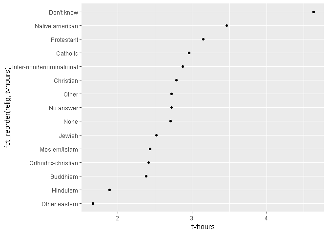<!-- -->

**레벨을 임의로 재정렬하는 것은 항상 좋은 것만은 아니다.** 예를 들어서 gss\_cat에서 rincome 변수의 경우에는
이미 원칙에 맞는 정렬이 되어 있어서 건드리면 좋지 못하다. fct\_reorder()는 레벨이 임의적으로 정렬된 팩터의
경우에만 사용해야 한다.

한편 **fct\_relevel함수**를 사용하면 레벨을 앞으로 옮길 수도 있다.

``` r
# fct_relevel 사용하기
gss_cat %>% 
  dplyr::group_by(rincome) %>% 
  dplyr::summarise(age = mean(age, na.rm = TRUE),
                   tvhours = mean(tvhours, na.rm = TRUE),
                   n = n()) %>% 
  ggplot() +
  geom_point(mapping = aes(age, fct_relevel(rincome, "Not applicable")))
```

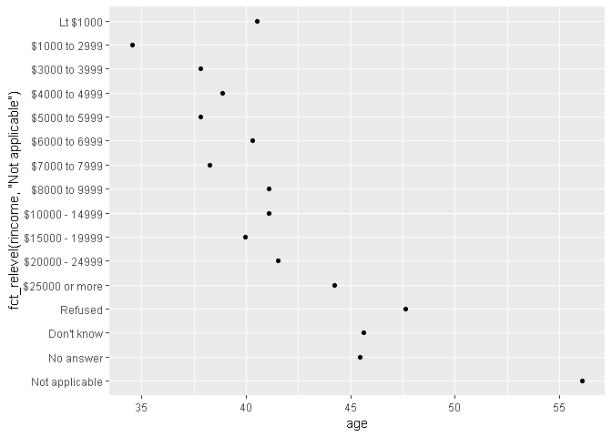<!-- -->

**fct\_reorder2함수**는 가장 큰 x 값과 연관된 y값으로 팩터형을 재정렬한다. 플롯의 선에 색상을 입힐 때, 선
색상은 범례와 정렬되므로 이 함수를 사용하면 플롯 읽기가 쉬워진다.

마지막으로, **fct\_infreq함수**를 사용해 빈도 오름차순으로 레벨을 정렬할 수도 있다. 추가 변수가 필요 없어서 재정렬
방법 중 가장 간단한 유형이다. **fct\_rev함수와 조합**하여 사용할 수 있다.

``` r
# fct_infreq와 fct_rev를 이용한, 재정렬
gss_cat %>% 
  dplyr::mutate(marital = marital %>% fct_infreq() %>% fct_rev()) %>% 
  ggplot(mapping = aes(marital)) +
  geom_bar()
```

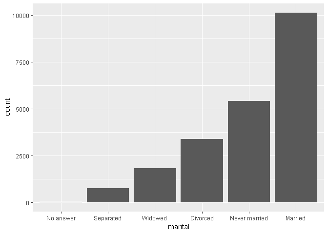<!-- -->

# 5\. 팩터 레벨 수정하기

레벨의 순서 변경보다 값을 변경하는 게 더 강력한 방법이다. 이렇게 하면 화면 출력 시 라벨을 명확히 할 수 있고, 레벨을
병합하여 상위 레벨 시각화를 할 수 있다. 가장 일반적이고 강력한 것은 **fct\_recode**이다. 이를
사용하여 각 레벨값을 다시 주거나 변경할 수 있다.

다수의 레벨을 병합하고자 하면, **fct\_collapse함수**가 유용하다.

플롯이나 테이블을 간단하게 만들기 위해 소규모 그룹 모두를 묶고 싶을 경우, **fct\_lump**를 사용한다.

``` r
# fct_recode를 통해 레벨을 병합하고, 이름 변경하기
gss_cat %>% 
  dplyr::mutate(partyid = fct_recode(partyid,
                                     "Republican, strong" = "Strong republican",
                                     "Republican, weak" = "Not str republican",
                                     "Independent, near rep" = "Ind,near rep",
                                     "Independent, near dem" = "Ind,near dem",
                                     "Democrat, weak" = "Not str democrat",
                                     "Democrat, strong" = "Strong democrat",
                                     "Other" = "No answer",
                                     "Other" = "Don't know",
                                     "Other" = "Other party")) %>% 
  count(partyid)
```

    ## # A tibble: 8 x 2
    ##   partyid                   n
    ##   <fct>                 <int>
    ## 1 Other                   548
    ## 2 Republican, strong     2314
    ## 3 Republican, weak       3032
    ## 4 Independent, near rep  1791
    ## 5 Independent            4119
    ## 6 Independent, near dem  2499
    ## 7 Democrat, weak         3690
    ## 8 Democrat, strong       3490

``` r
# fct_collapse를 사용하여 다수 레벨 병합하기
gss_cat %>% 
  dplyr::mutate(partyid = fct_collapse(partyid,
                                       other = c("No answer",
                                                 "Don't know",
                                                 "Other party"),
                                       rep = c("Strong republican", 
                                               "Not str republican"),
                                       ind = c("Ind,near rep",
                                               "Independent",
                                               "Ind,near dem"),
                                       dem = c("Not str democrat",
                                               "Strong democrat"))) %>% 
  count(partyid)
```

    ## # A tibble: 4 x 2
    ##   partyid     n
    ##   <fct>   <int>
    ## 1 other     548
    ## 2 rep      5346
    ## 3 ind      8409
    ## 4 dem      7180

``` r
# fct_lump를 활용한 병합
gss_cat %>% 
  dplyr::mutate(relig = fct_lump(relig)) %>% 
  count(relig)
```

    ## # A tibble: 2 x 2
    ##   relig          n
    ##   <fct>      <int>
    ## 1 Protestant 10846
    ## 2 Other      10637

``` r
# 유지하고 싶은 그룹의 수를 지정할 수도 있다.
gss_cat %>% 
  dplyr::mutate(relig = fct_lump(relig, n = 10)) %>% 
  count(relig)
```

    ## # A tibble: 10 x 2
    ##    relig                       n
    ##    <fct>                   <int>
    ##  1 Inter-nondenominational   109
    ##  2 Christian                 689
    ##  3 Orthodox-christian         95
    ##  4 Moslem/islam              104
    ##  5 Buddhism                  147
    ##  6 None                     3523
    ##  7 Jewish                    388
    ##  8 Catholic                 5124
    ##  9 Protestant              10846
    ## 10 Other                     458

# 13장 : Lubridate로 하는 날짜와 시간

# 1\. 들어가기

이 장에서는 R에서 날짜와 시간을 다루는 법을 볼 것이다.

  - 1년은 항상 365일인가?
  - 1일은 항상 24시간인가?
  - 1분은 항상 60초인가?

## 1.1 준비하기

이 장에서는 lubridate 패키지를 주로 살펴볼 것인데, 이 패키지를 사용하면 R에서 날짜와 시간을 다룰 수 있다.
lubridate는 날짜/시간 작업을 할 때만 필요하기 때문에 tidyverse의 구성원이 아니다. 실습 데이터로 이용할
nycflights13도 필요하다.

``` r
library(lubridate)
```

    ## Warning: package 'lubridate' was built under R version 3.6.1

    ## 
    ## Attaching package: 'lubridate'

    ## The following object is masked from 'package:base':
    ## 
    ##     date

``` r
library(nycflights13)
```

# 2\. 날짜/시간 생성

  - 데이트형(date) : 날짜. 티블에서 <date>로 출력한다.
  - 타임형(time) : 하루 중 시간. 티블에서 <time>으로 출력한다.
  - 데이트-타임형(date-time) : 날짜 더하기 시간. 시점을 고유하게 식별한다. 티블에서 <dttm>으로 출력한다.
    R의 몇몇 부분에서는 **POSIXct**이라고 부른다.

<!-- end list -->

``` r
# 날짜
today()
```

    ## [1] "2019-08-03"

``` r
# 현재 날짜와 시간
now()
```

    ## [1] "2019-08-03 03:40:43 KST"

**이 외에 날짜/시간을 생성하는 방법은 세 가지이다.**

  - 문자열로부터
  - 개별 데이트-타임형 구성요소로부터
  - 기존의 날짜/시간 객체로부터

## 2.1 문자열에서 생성하기

``` r
# y : 년
# m : 월
# d : 일
ymd("2019-08-01")
```

    ## [1] "2019-08-01"

``` r
mdy("January 31st, 2017")
```

    ## [1] "2017-03-01"

``` r
dmy("31-Jan-2017")
```

    ## [1] "2017-01-31"

``` r
# 이 함수들은 따옴표 없이 입력할 수 있다.
ymd(20170131)
```

    ## [1] "2017-01-31"

``` r
# 데이트-타임형을 생성하려면 파싱 함수 이름에 언더스코어와 h, m, s 중 하나 이상은 추가한다.
ymd_hms("2017-01-31 20:11:59")
```

    ## [1] "2017-01-31 20:11:59 UTC"

## 2.2 개별 구성요소에서 생성하기

데이트-타임형의 개별 구성요소들이 여러 열에 걸쳐 있는 경우가 있다. 그럴 경우에는, **데이트형을 만들고자 할 때
make\_date함수를, 데이트-타임형은 make\_datetime을 쓰면 된다.**

``` r
# 날짜가 따로따로 분포되어있는 케이스
flights %>% 
  dplyr::select(year, month, day, hour, minute)
```

    ## # A tibble: 336,776 x 5
    ##     year month   day  hour minute
    ##    <int> <int> <int> <dbl>  <dbl>
    ##  1  2013     1     1     5     15
    ##  2  2013     1     1     5     29
    ##  3  2013     1     1     5     40
    ##  4  2013     1     1     5     45
    ##  5  2013     1     1     6      0
    ##  6  2013     1     1     5     58
    ##  7  2013     1     1     6      0
    ##  8  2013     1     1     6      0
    ##  9  2013     1     1     6      0
    ## 10  2013     1     1     6      0
    ## # ... with 336,766 more rows

``` r
# make_datetime
flights %>% 
  dplyr::select(year, month, day, hour, minute) %>% 
  dplyr::mutate(departure = make_datetime(year, month, day, hour, minute))
```

    ## # A tibble: 336,776 x 6
    ##     year month   day  hour minute departure          
    ##    <int> <int> <int> <dbl>  <dbl> <dttm>             
    ##  1  2013     1     1     5     15 2013-01-01 05:15:00
    ##  2  2013     1     1     5     29 2013-01-01 05:29:00
    ##  3  2013     1     1     5     40 2013-01-01 05:40:00
    ##  4  2013     1     1     5     45 2013-01-01 05:45:00
    ##  5  2013     1     1     6      0 2013-01-01 06:00:00
    ##  6  2013     1     1     5     58 2013-01-01 05:58:00
    ##  7  2013     1     1     6      0 2013-01-01 06:00:00
    ##  8  2013     1     1     6      0 2013-01-01 06:00:00
    ##  9  2013     1     1     6      0 2013-01-01 06:00:00
    ## 10  2013     1     1     6      0 2013-01-01 06:00:00
    ## # ... with 336,766 more rows

## 2.3 flights 데이터의 날짜/시간 편집하기

``` r
# 데이터의 구조
str(flights)
```

    ## Classes 'tbl_df', 'tbl' and 'data.frame':    336776 obs. of  19 variables:
    ##  $ year          : int  2013 2013 2013 2013 2013 2013 2013 2013 2013 2013 ...
    ##  $ month         : int  1 1 1 1 1 1 1 1 1 1 ...
    ##  $ day           : int  1 1 1 1 1 1 1 1 1 1 ...
    ##  $ dep_time      : int  517 533 542 544 554 554 555 557 557 558 ...
    ##  $ sched_dep_time: int  515 529 540 545 600 558 600 600 600 600 ...
    ##  $ dep_delay     : num  2 4 2 -1 -6 -4 -5 -3 -3 -2 ...
    ##  $ arr_time      : int  830 850 923 1004 812 740 913 709 838 753 ...
    ##  $ sched_arr_time: int  819 830 850 1022 837 728 854 723 846 745 ...
    ##  $ arr_delay     : num  11 20 33 -18 -25 12 19 -14 -8 8 ...
    ##  $ carrier       : chr  "UA" "UA" "AA" "B6" ...
    ##  $ flight        : int  1545 1714 1141 725 461 1696 507 5708 79 301 ...
    ##  $ tailnum       : chr  "N14228" "N24211" "N619AA" "N804JB" ...
    ##  $ origin        : chr  "EWR" "LGA" "JFK" "JFK" ...
    ##  $ dest          : chr  "IAH" "IAH" "MIA" "BQN" ...
    ##  $ air_time      : num  227 227 160 183 116 150 158 53 140 138 ...
    ##  $ distance      : num  1400 1416 1089 1576 762 ...
    ##  $ hour          : num  5 5 5 5 6 5 6 6 6 6 ...
    ##  $ minute        : num  15 29 40 45 0 58 0 0 0 0 ...
    ##  $ time_hour     : POSIXct, format: "2013-01-01 05:00:00" "2013-01-01 05:00:00" ...

``` r
# flights 데이터의 구조를 살펴보면 알 수 있듯이, year, month, day가 따로따로 나뉘어져 있으며 dep_time과 arr_time의 경우 상당히 독특한 형식으로 기록되어 있다. 따라서 개별요소를 파싱하고, 데이트-타임형을 새롭게 생성하는 함수가 필요하다.


# 시간을 합쳐주는 함수를 데이터의 형식에 맞게 새롭게 생성
make_datetime_100 <- function(year, month, day, time) {
  
  make_datetime(year, month, day, time %/% 100, time %% 100)
  
}


# flights.dt 객체 생성
flights.dt <- flights %>% 
  dplyr::filter(!is.na(dep_time), !is.na(arr_time)) %>% 
  mutate(dep_time = make_datetime_100(year, month, day, dep_time),
         arr_time = make_datetime_100(year, month, day, arr_time),
         sched_dep_time = make_datetime_100(year, month, day, sched_dep_time),
         sched_arr_time = make_datetime_100(year, month, day, sched_arr_time)) %>% 
  select(origin, dest, ends_with("delay"), ends_with("time"))
```

## 2.4 기타 유형에서 생성

데이트-타임형과 데이트형 사이를 상호 전환하고 싶을 때도 있을 것이다. as\_datetime과 as\_date가 바로 이를
수행한다.

``` r
# 데이트형을 데이트타임형으로
as_datetime(today())
```

    ## [1] "2019-08-03 UTC"

``` r
# 타임형을 데이트형으로
as_date(now())
```

    ## [1] "2019-08-03"

``` r
# 유닉스 기준 시각(1970년 1월 1일부터 흐른 시간)일 경우,
# as_datetime은 초 단위
# as_date는 일 단위
as_datetime(60*60*10)
```

    ## [1] "1970-01-01 10:00:00 UTC"

``` r
as_date(365*10+2)
```

    ## [1] "1980-01-01"

## 2.5 연습문제

``` r
# 적절한 lubridate 함수를 사용하여 날짜를 파싱하라.
d1 <- c("August 19 (2015)", "July 1 (2015)")
d2 <- "12/30/14"


mdy(d1)
```

    ## [1] "2015-01-09" "2015-01-20"

``` r
mdy(d2)
```

    ## [1] "2014-12-30"

# 3\. 데이트-타임형 구성요소

이 절에서는 개별 구성요소를 얻고 설정하는 설정 함수에 초점을 맞춘다. 다음 절에서는 산술연산이 데이트-타임형에 어떻게 동작하는지
살펴볼 것이다.

## 3.1 구성요소 불러오기

``` r
datetime <- ymd_hms("2016-07-08 12:34:56")

year(datetime)
```

    ## [1] 2016

``` r
month(datetime)
```

    ## [1] 7

``` r
day(datetime)
```

    ## [1] 8

``` r
hour(datetime)
```

    ## [1] 12

``` r
minute(datetime)
```

    ## [1] 34

``` r
second(datetime)
```

    ## [1] 56

``` r
# 한 달에서의 일
mday(datetime)
```

    ## [1] 8

``` r
# 한 해에서의 일
yday(datetime)
```

    ## [1] 190

``` r
# 한 주에서의 일
wday(datetime)
```

    ## [1] 6

``` r
# 월이나 일의 약식 이름 반환
month(datetime, label = TRUE)
```

    ## [1] 7
    ## Levels: 1 < 2 < 3 < 4 < 5 < 6 < 7 < 8 < 9 < 10 < 11 < 12

``` r
wday(datetime, label = TRUE)
```

    ## [1] 금
    ## Levels: 일 < 월 < 화 < 수 < 목 < 금 < 토

``` r
# 이름 전체를 반환
month(datetime, label = TRUE, abbr = FALSE)
```

    ## [1] 7월
    ## 12 Levels: 1월 < 2월 < 3월 < 4월 < 5월 < 6월 < 7월 < 8월 < ... < 12월

``` r
wday(datetime, label = TRUE, abbr = FALSE)
```

    ## [1] 금요일
    ## 7 Levels: 일요일 < 월요일 < 화요일 < 수요일 < 목요일 < ... < 토요일

교재(231\~234p)에는 flights 데이터를 이용한 실습이 있지만, 생략하도록 한다. 궁금하거나 데이터 시각화에 활용할
방안이 떠오르지 않는다면, 교재를 보면 된다.

## 3.2 반올림

**floor\_date, round\_date, ceiling\_date** 함수를 이용하여 인근 시간 단위로 날짜를 내림,
반올림, 올림을 할 수 있다.

``` r
datetime <- ymd("2019-08-01")

floor_date(datetime, "week")
```

    ## [1] "2019-07-28"

``` r
round_date(datetime, "week")
```

    ## [1] "2019-08-04"

``` r
ceiling_date(datetime, "week")
```

    ## [1] "2019-08-04"

## 3.3 구성요소 설정

설정 함수를 사용하여 날짜/시간의 구성요소를 설정할 수 있다.

``` r
# 시간 설정
datetime <- ymd_hms("2016-07-08 12:34:56")
datetime
```

    ## [1] "2016-07-08 12:34:56 UTC"

``` r
# 개발 구성요소 수정하기
year(datetime) <- 2020
month(datetime) <- 01
hour(datetime) <- hour(datetime) + 1

# 다시 확인하기
datetime
```

    ## [1] "2020-01-08 13:34:56 UTC"

``` r
# update() 함수를 통해서 새로운 데이트-타임형을 생성할 수도 있다. 이 방법을 사용하여 여러 개의 값을 한 번에 설정할 수도 있다.
update(datetime, year = 2020, month = 2, mday = 2, hour = 2)
```

    ## [1] "2020-02-02 02:34:56 UTC"

``` r
# 응용 : 관심 있는 해의 하루 동안 항공편의 분포 그래프
flights.dt %>% 
  mutate(dep_hour = update(dep_time, yday = 1)) %>% 
  ggplot(aes(dep_hour)) +
  geom_freqpoly(binwidth = 300)
```

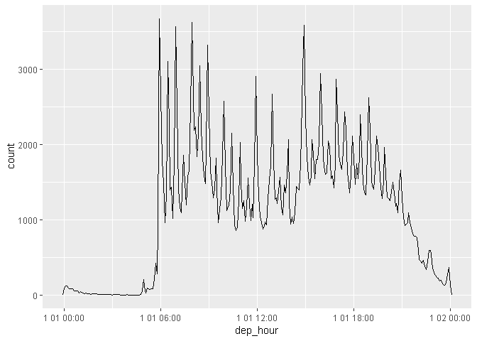<!-- -->

## 3.4 연습문제(236p)

``` r
# 1. 하루 동안 비행시간의 분포는 한 해 동안 어떻게 변화했는가?
flights.dt %>% 
  mutate(dep_hour = update(dep_time, year = 2013)) %>% 
  ggplot(aes(dep_hour)) +
  geom_freqpoly(binwidth = 300)
```

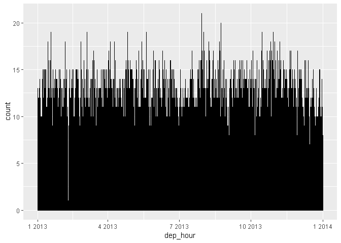<!-- -->

``` r
# 2. dep_time, sched_dep_time, dep_delay를 비교하라. 일관성이 있는가.
# 당연히 있지... dep_time - sched_dep_time = dep_delay 잖아
ggplot(data = flights.dt) +
  geom_freqpoly(mapping = aes(x = dep_time,
                              color = "red")) +
  geom_freqpoly(mapping = aes(x = sched_dep_time,
                              color = "blue"))
```

    ## `stat_bin()` using `bins = 30`. Pick better value with `binwidth`.
    ## `stat_bin()` using `bins = 30`. Pick better value with `binwidth`.

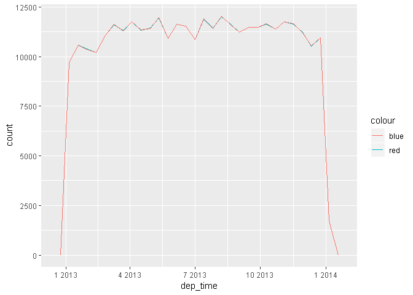<!-- -->

``` r
# 3. 출발, 도착 사이의 시간과 air_time 비교해보기
ggplot(data = flights.dt) +
  geom_freqpoly(mapping = aes(x = arr_time - dep_time,
                              color = "arr_time - dep_time")) +
  geom_freqpoly(mapping = aes(x = air_time,
                              color = "air_time"))
```

    ## Don't know how to automatically pick scale for object of type difftime. Defaulting to continuous.
    ## `stat_bin()` using `bins = 30`. Pick better value with `binwidth`.
    ## `stat_bin()` using `bins = 30`. Pick better value with `binwidth`.

    ## Warning: Removed 717 rows containing non-finite values (stat_bin).

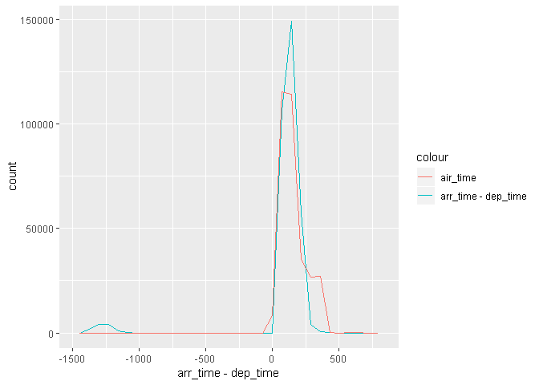<!-- -->

``` r
# 4. 하루 동안 평균 지연시간은 어떻게 변화하는가?
nrow(flights.dt)
```

    ## [1] 328063

``` r
summary(flights.dt)
```

    ##     origin              dest             dep_delay      
    ##  Length:328063      Length:328063      Min.   : -43.00  
    ##  Class :character   Class :character   1st Qu.:  -5.00  
    ##  Mode  :character   Mode  :character   Median :  -2.00  
    ##                                        Mean   :  12.58  
    ##                                        3rd Qu.:  11.00  
    ##                                        Max.   :1301.00  
    ##                                                         
    ##    arr_delay           dep_time                  
    ##  Min.   : -86.000   Min.   :2013-01-01 05:17:00  
    ##  1st Qu.: -17.000   1st Qu.:2013-04-05 06:00:30  
    ##  Median :  -5.000   Median :2013-07-04 09:12:00  
    ##  Mean   :   6.895   Mean   :2013-07-03 17:41:27  
    ##  3rd Qu.:  14.000   3rd Qu.:2013-10-01 17:18:00  
    ##  Max.   :1272.000   Max.   :2013-12-31 23:56:00  
    ##  NA's   :717                                     
    ##  sched_dep_time                   arr_time                  
    ##  Min.   :2013-01-01 05:15:00   Min.   :2013-01-01 00:03:00  
    ##  1st Qu.:2013-04-05 06:05:00   1st Qu.:2013-04-05 07:09:00  
    ##  Median :2013-07-04 09:15:00   Median :2013-07-04 11:06:00  
    ##  Mean   :2013-07-03 17:34:10   Mean   :2013-07-03 19:12:28  
    ##  3rd Qu.:2013-10-01 17:16:00   3rd Qu.:2013-10-01 19:18:00  
    ##  Max.   :2013-12-31 23:59:00   Max.   :2014-01-01 00:00:00  
    ##                                                             
    ##  sched_arr_time                   air_time    
    ##  Min.   :2013-01-01 00:05:00   Min.   : 20.0  
    ##  1st Qu.:2013-04-05 07:34:00   1st Qu.: 82.0  
    ##  Median :2013-07-04 11:20:00   Median :129.0  
    ##  Mean   :2013-07-03 19:30:48   Mean   :150.7  
    ##  3rd Qu.:2013-10-01 19:40:00   3rd Qu.:192.0  
    ##  Max.   :2013-12-31 23:59:00   Max.   :695.0  
    ##                                NA's   :717

``` r
# 일단 이 자료가 1년치 자료니까... 1일 전체의 운항 중에서 지연시간을 mean을 하여 1행을 만들고 2일도 마찬가지로 하고.... 아마도 새롭게 변수를 만들어야 할 것 같은데? 새롭게 만들어야 할 것 같다...

# 1일마다 평균 지연시간을 담을 객체
day.mean.delay <- c()

# 총 365일. 정확히 1년치 데이터이다.
length(table(yday(flights.dt$dep_time)))
```

    ## [1] 365

``` r
# 우리가 조사해야할 자료는 지연시간... dep_delay + arr_delay인 것 같다.
str(flights.dt)
```

    ## Classes 'tbl_df', 'tbl' and 'data.frame':    328063 obs. of  9 variables:
    ##  $ origin        : chr  "EWR" "LGA" "JFK" "JFK" ...
    ##  $ dest          : chr  "IAH" "IAH" "MIA" "BQN" ...
    ##  $ dep_delay     : num  2 4 2 -1 -6 -4 -5 -3 -3 -2 ...
    ##  $ arr_delay     : num  11 20 33 -18 -25 12 19 -14 -8 8 ...
    ##  $ dep_time      : POSIXct, format: "2013-01-01 05:17:00" "2013-01-01 05:33:00" ...
    ##  $ sched_dep_time: POSIXct, format: "2013-01-01 05:15:00" "2013-01-01 05:29:00" ...
    ##  $ arr_time      : POSIXct, format: "2013-01-01 08:30:00" "2013-01-01 08:50:00" ...
    ##  $ sched_arr_time: POSIXct, format: "2013-01-01 08:19:00" "2013-01-01 08:30:00" ...
    ##  $ air_time      : num  227 227 160 183 116 150 158 53 140 138 ...

``` r
# 새로운 데이터 프레임 객체 생성
mean.delay <- flights.dt %>%
  dplyr::mutate(add_delay = dep_delay + arr_delay) %>% 
  dplyr::select(ends_with("time"), add_delay)

# 반복문을 통한 1일 평균 지연시간. 총 365일이므로 365행이다.
for (i in 1:length(table(yday(flights.dt$dep_time)))) {
  
  day.mean.delay <- rbind(day.mean.delay,
                            sum(mean.delay[yday(mean.delay$dep_time) == i, "add_delay"], na.rm = TRUE) / nrow(mean.delay[yday(mean.delay$dep_time) == i, "add_delay"]))
  
}

# 길이 확인해보기
length(day.mean.delay)
```

    ## [1] 365

``` r
# 둘째 자리 까지만 표시하기
day.mean.delay <- day.mean.delay %>% round(digits = 2)

# 데이터 프레임 객체로 만들기
day.mean.frame <- data.frame(key = 1:length(day.mean.delay),
                             day_mean_delay = day.mean.delay)

# 산점도 그래프
ggplot(data = day.mean.frame) +
  geom_point(mapping = aes(x = key,
                           y = day_mean_delay,
                           size = day.mean.delay,
                           color = day.mean.delay))
```

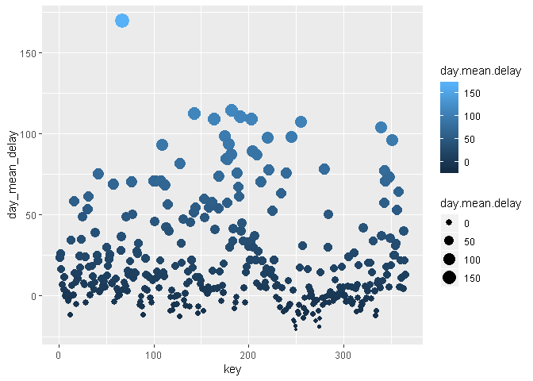<!-- -->

# 4\. 시간 범위

뺄셈, 덧셈, 나눗셈 같은 산술연산을 데이트형에 적용할 수 있다. ( 이미 위에서 했지만 ) **시간 범위(time span)를
대표하는 중요한 클래스 세 가지가 있다.**

  - 듀레이션형(duration) : 정확한 초를 나타냄
  - 피리어드형(period) : 주와 월과 같은 사람의 단위를 나타냄
  - 인터벌형(interval) : 시점과 종점을 나타냄

## 4.1 듀레이션형

R에서 두 데이트형 뺄셈을 하면 **difftime형 객체**가 생긴다.

``` r
# 해들리의 나이는? 
h_age <- today() - ymd(19791014)

h_age
```

    ## Time difference of 14538 days

**difftime 클래스 객체는 초, 분, 시, 일 또는 주의 시간 범위를 기록한다.** 이러한 애매함 때문에
difftime형으로 작업하는 것이 약간 고통스러울 수 있다. 따라서 **lubridate는 항상 초를 사용하는 대안
클래스, 듀레이션형을 제공한다.**

듀레이션형은 정확한 초로 표시하므로, 일광절약제가 있는 경우에는 예상치 못한 결과나 나올 수 있다는 점을 주의하라.

``` r
# 듀레이션형
as.duration(h_age)
```

    ## [1] "1256083200s (~39.8 years)"

``` r
# 듀레이션형의 편리한 생성자들
# 초, 분, 시간, 일, 주, 년 시간 단위들을 초로 표시해준다.
dseconds(15)
```

    ## [1] "15s"

``` r
dminutes(10)
```

    ## [1] "600s (~10 minutes)"

``` r
dhours(c(12, 24))
```

    ## [1] "43200s (~12 hours)" "86400s (~1 days)"

``` r
ddays(0:5)
```

    ## [1] "0s"                "86400s (~1 days)"  "172800s (~2 days)"
    ## [4] "259200s (~3 days)" "345600s (~4 days)" "432000s (~5 days)"

``` r
dweeks(3)
```

    ## [1] "1814400s (~3 weeks)"

``` r
dyears(1)
```

    ## [1] "31536000s (~52.14 weeks)"

``` r
# 듀레이션은 연산 가능하다
2 * dyears(1)
```

    ## [1] "63072000s (~2 years)"

``` r
dyears(1) + dweeks(12) + dhours(15)
```

    ## [1] "38847600s (~1.23 years)"

``` r
# 일(day)에서 듀레이션형을 더하고 뺄 수 있다
tomorrow <- today() + ddays(1)
last_year <- today() - dyears(1)
```

## 4.2 피리어드형

듀레이션형의 일광절약제 등의 문제를 해결하기 위해 lubridate는 피리어드형을 제공한다. 피리어드형은 시간 범위이지만 정해진
초 길이가 없다. 대신 일과 월과 같은 “사람의” 시간으로 동작한다. 따라서 작동 방식이 좀 더 직관적이다.

``` r
# 피리어드형의 생산자들
seconds(15)
```

    ## [1] "15S"

``` r
minutes(10)
```

    ## [1] "10M 0S"

``` r
hours(c(12, 24))
```

    ## [1] "12H 0M 0S" "24H 0M 0S"

``` r
days(7)
```

    ## [1] "7d 0H 0M 0S"

``` r
months(1:6)
```

    ## [1] "1m 0d 0H 0M 0S" "2m 0d 0H 0M 0S" "3m 0d 0H 0M 0S" "4m 0d 0H 0M 0S"
    ## [5] "5m 0d 0H 0M 0S" "6m 0d 0H 0M 0S"

``` r
weeks(3)
```

    ## [1] "21d 0H 0M 0S"

``` r
years(1)
```

    ## [1] "1y 0m 0d 0H 0M 0S"

``` r
# 피리어드형 또한 더하거나 곱할 수 있다.
10 * (months(6) + days(1))
```

    ## [1] "60m 10d 0H 0M 0S"

``` r
days(50) + hours(25) + minutes(2)
```

    ## [1] "50d 25H 2M 0S"

``` r
# 데이트형에 더해질 수 있으며, 듀레이션형과 달리 의도한 대로 동작한다.
ymd("2016-01-01") + dyears(1)
```

    ## [1] "2016-12-31"

``` r
ymd("2016-01-01") + years(1)
```

    ## [1] "2017-01-01"

``` r
# 피리어드를 사용하여 flights 데이터의 비행 날짜에 관한 문제를 해결하기

# 일부 항공편은 뉴욕시에서 출발하기 전에 목적지에 도착한 것처럼 보여진다.
# 이들은 심야 항공편이기 때문이다.
flights.dt %>% 
  dplyr::filter(arr_time < dep_time)
```

    ## # A tibble: 10,633 x 9
    ##    origin dest  dep_delay arr_delay dep_time            sched_dep_time     
    ##    <chr>  <chr>     <dbl>     <dbl> <dttm>              <dttm>             
    ##  1 EWR    BQN           9        -4 2013-01-01 19:29:00 2013-01-01 19:20:00
    ##  2 JFK    DFW          59        NA 2013-01-01 19:39:00 2013-01-01 18:40:00
    ##  3 EWR    TPA          -2         9 2013-01-01 20:58:00 2013-01-01 21:00:00
    ##  4 EWR    SJU          -6       -12 2013-01-01 21:02:00 2013-01-01 21:08:00
    ##  5 EWR    SFO          11       -14 2013-01-01 21:08:00 2013-01-01 20:57:00
    ##  6 LGA    FLL         -10        -2 2013-01-01 21:20:00 2013-01-01 21:30:00
    ##  7 EWR    MCO          41        43 2013-01-01 21:21:00 2013-01-01 20:40:00
    ##  8 JFK    LAX          -7       -24 2013-01-01 21:28:00 2013-01-01 21:35:00
    ##  9 EWR    FLL          49        28 2013-01-01 21:34:00 2013-01-01 20:45:00
    ## 10 EWR    FLL          -9       -14 2013-01-01 21:36:00 2013-01-01 21:45:00
    ## # ... with 10,623 more rows, and 3 more variables: arr_time <dttm>,
    ## #   sched_arr_time <dttm>, air_time <dbl>

``` r
# 심야 항공편의 도착시간에 days(1)을 더해서 문제를 해결할 수 있다.
flights.dt <- flights.dt %>% 
  mutate(overnight = arr_time < dep_time,
         arr_time = arr_time + days(overnight * 1),
         sched_arr_time = sched_arr_time + days(overnight * 1))

# 이제 더 이상 문제가 발생하지 않는다.
flights.dt %>% 
  filter(overnight, arr_time < dep_time)
```

    ## # A tibble: 0 x 10
    ## # ... with 10 variables: origin <chr>, dest <chr>, dep_delay <dbl>,
    ## #   arr_delay <dbl>, dep_time <dttm>, sched_dep_time <dttm>,
    ## #   arr_time <dttm>, sched_arr_time <dttm>, air_time <dbl>,
    ## #   overnight <lgl>

## 4.3 인터벌형

**인터벌형은 시작점이 있는 듀레이션형**이다. 듀레이션은 항상 초 단위로 표현하며 듀레이션형 1년은 365일에 해당하는 초로
정의된다. 하지만 2016년과 같은 윤년이라면, 366일을 반환해야 한다. 이 때 인터벌형은 기간이 정확히 얼마인지 확인할
수 있도록 만든다.

``` r
# 인터벌형을 통하여 기간 정확히 확인하기
next.year <- today() + years(1)
(today() %--% next.year) / ddays(1)
```

    ## [1] 366

``` r
# 인터벌형이 피리어드형 얼마에 해당하는지 확인하려면 정수 나누기를 사용해야 한다.
(today() %--% next.year) %/% days(1)
```

    ## Note: method with signature 'Timespan#Timespan' chosen for function '%/%',
    ##  target signature 'Interval#Period'.
    ##  "Interval#ANY", "ANY#Period" would also be valid

    ## [1] 366

## 4.4 요약

듀레이션형, 피리어드형, 인터벌형 중에서 선택은 어떻게 해야 하는가? 주어진 문제를 해결하는 가장 간단한 데이터 구조를 택하면
된다.

  - 물리적 시간만 고려하는 경우 듀레이션형
  - 사람의 시간을 추가해야 하는 경우에는 피리어드형
  - 인간이 사용하는 시간 단위로 파악해야 하는 경우에는 인터벌형

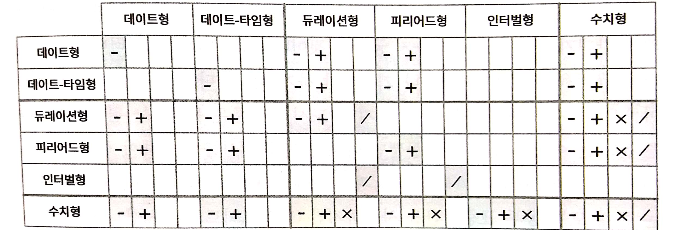

위의 그림은 다른 데이터 유형 사이에 허용된 산술연산을 요약한 것이다.

# 5\. 시간대

R은 국제 표준 IANA 시간대를 사용한다. <대륙> / <도시> 형태로 /를 쓰는 일관된 명명 체계를 사용한다.

R에서 시간대는 출력 제어만 하는 데이트-타임형의 한 속성이다.

``` r
# 현재 R이 인식하고 있는 시간대 확인하기
Sys.timezone()
```

    ## [1] "Asia/Seoul"

``` r
# OlsonNames() : 모든 시간대 목록 확인하기
length(OlsonNames())
```

    ## [1] 593

``` r
# 아래의 세 가지 객체는 같은 시점을 나타낸다.
x1 <- ymd_hms("2015-06-01 12:00:00", tz = "America/New_York")
x2 <- ymd_hms("2015-06-01 18:00:00", tz = "Europe/Copenhagen")
x3 <- ymd_hms("2015-06-02 04:00:00", tz = "Pacific/Auckland")


# 시간대 변경 방법 1 : 시각을 유지하고 표시 방법만을 변경한다.
x4 <- c(x1, x2, x3)
x5 <- with_tz(x4, tzone = "Australia/Lord_Howe")

# 동일한 시점이지만, 시각은 원래대로 유지되고 표시 방법이 다르다.
x5 - x4
```

    ## Time differences in secs
    ## [1] 0 0 0

``` r
x5
```

    ## [1] "2015-06-02 02:30:00 +1030" "2015-06-02 02:30:00 +1030"
    ## [3] "2015-06-02 02:30:00 +1030"

``` r
x4
```

    ## [1] "2015-06-01 12:00:00 EDT" "2015-06-01 12:00:00 EDT"
    ## [3] "2015-06-01 12:00:00 EDT"

``` r
# 시간대 변경 방법 2 : 기본 시각을 변경한다.
x6 <- force_tz(x4, tzone = "Australia/Lord_Howe")

x4
```

    ## [1] "2015-06-01 12:00:00 EDT" "2015-06-01 12:00:00 EDT"
    ## [3] "2015-06-01 12:00:00 EDT"

``` r
x6
```

    ## [1] "2015-06-01 12:00:00 +1030" "2015-06-01 12:00:00 +1030"
    ## [3] "2015-06-01 12:00:00 +1030"

``` r
# 시각에 잘못된 시간대가 붙어 있다면 이를 수정하기 위해 이 방법을 사용한다.
x6-x4
```

    ## Time differences in hours
    ## [1] -14.5 -14.5 -14.5
