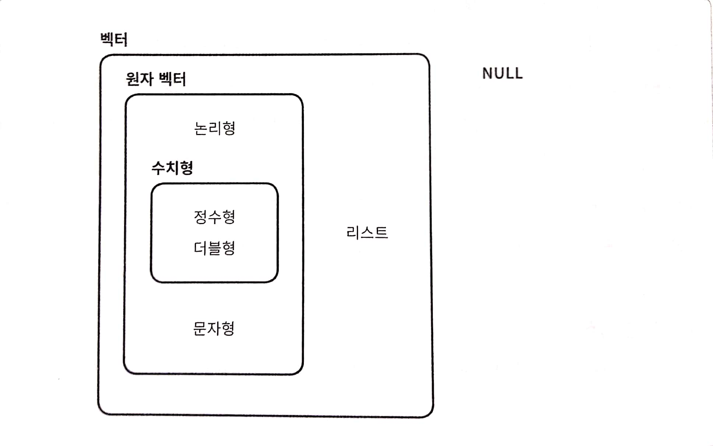
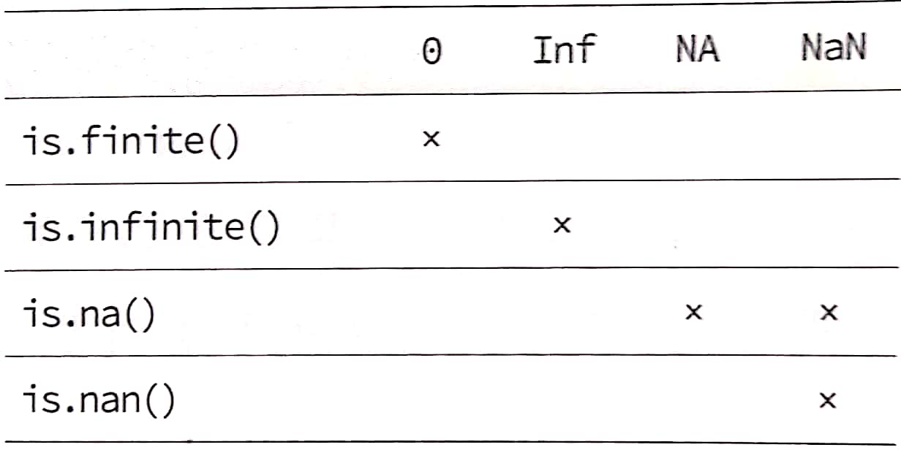
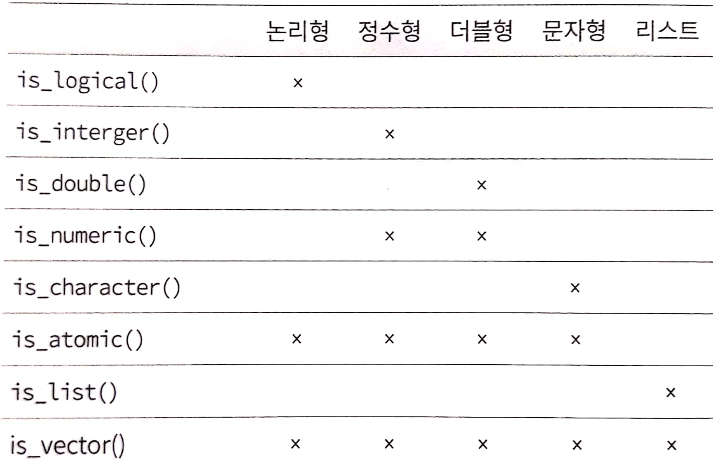

16장 : 벡터
================
huimin
2019 8 5

# 기초 설정

``` r
library(tidyverse)
```

    ## Warning: package 'tidyverse' was built under R version 3.6.1

    ## Registered S3 methods overwritten by 'ggplot2':
    ##   method         from 
    ##   [.quosures     rlang
    ##   c.quosures     rlang
    ##   print.quosures rlang

    ## Registered S3 method overwritten by 'rvest':
    ##   method            from
    ##   read_xml.response xml2

    ## -- Attaching packages -------------------------------- tidyverse 1.2.1 --

    ## √ ggplot2 3.1.1       √ purrr   0.3.2  
    ## √ tibble  2.1.1       √ dplyr   0.8.0.1
    ## √ tidyr   0.8.3       √ stringr 1.4.0  
    ## √ readr   1.3.1       √ forcats 0.4.0

    ## -- Conflicts ----------------------------------- tidyverse_conflicts() --
    ## x dplyr::filter() masks stats::filter()
    ## x dplyr::lag()    masks stats::lag()

``` r
library(purrr)
library(readr)
library(lubridate)
```

    ## Warning: package 'lubridate' was built under R version 3.6.1

    ## 
    ## Attaching package: 'lubridate'

    ## The following object is masked from 'package:base':
    ## 
    ##     date

# 1\. 들어가기

R의 기초 객체인 벡터에 대해 알아야 한다. 이 장의 초점은 베이스 R 데이터 구조에 있으므로, 여타 다른 패키지를 로드할 필요는
없다. 그러나 베이스 R의 비일관성을 피하기 위한 일환으로 **purrr 패키지**의 함수를 사용할 것이다.

``` r
# 소스코드를 보는 방법 : 괄호를 제거하고, 코드를 입력하면 된다.
dplyr::near
```

    ## function (x, y, tol = .Machine$double.eps^0.5) 
    ## {
    ##     abs(x - y) < tol
    ## }
    ## <bytecode: 0x00000000188685d0>
    ## <environment: namespace:dplyr>

# 2\. 벡터의 기초



벡터는 두 가지 유형이 있다.

  - 원자 벡터 : 여섯 가지 유형으로 논리형(logical), 정수형(integer), 더블형(double),
    문자형(character), 복소수형(character), 원시형(raw)이 있다. 정수형 및 더블형 벡터는
    협쳐서 수치형(numeric) 벡터라고 한다.
  - 리스트 : 재귀 벡터라고 할 수 있는데, 한 리스트가 다른 리스트를 포함할 수 있기 때문이다.

**원자 벡터는 동질적인 유형만을 담을 수 있는데에 반해, 리스트는 이질적인 유형을 담을 수 있다.**

``` r
# typeof로 유형 확인하기
typeof(letters)
```

    ## [1] "character"

``` r
typeof(1:10)
```

    ## [1] "integer"

``` r
# length로 길이 확인하기
x <- list("a","b",1)
length(x)
```

    ## [1] 3

# 3\. 원자 벡터의 주요 유형

원자 벡터의 가장 중요한 네 가지 유형은 **논리형, 정수형, 더블형, 문자형**이다.

## 3.1 논리형

논리형 벡터는 FALSE, TRUE 및 NA의 세 가지 값만 사용할 수 있기 때문에 가장 단순하다.

``` r
# 논리형 벡터 예시
1:10 %% 3 == 0
```

    ##  [1] FALSE FALSE  TRUE FALSE FALSE  TRUE FALSE FALSE  TRUE FALSE

``` r
c(TRUE, TRUE, FALSE, NA)
```

    ## [1]  TRUE  TRUE FALSE    NA

## 3.2 수치형

정수형 및 더블형 벡터는 합쳐서 수치형 벡터로 알려져 있다. **R에서 숫자는 기본값으로 더블형을 취한다. 정수형으로 만들려면
뒤에 L을 붙이면 된다.** 정수형과 더블형의 두 가지 중요한 차이점을 알고 있어야 한다.

  - 더블형은 근사값이다. 더블형은 부동 소수점 수를 나타내는데, 고정된 크기의 메모리로 이를 매번 정확히 표현할 수는 없다.
    즉, 더블형 값은 모두 근사치로 간주해야 한다.
  - 정수형에는 특수한 값이 NA 한 개가 있으며, 더블형에는 NA, NaN, Inf 및 -Inf 네 개가 있다. 이 모든
    특수한 수치들은 나눗셈에서 발생할 수 있다.

<!-- end list -->

``` r
# 근사값이기 때문에 오차가 발생한다.
x <- sqrt(2) ^ 2
x
```

    ## [1] 2

``` r
x - 2
```

    ## [1] 4.440892e-16

``` r
# 더블형의 특수한 수치
c(-1, 0, 1) / 0
```

    ## [1] -Inf  NaN  Inf

더블형의 특수한 수치를 확인할 목적으로 ==를 사용할 수는 없다. 대신 도우미 함수인 **is.finite,
is.infinite, is.nan**을 사용해야한다.



## 3.3 문자형

문자형 벡터는 각 요소가 문자열이고 문자열에 임의의 양의 데이터가 포함될 수 있기 때문에 가장 복잡한 유형의 원자 벡터이다.

문자열에 대해서도 이미 많이 배웠기 때문에, 여기서는 문자열 구현에 있어서 중요한 특징 중 하나를 말하고자 한다. R은 전역
문자열 풀을 사용한다. 즉, 각 고유 문자열은 메모리에 한 번만 저장되며 문자열을 사용할 때마다 해당 표현을
포인트한다. 이렇게 하면 중복 문자열에 필요한 메모리 양이 줄어든다. **pryr::object\_size**를
사용하여 이 동작을 직접 볼 수 있다.

``` r
# object_size
x <- "적당히 긴 문자열입니다."
object.size(x)
```

    ## 136 bytes

``` r
y <- rep(x, 1000)
object.size(y)
```

    ## 8128 bytes

y의 각 요소는 같은 문자열에 대한 포인터이기 때문에 y는 x 메모리의 1000배를 차지하지 않는다. 포인터는 8바이트이므로,
153B 문자열에 대한 포인터 1000개는 8\*1000 + 153 = 8.14kb이다.

## 3.4 결측값

각 유형의 원자 벡터에는 고유한 결측값이 있다.

``` r
NA # 논리형
```

    ## [1] NA

``` r
NA_integer_ # 정수형
```

    ## [1] NA

``` r
NA_real_ # 더블형
```

    ## [1] NA

``` r
NA_character_ # 문자형
```

    ## [1] NA

# 4\. 원자 벡터 이용하기

원자 벡터와 함께 사용할 수 있는 도구들을 검토한다.

  - 한 유형에서 다른 유형으로 변환시키는 법. 자동으로 변환되는 조건
  - 한 객체가 특정 유형 벡터인지 알아보는 법
  - 다른 길이의 벡터들로 작업할 때 발생하는 일
  - 벡터의 요소를 이름 짓는 법
  - 관심 있는 요소를 추출하는 법

## 4.1 강제 변환

다른 유형으로 강제 변환하는 방법은 두 가지이다.

  - 명시적 강제 변환 : as.xxx 같은 함수를 호출하여 변환
  - 암묵적 강제 변환 : 특정 유형의 벡터를 필요로 하는 함수에서 다른 벡터를 사용하는 경우 발생한다.

## 4.2 테스트 함수



벡터 유형에 따라 다른 작업을 수행해야 하는 때가 종종 있다. typeof를 사용하거나 다른 테스트 함수를 사용하는 것이다.
베이스 R에는 is.vector 및 is.atomic과 같은 함수가 많이 있지만, 이들은 종종 예상과 다른 결과를
반환한다. 대신, **purrr이 제공하는 is.xxx 함수를 사용하는 것이 안전하다.**

## 4.3 스칼라와 재활용 규칙

R은 호환성을 위해 벡터의 유형을 암묵적으로 강제 변환할 뿐만 아니라, 벡터의 길이도 암묵적으로 강제 변환한다. **짧은 벡터가
긴 벡터의 길이로 반복되거나 재활용되므로 이를 벡터 재활용이라고 한다.**

벡터 재활용은 벡터와 스칼라를 혼합할 때 발생한다. 엄밀하게 말하자면 스칼라는 사실 R에서는 존재하지 않고, 단지 길이가 1인
벡터일 뿐이다.

``` r
# 벡터 재활용 법칙
# 100이 길이가 10인 벡터가 되고, 재활용의 법칙으로 인하여 계산된다.
sample(10) + 100
```

    ##  [1] 104 108 103 105 106 110 101 109 107 102

``` r
runif(10) > 0.5
```

    ##  [1] FALSE FALSE  TRUE  TRUE  TRUE  TRUE  TRUE FALSE  TRUE FALSE

**벡터 재활용은 프로그램을 유연하게 만들지만, 한편으로는 조용히 문제를 발생시킬 수 있다.** 재활용을 사용하고 싶다면,
rep으로 직접 처리하는 편이 좋다.

``` r
tibble(x = 1:4, y = rep(1:2, 2))
```

    ## # A tibble: 4 x 2
    ##       x     y
    ##   <int> <int>
    ## 1     1     1
    ## 2     2     2
    ## 3     3     1
    ## 4     4     2

``` r
tibble(x = 1:4, y = rep(1:2, each = 2))
```

    ## # A tibble: 4 x 2
    ##       x     y
    ##   <int> <int>
    ## 1     1     1
    ## 2     2     1
    ## 3     3     2
    ## 4     4     2

## 4.4 벡터 이름 짓기

명명된 벡터는 서브셋할 때 유용하다.

``` r
# 생성하면서 이름 짓기
c(x = 1, y = 2, z = 4)
```

    ## x y z 
    ## 1 2 4

``` r
# 생성 이후에 purrr::set_names으로 이름을 지정할 수도 있다.
set_names(1:3, c("a","b","c"))
```

    ## a b c 
    ## 1 2 3

## 4.5 서브셋하기

\[를 활용하여 서브셋을 할 수 있다.

``` r
# 1. 정수형만 포함하는 수치형 벡터를 입력하는 경우 (양수, 음수 또는 0)
x <- c("one", "two", "three", "four", "five")
x[c(3, 2, 5)]
```

    ## [1] "three" "two"   "five"

``` r
x[c(-1, -3, -5)] # 음수값은 해당 요소를 누락시킨다.
```

    ## [1] "two"  "four"

``` r
x[0] # 0으로 서브셋할 경우 아무것도 반환하지 않는다.
```

    ## character(0)

``` r
# 2. 논리형 벡터로 서브셋하면 TRUE에 해당하는 모든 값이 반환된다.
x <- c(10, 3, NA, 5, 8, 1, NA)
x[!is.na(x)] # x중 결측값이 아닌 모든 값
```

    ## [1] 10  3  5  8  1

``` r
x[x %% 2 == 0] # x중 짝수 혹은 결측값
```

    ## [1] 10 NA  8 NA

``` r
# 3. 명명된 벡터를 서브셋할 수 있다.
x <- c(abc = 1, def = 2, xyz = 45)
x[c("xyz", "def")]
```

    ## xyz def 
    ##  45   2

``` r
# 4. 가장 간단한 서브셋 동작 x[]이다. 이는 전체 x를 반환한다.
x <- data.frame(y = c(1,2,3), z = c(4,5,6))
x[]
```

    ##   y z
    ## 1 1 4
    ## 2 2 5
    ## 3 3 6

``` r
x[1, ]
```

    ##   y z
    ## 1 1 4

``` r
x[, 1]
```

    ## [1] 1 2 3

# 5\. 재귀 벡터(리스트)

리스트는 다른 리스트를 포함할 수 있기 때문에 원자 벡터보다 한 단계 더 복잡하다. 이는 계층적 혹은 나무 같은 구조를 표현하는데
적합하다.

또한, **str함수**는 리스트를 다루는 도구인데, 내용이 아닌 구조에 초점을 맞추기 때문에 매우 유용하다.

``` r
x <- list(1,2,3)
x
```

    ## [[1]]
    ## [1] 1
    ## 
    ## [[2]]
    ## [1] 2
    ## 
    ## [[3]]
    ## [1] 3

``` r
# str함수
str(x)
```

    ## List of 3
    ##  $ : num 1
    ##  $ : num 2
    ##  $ : num 3

``` r
str(iris)
```

    ## 'data.frame':    150 obs. of  5 variables:
    ##  $ Sepal.Length: num  5.1 4.9 4.7 4.6 5 5.4 4.6 5 4.4 4.9 ...
    ##  $ Sepal.Width : num  3.5 3 3.2 3.1 3.6 3.9 3.4 3.4 2.9 3.1 ...
    ##  $ Petal.Length: num  1.4 1.4 1.3 1.5 1.4 1.7 1.4 1.5 1.4 1.5 ...
    ##  $ Petal.Width : num  0.2 0.2 0.2 0.2 0.2 0.4 0.3 0.2 0.2 0.1 ...
    ##  $ Species     : Factor w/ 3 levels "setosa","versicolor",..: 1 1 1 1 1 1 1 1 1 1 ...

``` r
# list는 객체를 혼합하여 포함할 수 있다.
y <- list("a", 1L, 1.5, TRUE)
str(y)
```

    ## List of 4
    ##  $ : chr "a"
    ##  $ : int 1
    ##  $ : num 1.5
    ##  $ : logi TRUE

``` r
z <- list(list(1:3), list(c("a","b","c")))
str(z)
```

    ## List of 2
    ##  $ :List of 1
    ##   ..$ : int [1:3] 1 2 3
    ##  $ :List of 1
    ##   ..$ : chr [1:3] "a" "b" "c"

## 5.2 서브셋하기

리스트를 서브셋하는 방법은 세 가지이다.

``` r
a <- list(a = 1:3, b = "a string", c = pi, d = list(-1, -5))

# 1. []를 사용하기 (리스트를 반환한다.)
a[1]
```

    ## $a
    ## [1] 1 2 3

``` r
a[2]
```

    ## $b
    ## [1] "a string"

``` r
a[4]
```

    ## $d
    ## $d[[1]]
    ## [1] -1
    ## 
    ## $d[[2]]
    ## [1] -5

``` r
# 2. [[]]를 사용하기 (리스트의 구성요소가 가지고 있는 본래의 유형으로 반환)
a[[1]]
```

    ## [1] 1 2 3

``` r
a[[4]]
```

    ## [[1]]
    ## [1] -1
    ## 
    ## [[2]]
    ## [1] -5

``` r
# 3. $를 사용하기 [[]]와 유사하다.
a$a
```

    ## [1] 1 2 3

``` r
a$d
```

    ## [[1]]
    ## [1] -1
    ## 
    ## [[2]]
    ## [1] -5

# 6\. 속성

**벡터에 임의의 추가 메타 데이터를 속성을 통해 포함시킬 수 있다.** 속성은 어떤 객체에 첨부할 수 있는 벡터의 명명된
리스트로 생각할 수 있다. **개별 속성값은 attr함수로 가져오거나 설정할 수 있으며, attributes함수를
통해 한번에 모두 볼 수 있다.**

R의 기본 부분을 구현하는 데 세 가지 중요한 속성이 사용된다.

  - Names는 벡터 요소의 이름을 지정하는 데 사용된다.
  - Dimensions는 벡터를 행렬이나 어레이 같이 동작하도록 만든다.
  - Class는 S3 객체지향 시스템을 구현하는 데 사용된다.

<!-- end list -->

``` r
# attr을 통하여 속성 설정하기
x <- 1:10
attr(x, "greeting") <- "hi"
attr(x, "farewell") <- "bye"

# x의 속성 확인하기
str(x)
```

    ##  int [1:10] 1 2 3 4 5 6 7 8 9 10
    ##  - attr(*, "greeting")= chr "hi"
    ##  - attr(*, "farewell")= chr "bye"

``` r
attributes(x)
```

    ## $greeting
    ## [1] "hi"
    ## 
    ## $farewell
    ## [1] "bye"

# 7\. 확장 벡터

확장 벡터는 클래스를 가지므로, 원자 벡터와 다르게 동작한다. 이 책에서는 네 가지 중요한 확장 벡터를 사용한다.

  - 팩터형
  - 데이터형
  - 데이트-타임형
  - 티블

## 7.1 팩터형

팩터형은 가질 수 있는 값이 고정된 범주형 데이터를 표현하기 위해 설계되었다. 팩터형은 정수형을 기반으로 만들어졌고, 레벨 속성을
갖는다.

``` r
x <- factor(c("ab","cd","ab"), levels = c("ab","cd","ef"))

typeof(x)
```

    ## [1] "integer"

``` r
attributes(x)
```

    ## $levels
    ## [1] "ab" "cd" "ef"
    ## 
    ## $class
    ## [1] "factor"

## 7.2 데이트형과 데이트-타임형

R의 데이트형은 1970년 1월 1일부터 지난 일 수를 나타내는 수치형 벡터이다.

``` r
x <- as.Date("1971-01-01")
unclass(x)
```

    ## [1] 365

``` r
typeof(x)
```

    ## [1] "double"

``` r
attributes(x)
```

    ## $class
    ## [1] "Date"

데이트-타임형은 1970년 1월 1일부터 지난 초 수를 나타내는 **POSIXct 클래스**를 가진 수치형 벡터이다.

``` r
x <- lubridate::ymd_hm("1970-01-01 01:00")
unclass(x)
```

    ## [1] 3600
    ## attr(,"tzone")
    ## [1] "UTC"

``` r
typeof(x)
```

    ## [1] "double"

``` r
attributes(x)
```

    ## $class
    ## [1] "POSIXct" "POSIXt" 
    ## 
    ## $tzone
    ## [1] "UTC"

tzone 속성은 선택사항이다. 이것은 시간이 출력되는 방식을 제어한다. 절대 시간을 제어하는 것은 아니다.

**데이트-타임형의 또 다른 유형은 POSIXlt라고 부르는 것이다.** 이는 명명된 리스트를 기반으로 만들어졌다.

``` r
y <- as.POSIXlt(x)
typeof(y)
```

    ## [1] "list"

``` r
attributes(y)
```

    ## $names
    ## [1] "sec"   "min"   "hour"  "mday"  "mon"   "year"  "wday"  "yday"  "isdst"
    ## 
    ## $class
    ## [1] "POSIXlt" "POSIXt" 
    ## 
    ## $tzone
    ## [1] "UTC"

**POSIXlt은 tidyverse 내부에서 거의 쓰이지 않는다.** 오히려 연 또는 월같은 특정 구성요소를 추출하는 데
필요하기 때문에 베이스 R에서 한 번씩 사용된다. lubridate가 이 작업을 대신 수행하는 도우미를 제공하므로
**POSIXlt는 필요없다.** POSIXlt가 주어졌을 때는 항상 **lubridate::as\_date\_time함수를
통하여 일반적인 데이트-타임형으로 변환하는 것이 좋다.**

## 7.3 티블

티블은 확장 리스트이다. 세 가지 클래스인 tbl\_df, tbl, date.frame을 갖는다. 두 가지 속성은 names(열
이름)과 row.names(행이름)를 갖는다.

**데이터프레임**과 매우 유사한 구조를 가지고, 쓰임도 동일하다.

``` r
# 티블
tb <- tibble(x = 1:5, y = 5:1)
typeof(tb)
```

    ## [1] "list"

``` r
attributes(tb)
```

    ## $names
    ## [1] "x" "y"
    ## 
    ## $row.names
    ## [1] 1 2 3 4 5
    ## 
    ## $class
    ## [1] "tbl_df"     "tbl"        "data.frame"

``` r
# 데이터프레임
df <- data.frame(x = 1:5, y = 5:1)
typeof(df)
```

    ## [1] "list"

``` r
attributes(df)
```

    ## $names
    ## [1] "x" "y"
    ## 
    ## $class
    ## [1] "data.frame"
    ## 
    ## $row.names
    ## [1] 1 2 3 4 5
