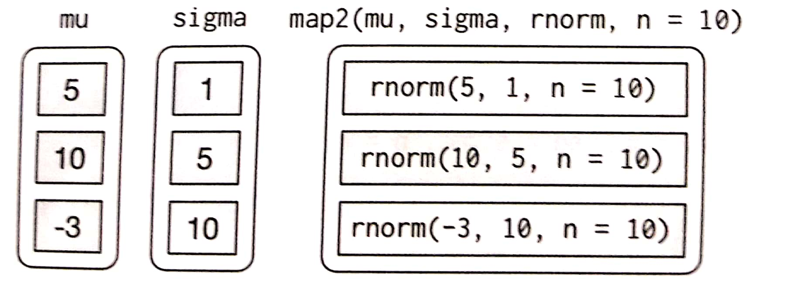
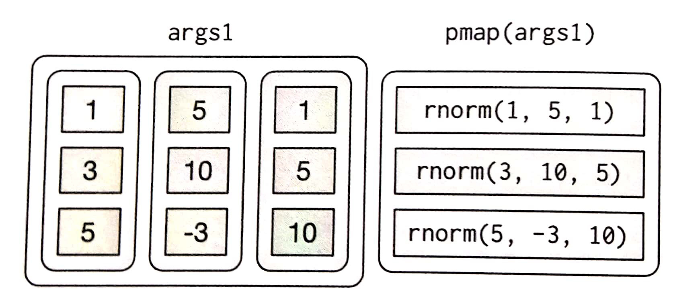
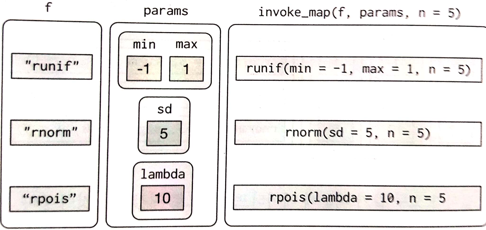

17장 : purrr로 하는 반복작업
================
huimin
2019 8 6

# 기초 설정

``` r
library(tidyverse)
```

    ## Warning: package 'tidyverse' was built under R version 3.6.1

    ## Registered S3 methods overwritten by 'ggplot2':
    ##   method         from 
    ##   [.quosures     rlang
    ##   c.quosures     rlang
    ##   print.quosures rlang

    ## Registered S3 method overwritten by 'rvest':
    ##   method            from
    ##   read_xml.response xml2

    ## -- Attaching packages -------------------------------- tidyverse 1.2.1 --

    ## √ ggplot2 3.1.1       √ purrr   0.3.2  
    ## √ tibble  2.1.1       √ dplyr   0.8.0.1
    ## √ tidyr   0.8.3       √ stringr 1.4.0  
    ## √ readr   1.3.1       √ forcats 0.4.0

    ## -- Conflicts ----------------------------------- tidyverse_conflicts() --
    ## x dplyr::filter() masks stats::filter()
    ## x dplyr::lag()    masks stats::lag()

``` r
library(readr)
```

# 1\. 들어가기

함수형 프로그래밍의 어휘를 습득하면 코드를 더 적게 사용하고, 더 쉽게 그리고 오류를 덜 발생시키면서, 일반적인 반복 문제를
해결할 수 있다.

# 2\. For 루프

``` r
# 임의의 데이터
df <- tibble(a = rnorm(10),
             b = rnorm(10),
             c = rnorm(10),
             d = rnorm(10))

# 이 데이터의 각 열의 중앙값을 계산하고자 한다.
output <- vector("double", ncol(df))

for (i in seq_along(df)) {
  
  output[[i]] <- median(df[[i]])
  
}

output
```

    ## [1] 0.8241183 0.9191982 0.3324756 0.1472734

위의 루프에는 3가지 구성 요소가 있다.

  - output : 출력을 위해 충분한 공간을 할당한다. vector 함수를 이용하여 주어진 길이의 빈 벡터를 만들었다.
  - **seq\_along** : 시퀀스는 무엇을 따라가며 반복해야 하는지를 결정한다. length함수를 이용하는 것보다
    안전한 방법이다.
  - 본문 : 실행되는 코드이다.

## 2.1 연습문제(302p)

``` r
# 1. 다음을 수행하는 루프를 작성하라.

# 1.1 mtcars 모든 열의 평균을 계산
output <- vector("double", ncol(mtcars))

for (i in 1:ncol(mtcars)) {
  
  output[i] <- mean(mtcars[, i], na.rm = TRUE)
  
}

output
```

    ##  [1]  20.090625   6.187500 230.721875 146.687500   3.596563   3.217250
    ##  [7]  17.848750   0.437500   0.406250   3.687500   2.812500

``` r
# 1.2 iris 각 열의 유일한 값의 개수를 계산
output <- vector("double", ncol(iris))

for (i in 1:ncol(iris)) {
  
  output[i] <- iris %>% 
  dplyr::count(iris[, i]) %>% 
  dplyr::filter(n == 1) %>% 
  nrow()
  
}

output
```

    ## [1]  9  5 10  2  0

아… 이번 장은 그냥… 책만 보는 것이 더 나을 것 같네… For 루프 변형 부분은 생략하겠다.

# 5\. 맵 함수

for 루프 대신 purrr 함수들을 사용하면 리스트 조작 문제를 독립적인 조각들로 나눌 수 있다.

  - 리스트의 단일 요소에 대해서만 문제를 푼다면 어떻게 해결하겠는가? 이 문제를 해결했다면 리스트의 모든 요소들에 이 해답을
    일반화하는 것은 purrr이 해결해준다.
  - 복잡한 문제를 해결하는 경우, 해결책으로 한 걸음 나아가기 위해 문제를 쉬운 크기로 분해하는 방법은 무엇일까? purrr을
    사용하면 파이프와 함께 작성할 수 있는 작은 조각 여러 개로 만들 수 있다.
  - 이 구조를 사용하면 새로운 문제를 쉽게 해결할 수 있다. 또한 이전 코드를 다시 읽을 때 문제를 어떻게 해결했는지 더 쉽게
    이해할 수 있다.

벡터를 따라 루프를 돌며, 각 요소에 어떤 작업을 하고, 결과를 저장하는 패턴은 매우 일반적이다. purrr 패키지에는 이런
작업을 수행하는 함수 모음이 있다.

  - **map** : 리스트를 출력한다.
  - **map\_lgl** : 논리형 벡터를 출력한다.
  - **map\_int** : 정수형 벡터를 출력한다.
  - **map\_dbl** : 더블형 벡터를 출력한다.
  - **map\_chr** : 문자형 벡터를 출력한다.

각 함수는 벡터를 입력으로, 각 조각에 함수를 적용한 후, 입력과 길이가 같이 이름들이 같은 새로운 벡터를 반환한다. **반환
벡터의 유형은 맵(map) 함수의 접미사에 의해 결정된다.**

**map함수들을 활용하면 for루프를 사용하지 않고, 시간이 훨씬 적게 걸린다. 또한 코드를 쉽게 볼 수 있다는 명확성도
있다.**

``` r
# map함수
map_dbl(df, mean)
```

    ##           a           b           c           d 
    ##  0.49186081  0.66242757 -0.05837269  0.15655851

``` r
map_dbl(df, median)
```

    ##         a         b         c         d 
    ## 0.8241183 0.9191982 0.3324756 0.1472734

``` r
map_dbl(df, sd)
```

    ##         a         b         c         d 
    ## 1.4571511 0.9550914 1.2349212 1.0572727

``` r
# 파이프도 정상적으로 동작한다.
df %>% map_dbl(mean)
```

    ##           a           b           c           d 
    ##  0.49186081  0.66242757 -0.05837269  0.15655851

``` r
# map함수는 .f가 호출될 때마다 추가 인수를 전달할 수도 있다.
map_dbl(df, mean, trim = 0.5)
```

    ##         a         b         c         d 
    ## 0.8241183 0.9191982 0.3324756 0.1472734

## 5.1 단축어

타이핑을 약간 줄이기 위해 .f와 함께 사용할 수 있는 단축어가 몇 개 있다. 데이터셋 각 그룹에 선형 모형을 적합하고 싶다고
하자. 다음 예제에서는 mtcars 데이터셋을 (각 cylinder 값마다 하나씩) 세 조각으로 나누어 각 조각마다 선형
모형을 동일하게 적합한다.

``` r
# 참고로 split 함수는, 주어진 기준에 따라서 데이터를 리스트로 분리하는 함수이다.
models <- mtcars %>% 
  split(.$cyl) %>% 
  map(function(df) lm(mpg ~ wt, data = df))

models
```

    ## $`4`
    ## 
    ## Call:
    ## lm(formula = mpg ~ wt, data = df)
    ## 
    ## Coefficients:
    ## (Intercept)           wt  
    ##      39.571       -5.647  
    ## 
    ## 
    ## $`6`
    ## 
    ## Call:
    ## lm(formula = mpg ~ wt, data = df)
    ## 
    ## Coefficients:
    ## (Intercept)           wt  
    ##       28.41        -2.78  
    ## 
    ## 
    ## $`8`
    ## 
    ## Call:
    ## lm(formula = mpg ~ wt, data = df)
    ## 
    ## Coefficients:
    ## (Intercept)           wt  
    ##      23.868       -2.192

purrr에는 편리한 단축어인 **한쪽 공식(one-sided formula)**이 있다.

``` r
models <- mtcars %>% 
  split(.$cyl) %>% # split(mtcars, mtcars$cyl)
  map(~lm(mpg ~ wt, data = .)) # function(df) lm(mpg ~ wt, data = df)

models
```

    ## $`4`
    ## 
    ## Call:
    ## lm(formula = mpg ~ wt, data = .)
    ## 
    ## Coefficients:
    ## (Intercept)           wt  
    ##      39.571       -5.647  
    ## 
    ## 
    ## $`6`
    ## 
    ## Call:
    ## lm(formula = mpg ~ wt, data = .)
    ## 
    ## Coefficients:
    ## (Intercept)           wt  
    ##       28.41        -2.78  
    ## 
    ## 
    ## $`8`
    ## 
    ## Call:
    ## lm(formula = mpg ~ wt, data = .)
    ## 
    ## Coefficients:
    ## (Intercept)           wt  
    ##      23.868       -2.192

여기에서 **.을 대명사로 사용했는데, 현재 리스트 요소를 가리킨다.** for루프에서 i가 현재 지수를 가리키는 것과 같다.

여기서 요약 통계량(중에서도 r.squrared)을 알고 싶다면, 다음과 같은 단축어를 사용할 수 있다.

``` r
models %>% 
  map(summary) %>% 
  map_dbl(~.$r.squared)
```

    ##         4         6         8 
    ## 0.5086326 0.4645102 0.4229655

그러나 명명된 구성요소를 추출하는 것은 자주하는 연산이므로 purrr에 있는 더 짧은 단축어가 있는데, 바로 문자열을 사용할 수
있다.

``` r
models %>% 
  map(summary) %>% 
  map_dbl("r.squared")
```

    ##         4         6         8 
    ## 0.5086326 0.4645102 0.4229655

정수형을 사용하여 위치로 요소를 선택할 수도 있다.

``` r
x <- list(list(1,2,3), list(4,5,6), list(7,8,9))
x %>% 
  map_dbl(3)
```

    ## [1] 3 6 9

## 5.2 베이스 R

**베이스 R의 apply 함수 계열**에 익숙하다면, purrr 함수들과 다음과 같은 유사점이 있음을 발견했을 것이다.

**lapply** : map함수와 동일하다. 차이점은 map은 purrr의 다른 모든 함수와 일관성이 있고, .f에 단축어를
사용할 수 있다는 것이다.

**sapply** : lapply의 출력을 자동으로 단순하게 만드는 래퍼이다. 이 함수는 대화식 작업에서는 유용하지만, 함수
안에서는 **다음과 같이 어떤 출력을 얻게 될지 모르기 때문에 문제가 된다.**

``` r
# sapply의 문제점
x1 <- list(c(0.27, 0.37, 0.57, 0.91, 0.20),
           c(0.90, 0.94, 0.66, 0.63, 0.06),
           c(0.21, 0.18, 0.69, 0.38, 0.77))

x2 <- list(c(0.50, 0.72, 0.99, 0.38, 0.78),
           c(0.93, 0.21, 0.65, 0.13, 0.27),
           c(0.39, 0.01, 0.38, 0.87, 0.34))

threshold <- function(x, cutoff = 0.8) x[x > cutoff]

x1 %>% sapply(threshold) %>% str()
```

    ## List of 3
    ##  $ : num 0.91
    ##  $ : num [1:2] 0.9 0.94
    ##  $ : num(0)

``` r
x2 %>% sapply(threshold) %>% str()
```

    ##  num [1:3] 0.99 0.93 0.87

**vapply** : 유형을 정의하는 추가 인수를 제공하기 때문에 sapply의 안전한 대체함수이다. 유일한 문제는 타이핑을
길게 해야 한다는 것이다.

``` r
# 아래의 두 코드는 같은 뜻이다. 다만, vapply가 상대적으로 코드가 길다.
vapply(df, is.numeric, logical(1))
```

    ##    a    b    c    d 
    ## TRUE TRUE TRUE TRUE

``` r
map_lgl(df, is.numeric)
```

    ##    a    b    c    d 
    ## TRUE TRUE TRUE TRUE

**purrr함수에는 앞으로도 용이한 병렬처리, 진행률 막대가 제공될 예정이라고 한다. 아무래도 치트시트를 보는 것이 좋을 것
같다.**

## 5.3 연습문제(314p)

``` r
# 1. 맵 함수들 중 하나를 사용하여 다음을 수행하는 코드를 작성하라.

# a. mtcars 모든 열의 평균을 계산하라.
map_dbl(mtcars, mean, na.rm = TRUE)
```

    ##        mpg        cyl       disp         hp       drat         wt 
    ##  20.090625   6.187500 230.721875 146.687500   3.596563   3.217250 
    ##       qsec         vs         am       gear       carb 
    ##  17.848750   0.437500   0.406250   3.687500   2.812500

``` r
# b. nycflights13::flights 각 열의 유형을 확인하라.
library(nycflights13)

flights %>% 
  map_chr(typeof)
```

    ##           year          month            day       dep_time sched_dep_time 
    ##      "integer"      "integer"      "integer"      "integer"      "integer" 
    ##      dep_delay       arr_time sched_arr_time      arr_delay        carrier 
    ##       "double"      "integer"      "integer"       "double"    "character" 
    ##         flight        tailnum         origin           dest       air_time 
    ##      "integer"    "character"    "character"    "character"       "double" 
    ##       distance           hour         minute      time_hour 
    ##       "double"       "double"       "double"       "double"

``` r
# c. iris 각 열에서 유일한 값의 개수를 계산하라.

# 단축키 사용한 버전 (map을 사용해서, 리스트로 반환 됨)
map(iris, unique) %>%
  map(~length(.))
```

    ## $Sepal.Length
    ## [1] 35
    ## 
    ## $Sepal.Width
    ## [1] 23
    ## 
    ## $Petal.Length
    ## [1] 43
    ## 
    ## $Petal.Width
    ## [1] 22
    ## 
    ## $Species
    ## [1] 3

``` r
# 단축키 안쓰고 그냥 apply계열 함수처럼 써도 됨
# map_dbl을 사용해서 더블형 벡터로 반환됨
map(iris, unique) %>%
  map_dbl(length)
```

    ## Sepal.Length  Sepal.Width Petal.Length  Petal.Width      Species 
    ##           35           23           43           22            3

``` r
# 2. 데이터프레임의 각 열이 팩터형인지 여부를 나타내는 벡터를 생성하는 방법은 무엇인가?
1:ncol(diamonds) %>% 
  map_lgl(~is.factor(diamonds[[.]]))
```

    ##  [1] FALSE  TRUE  TRUE  TRUE FALSE FALSE FALSE FALSE FALSE FALSE

참고로, **티블형 데이터의 경우에는 서브셋을 데이터프레임과 다르게 해야 제대로 작동한다.** 티블형의 경우에는 리스트와
마찬가지로 “\[\[” 대괄호 2개를 씌워주지 않을 경우, 서브셋을 할 때 티블형태가 그대로 유지된다.
**따라서, 티블 형식의 경우에는 반드시 리스트와 동일한 형식으로 서브셋을 해야한다.**

``` r
# 3. 리스트가 아닌 벡터에 맵 함수를 사용하면 어떻게 되는가?
# 각 벡터가 하나의 열로 취급된다.
map(1:5, runif)
```

    ## [[1]]
    ## [1] 0.1861453
    ## 
    ## [[2]]
    ## [1] 0.8352568 0.9490612
    ## 
    ## [[3]]
    ## [1] 0.38612014 0.01182576 0.41370106
    ## 
    ## [[4]]
    ## [1] 0.9759964 0.5735004 0.5431877 0.8603419
    ## 
    ## [[5]]
    ## [1] 0.9178777 0.9721537 0.1717335 0.4455710 0.2465923

``` r
# 4. map(-2:2, rnorm, n = 5)을 하면 어떻게 되는가? map_dbl(-2:2, rnorm, n = 5)을 하면 어떻게 되는가?
map(-2:2, rnorm, n = 5)
```

    ## [[1]]
    ## [1] -1.1023911 -1.3200012 -1.2203311 -0.3996858 -2.1069625
    ## 
    ## [[2]]
    ## [1] -1.0522836 -2.0814007 -1.5647658 -0.4804869 -3.7149778
    ## 
    ## [[3]]
    ## [1] -0.5820944  0.2322538 -0.5648794 -1.7195251 -0.4014376
    ## 
    ## [[4]]
    ## [1]  0.8959415  0.3337187 -1.4341962  1.3990413 -0.1355809
    ## 
    ## [[5]]
    ## [1]  1.5972099 -0.2312898  2.3100607  3.1928387  2.9466506

``` r
# map_dbl(-2:2, rnorm, n = 5)은 오류 발생
```

``` r
# 5. map(x, function(df) lm(mpg ~ wt, data = df))의 익명 함수를 제거하여 다시 작성하라.
map(split(mtcars, mtcars$cyl), ~lm(mpg ~ wt, data = .))
```

    ## $`4`
    ## 
    ## Call:
    ## lm(formula = mpg ~ wt, data = .)
    ## 
    ## Coefficients:
    ## (Intercept)           wt  
    ##      39.571       -5.647  
    ## 
    ## 
    ## $`6`
    ## 
    ## Call:
    ## lm(formula = mpg ~ wt, data = .)
    ## 
    ## Coefficients:
    ## (Intercept)           wt  
    ##       28.41        -2.78  
    ## 
    ## 
    ## $`8`
    ## 
    ## Call:
    ## lm(formula = mpg ~ wt, data = .)
    ## 
    ## Coefficients:
    ## (Intercept)           wt  
    ##      23.868       -2.192

# 6\. 실패 다루기

맵 함수를 사용해 많은 연산을 반복할 때, 연산 중 하나가 실패할 확률이 높다. 이 경우 오류 메시지가 표시되고 출력은 표시되지
않는다. 이번 절에서는 새로운 함수인 **safely**를 사용하여 이러한 상황을 다루는 법을 배울 것이다.

  - result : 원 결과. 오류가 있다면 NULL이 된다.
  - error : 오류 객체. 연산이 성공적이었따면 이는 NULL이 될 것이다.

<!-- end list -->

``` r
safe_log <- safely(log)
str(safe_log(10))
```

    ## List of 2
    ##  $ result: num 2.3
    ##  $ error : NULL

``` r
str(safe_log("a"))
```

    ## List of 2
    ##  $ result: NULL
    ##  $ error :List of 2
    ##   ..$ message: chr "수학함수에 숫자가 아닌 인자가 전달되었습니다"
    ##   ..$ call   : language .Primitive("log")(x, base)
    ##   ..- attr(*, "class")= chr [1:3] "simpleError" "error" "condition"

보다시피, 함수가 성공한 경우 result에 결과를 포함하게 되고, error요소는 NULL이 된다. 함수가 실패한 경우,
result가 NULL이 되고 error 요소는 오류 객체를 포함하게 된다.

safely는 다음과 같이 map과 함께 수행되도록 설계되었다.

``` r
x <- list(1, 10, "a")
y <- x %>% map(safely(log))
str(y)
```

    ## List of 3
    ##  $ :List of 2
    ##   ..$ result: num 0
    ##   ..$ error : NULL
    ##  $ :List of 2
    ##   ..$ result: num 2.3
    ##   ..$ error : NULL
    ##  $ :List of 2
    ##   ..$ result: NULL
    ##   ..$ error :List of 2
    ##   .. ..$ message: chr "수학함수에 숫자가 아닌 인자가 전달되었습니다"
    ##   .. ..$ call   : language .Primitive("log")(x, base)
    ##   .. ..- attr(*, "class")= chr [1:3] "simpleError" "error" "condition"

리스트가 두 개 있으면 작업하기 더 쉬울 것이다. purrr::transpose를 사용하면 쉽게 얻을 수 있다.

``` r
y <- y %>% transpose()
str(y)
```

    ## List of 2
    ##  $ result:List of 3
    ##   ..$ : num 0
    ##   ..$ : num 2.3
    ##   ..$ : NULL
    ##  $ error :List of 3
    ##   ..$ : NULL
    ##   ..$ : NULL
    ##   ..$ :List of 2
    ##   .. ..$ message: chr "수학함수에 숫자가 아닌 인자가 전달되었습니다"
    ##   .. ..$ call   : language .Primitive("log")(x, base)
    ##   .. ..- attr(*, "class")= chr [1:3] "simpleError" "error" "condition"

나름대로 오류를 처리하는 법이 있겠지만, 일반적으로 y값이 오류인 x값을 보거나, 정상인 y값을 살펴볼 것이다.

``` r
is_ok <- y$error %>% map_lgl(is_null)
x[!is_ok]
```

    ## [[1]]
    ## [1] "a"

``` r
y$result[is_ok] %>% flatten_dbl()
```

    ## [1] 0.000000 2.302585

purrr에는 이 밖에도 유용한 형용사 두 개가 있다.

1.  possibly : safely와 마찬가지로 항상 성공한다. 오류 시 반환할 기본값을 지정할 수 있기 때문에
    safely보다 단순하다.

<!-- end list -->

``` r
x <- list(1, 10, "a")
x %>% map_dbl(possibly(log, NA_real_))
```

    ## [1] 0.000000 2.302585       NA

2.  quietly : safely와 비슷한 역할을 수행하지만 오류를 캡쳐하는 대신 인쇄되는 출력, 메시지, 경고를 캡쳐한다.

<!-- end list -->

``` r
x <- list(1, -1)
x %>% map(quietly(log)) %>% str()
```

    ## List of 2
    ##  $ :List of 4
    ##   ..$ result  : num 0
    ##   ..$ output  : chr ""
    ##   ..$ warnings: chr(0) 
    ##   ..$ messages: chr(0) 
    ##  $ :List of 4
    ##   ..$ result  : num NaN
    ##   ..$ output  : chr ""
    ##   ..$ warnings: chr "NaN이 생성되었습니다"
    ##   ..$ messages: chr(0)

# 7\. 다중 인수로 매핑

지금까지는 단일 입력을 따라 반복하였지만, 다중의 연관된 인풋을 따라가며 병렬로 반복해야 하는 경우도 종종 있다. **map2와
pmap이 바로 이 작업을 한다.**

예를 들어 다른 평균을 가진 랜덤 정규분포 샘플을 생성하고 싶다고 하자. map으로 하는 법은 알고 있다.

``` r
mu <- list(5, 10, -3)


mu %>% 
  map(rnorm, n = 5) %>% 
  str()
```

    ## List of 3
    ##  $ : num [1:5] 6.34 4.02 4.1 4.23 4.69
    ##  $ : num [1:5] 12.08 9.74 9.41 10.13 11.3
    ##  $ : num [1:5] -4.95 -3.91 -3.44 -1.69 -3.05

표준편차도 변경시키고 싶다면 어떻게 할까? 한 가지 방법은 다음과 같이 지수를 따라 반복하고, 평균과 표준편차 벡터에 인덱싱하는
것이다.

``` r
sigma <- list(1, 5, 10)


seq_along(mu) %>% 
  map(~rnorm(5, mu[[.]], sigma[[.]])) %>% 
  str()
```

    ## List of 3
    ##  $ : num [1:5] 3.54 3.7 6.54 3.87 4.73
    ##  $ : num [1:5] 16.9 15.8 10.2 14.3 11.7
    ##  $ : num [1:5] -4.97 -7.4 -16.01 -1.37 10.07

위의 코드 대신 map2를 사용할 수 있다. 이는 두 개의 벡터를 따라 병렬로 반복한다.

``` r
map2(mu, sigma, rnorm, n = 5) %>% str()
```

    ## List of 3
    ##  $ : num [1:5] 5.82 4.94 3.75 6.59 4.22
    ##  $ : num [1:5] 8.33 18.99 10.9 9.74 8.46
    ##  $ : num [1:5] 1.37 4.03 2.43 -4.02 -3.03

위의 코드를 그림으로 나타내면 다음과 같다.



그리고 purrr에는 인수 리스트를 취하는 **pmap**이 있다. 평균, 표준편차, 표본의 개수를 변경하려는 경우 사용할 수
있다.

``` r
n <- list(1, 3, 5)
args1 <- list(n, mu, sigma)

args1 %>% 
  pmap(rnorm) %>% 
  str()
```

    ## List of 3
    ##  $ : num 4.93
    ##  $ : num [1:3] 10.77 6.15 12.42
    ##  $ : num [1:5] -25.708 1.209 -4.379 0.182 -9.278

위의 코드를 그림으로 나타내면 다음과 같다.



그리고 리스트 요소의 이름이 없다면, 코드를 읽기 어렵기 때문에 **인수를 명명하는 것**이 좋다.

``` r
args2 <- list(mean = mu, sd = sigma, n = n)

args2 %>% 
  pmap(rnorm) %>% 
  str()
```

    ## List of 3
    ##  $ : num 6.11
    ##  $ : num [1:3] 10.84 8.19 4.61
    ##  $ : num [1:5] 4.315 -0.166 1.482 -2.639 -12.867

인수의 길이가 같기 때문에 **데이터프레임(티블)으로 저장하는 것**도 좋은 선택이다.

``` r
params <- tibble(mean = c(5, 10, -3),
                 sd = c(1, 5, 10),
                 n = c(1, 3, 5))

params %>% 
  pmap(rnorm)
```

    ## [[1]]
    ## [1] 5.497756
    ## 
    ## [[2]]
    ## [1]  6.628313 11.352314 11.069744
    ## 
    ## [[3]]
    ## [1]  2.057528  7.252506  1.893946 -6.009214 -6.302495

## 7.1 다른 함수 불러오기

인수를 변경하는 것뿐만 아니라 함수 자체도 변경하고 싶을 수 있다. **invoke\_map**을 사용하여 이 경우를 다룰 수
있다.

``` r
f <- c("runif", "rnorm", "rpois")


param <- list(list(min = -1, max = 1),
              list(sd = 5),
              list(lambda = 10))


invoke_map(f, param, n = 5) %>% str()
```

    ## List of 3
    ##  $ : num [1:5] -0.56 0.537 -0.779 -0.345 0.793
    ##  $ : num [1:5] -1.08 -11.23 -8.49 3.25 4.05
    ##  $ : int [1:5] 12 12 9 8 12

위의 코드를 그림으로 나타내면 다음과 같다.



**이 또한 티블을 통해 일치하는 쌍을 좀 더 쉽게 만들 수 있다.**

``` r
sim <- tribble(~f, ~params,
               "runif", list(min = -1, max = 1),
               "rnorm", list(sd = 5),
               "rpois", list(lambda = 10))

sim %>% 
  mutate(sim = invoke_map(f, params, n = 10))
```

    ## # A tibble: 3 x 3
    ##   f     params     sim       
    ##   <chr> <list>     <list>    
    ## 1 runif <list [2]> <dbl [10]>
    ## 2 rnorm <list [1]> <dbl [10]>
    ## 3 rpois <list [1]> <int [10]>

# 8\. 워크

**워크는 반환값이 아닌 부작용을 위해 함수를 호출하고자 할 경우 맵 함수의 대안으로 사용할 수 있다.** 결과를 스크린에
렌더링하거나 디스크에 파일을 저장하는 것과 같이, 반환값이 아니라 동작이 중요하기 때문에 이를 사용한다. 다음은
매우 간단한 예제이다.

``` r
x <- list(1, "a", 3)

x %>% 
  walk(print)
```

    ## [1] 1
    ## [1] "a"
    ## [1] 3

walk는 walk2나 pwalk에 비해 일반적으로 그다지 유용하지 않다. 예를 들어 플롯 리스트와 파일명 벡터가 있는 경우
pwalk를 사용하여 디스크의 해당 위치에 각 파일을 저장할 수 있다.

``` r
plots <- mtcars %>% 
  split(.$cyl) %>% 
  map(~ggplot(., aes(mpg, wt)) + geom_point())

paths <- stringr::str_c(names(plots), ".pdf")

pwalk(list(paths, plots), ggsave, path = tempdir())
```

    ## Saving 7 x 5 in image
    ## Saving 7 x 5 in image
    ## Saving 7 x 5 in image

walk, walk2, pwalk는 **모두 첫 번째 인수 .x를 보이지 않게 반환한다.** 따라서 이 함수들을 파이프라인 중간에
사용하기 적절하다.

# 9\. For 루프의 기타 패턴

purrr에는 for 루프의 기타 유형을 추상화하는 함수들이 많이 있다. 이 함수들은 맵 함수보다 드물게 사용되지만 알고 있으면
유용하다.

## 9.1 논리서술자 함수

많은 함수는 단일 TRUE나 FALSE를 반환하는 논리서술자 함수와 함께 작동한다. **keep과 discard**는 입력에서
논리서술이 각각 TRUE이거나 FALSE인 요소를 반환한다.

``` r
iris %>% 
  purrr::keep(is.factor) %>% 
  str()
```

    ## 'data.frame':    150 obs. of  1 variable:
    ##  $ Species: Factor w/ 3 levels "setosa","versicolor",..: 1 1 1 1 1 1 1 1 1 1 ...

``` r
iris %>% 
  purrr::discard(is.factor) %>% 
  str()
```

    ## 'data.frame':    150 obs. of  4 variables:
    ##  $ Sepal.Length: num  5.1 4.9 4.7 4.6 5 5.4 4.6 5 4.4 4.9 ...
    ##  $ Sepal.Width : num  3.5 3 3.2 3.1 3.6 3.9 3.4 3.4 2.9 3.1 ...
    ##  $ Petal.Length: num  1.4 1.4 1.3 1.5 1.4 1.7 1.4 1.5 1.4 1.5 ...
    ##  $ Petal.Width : num  0.2 0.2 0.2 0.2 0.2 0.4 0.3 0.2 0.2 0.1 ...

**some과 every**는 논리서술이 일부 혹은 모든 요소가 참인지 확인한다.

``` r
x <- list(1:5, letters, list(10))

x %>% 
  some(is.character)
```

    ## [1] TRUE

``` r
x %>% 
  every(is.vector)
```

    ## [1] TRUE

**detect**는 논리서술이 참인 첫 번째 요소를 찾는다. detect\_index는 해당 위치를 반환한다.

``` r
set.seed(123)
x <- sample(10)
x
```

    ##  [1]  3 10  2  8  6  9  1  7  5  4

``` r
x %>% 
  purrr::detect(~. > 5)
```

    ## [1] 10

``` r
x %>% 
  purrr::detect_index(~. > 5)
```

    ## [1] 2

**head\_while과 tail\_while**은 벡터의 시작 혹은 끝에서부터 논리서술자가 참인 요소들을 반환한다.

``` r
x %>% 
  head_while(~. > 5)
```

    ## integer(0)

``` r
x %>% 
  tail_while(~. > 5)
```

    ## integer(0)

## 9.2 리듀스와 누적

쌍을 객체 하나로 줄이는 함수를 반복 적용하여, **복잡한 리스트를 간단한 리스트로 줄이고 싶을 때도 있을 것이다.** 테이블 두
개를 입력으로 하는 dplyr 동사를 여러 테이블에 적용할 때 유용하다.

**예를 들어 데이터프레임 리스트가 있을 때, 리스트의 요소를 조인해서 하나의 데이터프레임으로 만들려면 다음과 같이 하면
된다.**

``` r
dfs <- list(age = tibble(name = "John", age = 30),
            sex = tibble(name = c("John", "Mary"), sex = c("M", "F")),
            trt = tibble(name = "Mary", treatment = "A"))

dfs %>% reduce(full_join)
```

    ## Joining, by = "name"
    ## Joining, by = "name"

    ## # A tibble: 2 x 4
    ##   name    age sex   treatment
    ##   <chr> <dbl> <chr> <chr>    
    ## 1 John     30 M     <NA>     
    ## 2 Mary     NA F     A

또는 벡터의 리스트가 있을 때, 교집합을 구하는 방법은 다음과 같다.

``` r
vs <- list(c(1, 3, 5, 6, 10),
           c(1, 2, 3, 7, 8, 10),
           c(1, 2, 3, 4, 8, 9, 10))

vs %>% reduce(intersect)
```

    ## [1]  1  3 10

reduce함수는 “이진” 함수를 입력으로, 이를 하나의 요소만 남아있을 때까지 반복적으로 리스트에 적용한다. 누적은 비슷하지만
중간 결과를 모두 유지한다. 누적 합계를 구현할 때 사용할 수 있다.

``` r
x <- sample(10)
x
```

    ##  [1] 10  5  3  8  1  4  6  9  7  2

``` r
x %>% accumulate("+")
```

    ## [[1]]
    ## [1] 10
    ## 
    ## [[2]]
    ## NULL
    ## 
    ## [[3]]
    ## NULL
    ## 
    ## [[4]]
    ## NULL
    ## 
    ## [[5]]
    ## NULL

이유는 모르겠지만, 제대로 작동하지 않는다.
