18장 : modelr을 이용한 모델의 기초
================
huimin
2019 8 14

# 기초 설정

``` r
library(tidyverse)
```

    ## Warning: package 'tidyverse' was built under R version 3.6.1

    ## Registered S3 methods overwritten by 'ggplot2':
    ##   method         from 
    ##   [.quosures     rlang
    ##   c.quosures     rlang
    ##   print.quosures rlang

    ## Registered S3 method overwritten by 'rvest':
    ##   method            from
    ##   read_xml.response xml2

    ## -- Attaching packages -------------------------------- tidyverse 1.2.1 --

    ## √ ggplot2 3.1.1       √ purrr   0.3.2  
    ## √ tibble  2.1.1       √ dplyr   0.8.0.1
    ## √ tidyr   0.8.3       √ stringr 1.4.0  
    ## √ readr   1.3.1       √ forcats 0.4.0

    ## -- Conflicts ----------------------------------- tidyverse_conflicts() --
    ## x dplyr::filter() masks stats::filter()
    ## x dplyr::lag()    masks stats::lag()

``` r
library(readr)
library(modelr)
library(purrr)
```

# 1\. 들어가기

모델의 목표는 데이터셋에 대한 낮은 차원의 간단한 요약을 제공하는 것이다. 이 책에서는 모델을 사용하여 데이터를 패턴과 잔차로
분리할 것이다.

**교묘하게 뽑힌 간략한 모델은 종종 매우 유용한 근사치를 제공한다. 모델은 사실을 제공하지 않는다. 하지만 모델이 무엇인가를
이해하는 데 도움을 주며 유용하다는 점은 변하지 않는다.**

# 2\. 간단한 모델

시뮬레이션 데이터셋 sim1을 살펴보자.

``` r
ggplot(data = sim1, mapping = aes(x = x, y = y)) +
  geom_point()
```

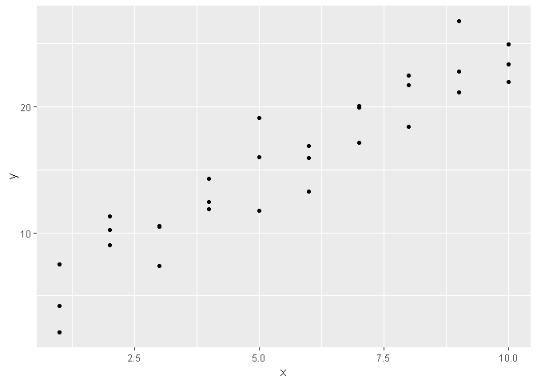<!-- -->

데이터의 강한 패턴이 느껴진다. 아마도 선형관계일 것이다. **간단한 패턴의 경우 기울기와 y 절편을 파라미터로 하는
geom\_abline함수를 사용할 수 있다.**

``` r
models <- tibble(a1 = runif(250, -20, 40),
                 a2 = runif(250, -5, 5))

ggplot(sim1, aes(x, y)) +
  geom_abline(mapping = aes(intercept = a1, slope = a2),
              data = models,
              alpha = 0.25) +
  geom_point()
```

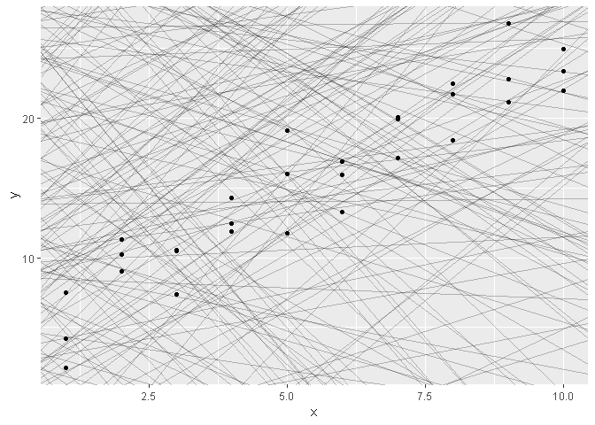<!-- -->

하지만, 위의 그림은 직관적이지 못하다. 따라서 다음과 같이 수정할 수 있다.

모델 파라미터와 데이터를 입력값으로 사용하여, **모델에 의해 예측된 값을 제공하는 함수를 만든다.**

``` r
# 
model1 <- function(a, data) {
  
  a[1] + data$x * a[2]
  
}

model1(c(7, 1.5), sim1)
```

    ##  [1]  8.5  8.5  8.5 10.0 10.0 10.0 11.5 11.5 11.5 13.0 13.0 13.0 14.5 14.5
    ## [15] 14.5 16.0 16.0 16.0 17.5 17.5 17.5 19.0 19.0 19.0 20.5 20.5 20.5 22.0
    ## [29] 22.0 22.0

다음으로는, 예측값과 실제값 사이의 차이를 계산하는 방법이 필요하다. **여기서는 RMSE를 사용하도록 하겠다.**

``` r
# 실제값과 예측값 사이에 RMSE를 구해주는 함수
measure_distance <- function(mod, data) {
  
  diff <- data$y - model1(mod, data)
  sqrt(mean(diff^2))
  
}

measure_distance(c(7, 1.5), sim1)
```

    ## [1] 2.665212

이제 purrr을 사용하여 모든 모델의 차이를 계산할 수도 있다.

``` r
sim1_dist <- function(a1, a2) {
  
  measure_distance(c(a1, a2), sim1)
  
}

models <- models %>% 
  dplyr::mutate(dist = purrr::map2_dbl(a1, a2, sim1_dist))

models
```

    ## # A tibble: 250 x 3
    ##       a1     a2  dist
    ##    <dbl>  <dbl> <dbl>
    ##  1  26.6  0.617 15.3 
    ##  2  11.5 -1.12  13.8 
    ##  3  10.9  1.84   6.00
    ##  4  15.2 -4.28  30.1 
    ##  5 -15.8 -0.350 34.0 
    ##  6  39.0 -3.33  16.4 
    ##  7 -10.7 -4.41  53.8 
    ##  8  30.9  2.62  29.9 
    ##  9  35.8  3.81  41.6 
    ## 10  17.6 -1.22  10.7 
    ## # ... with 240 more rows

다음으로 최적의 10가지 모델을 데이터에 겹쳐서 나타내보자. -dist를 사용해서 모델별로 색상을 지정했다.

``` r
ggplot(data = sim1, mapping = aes(x, y)) +
  geom_point(size = 2, color = "grey30") +
  geom_abline(aes(intercept = a1, slope = a2, color = -dist),
              data = filter(models, rank(dist) <= 10))
```

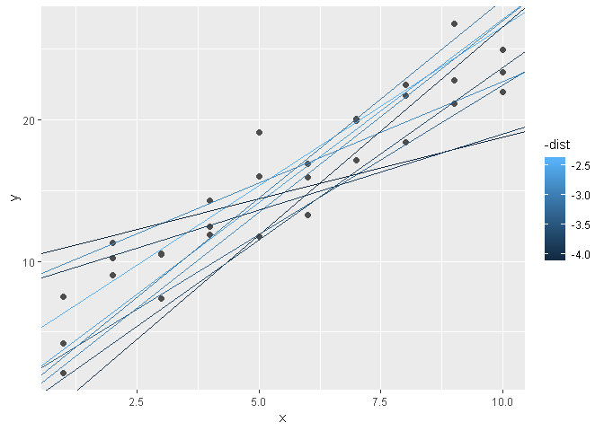<!-- -->

가장 차이가 적은 모델이 가장 밝은 색으로 나타낸다.

랜덤한 모델을 많이 시도해 보는 대신 체계적으로 균등하게 배치된 격자무늬의 점(그리드 서치)을 생성할 수 있다.

``` r
# 그리드 객체 생성
grid <- expand.grid(a1 = seq(-5, 20, length = 25),
                    a2 = seq(1, 3, length = 25)) %>% 
  dplyr::mutate(dist = purrr::map2_dbl(a1, a2, sim1_dist))


# 적절한 그리드 파라미터를 그림으로 확인하기
grid %>% 
  ggplot(aes(a1, a2)) +
  geom_point(data = filter(grid, rank(dist) <= 10),
             size = 4,
             color = "red") +
  geom_point(aes(color = -dist))
```

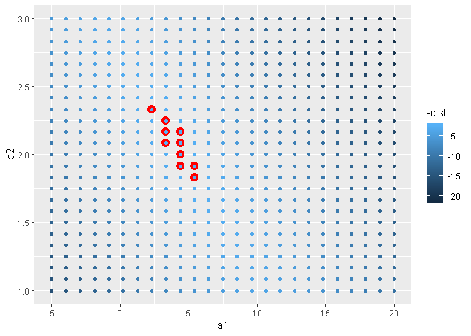<!-- -->

최적의 그리드 파라미터를 통하여, 그래프를 그려본다면 다음과 같다.

``` r
ggplot(sim1, aes(x, y)) +
  geom_point(size = 2, color = "grey30") +
  geom_abline(aes(intercept = a1, slope = a2, color = -dist),
              data = filter(grid, rank(dist) <= 10))
```

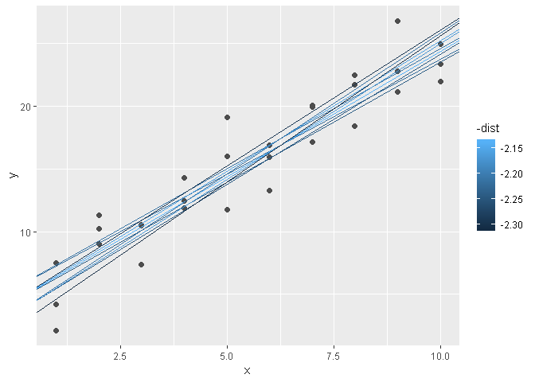<!-- -->

이제 여기서, **뉴턴 랩슨 기법**을 활용하여 수치를 최소화하여 조금 더 간략하게 표현할 수 있다.

뉴턴 랩슨 기법은 시작점을 선택하고 가장 가파른 기울기를 찾기 위해 탐색한다. 그런 다음 가장 작은 값으로 갈 수 없을 때까지
기울기를 약간씩 기울이는 작업을 반복한다. R에서는 **optim함수**를 사용하여 이 작업을 수행할 수 있다.

``` r
# 뉴턴 랩슨 기법
best <- optim(c(0, 0),
              measure_distance,
              data = sim1)

best$par
```

    ## [1] 4.222248 2.051204

``` r
ggplot(sim1, aes(x, y)) +
  geom_point(size = 2, color = "grey30") +
  geom_abline(intercept = best$par[1], slope = best$par[2])
```

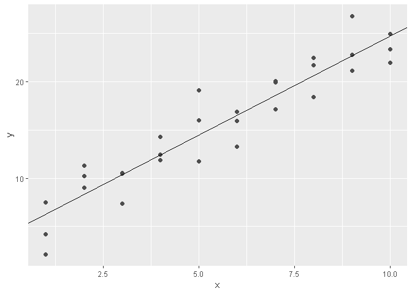<!-- -->

위의 그림처럼, 매우 직관적인 결과가 도출된다. 이 모델에 적용할 수 있는 접근법이 한 가지 더 있다. **R에서는 lm이라는
선형 모델을 적합하기 위해 특별히 고안된 툴이 있다.**

``` r
sim1_mod <- lm(y ~ x,
               data = sim1)

coef(sim1_mod)
```

    ## (Intercept)           x 
    ##    4.220822    2.051533

이 선형 회귀 모형 접근법은 더 빠르며 전체의 최솟값을 보장한다.

# 3\. 모델 시각화하기

모델의 예측값을 탐색함으로써 모델을 이해하는 데 초점을 맞춘다. 이러한 과정을 거친다면, 모델에서 포착하지 못한 것을 확인할 때
유용하다. 잔차는 눈에 띄는 패턴을 제거하여 감지하기 어려운 나머지 추세를 분석할 수 있도록 해주므로 중요하다고 할 수 있다.

## 3.1 예측값

모델의 예측값을 시각화하기 위해 데이터가 존재하는 영역을 포함하는 균일한 간격의 그리드를 생성한다. 가장 쉬운 방법은
**modelr::data\_grid**를 사용하는 것이다.

**첫 번째 인수는 데이터프레임이며, 그 다음 인수에 대해서는 고유한 값에 대한 모든 조합을 생성한다.**

``` r
grid <- sim1 %>% 
  data_grid(x)

grid
```

    ## # A tibble: 10 x 1
    ##        x
    ##    <int>
    ##  1     1
    ##  2     2
    ##  3     3
    ##  4     4
    ##  5     5
    ##  6     6
    ##  7     7
    ##  8     8
    ##  9     9
    ## 10    10

다음은 예측값을 추가한다. 데이터프레임과 모델을 인수로 갖는 **modelr::add\_predictions함수**를 통하여
모델의 예측값을 데이터 프레임의 새로운 열로 추가한다.

``` r
grid <- grid %>% 
  add_predictions(sim1_mod)

grid
```

    ## # A tibble: 10 x 2
    ##        x  pred
    ##    <int> <dbl>
    ##  1     1  6.27
    ##  2     2  8.32
    ##  3     3 10.4 
    ##  4     4 12.4 
    ##  5     5 14.5 
    ##  6     6 16.5 
    ##  7     7 18.6 
    ##  8     8 20.6 
    ##  9     9 22.7 
    ## 10    10 24.7

다음으로 예측값을 플롯에 나타낸다. geom\_abline을 사용하는 것과 비교하였을 때 다음의 추가 진행 작업에 어떤 차이점이
있는지 궁금할 것이다. 이 접근법의 장점은 간단한 모델부터 복잡한 모델까지 R의 모든 모델에 동작한다는 것이다. 오직 시각화
기술에 의해서만 제한된다.

``` r
# ggplot에서도 이런 식으로 선을 따로 만들어 줄 수 있구만
ggplot(sim1, aes(x)) +
  geom_point(aes(y = y)) +
  geom_line(aes(y = pred),
            data = grid,
            color = "red",
            size = 1)
```

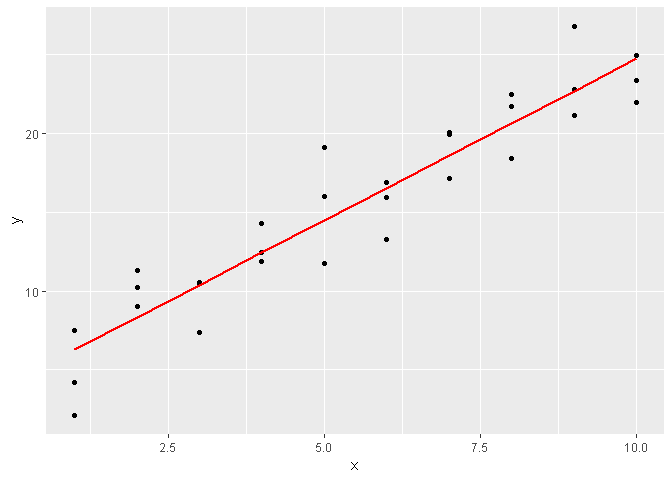<!-- -->

## 3.2 잔차

잔차는 이전에 계산한 예측값과 관측값 사이의 차이값이다. add\_predictions와 유사한 기능을 하는
**add\_residuals**를 사용해서 데이터에 잔차를 추가한다.

잔차를 계산하는데에는 실제 관측값이 필요하기 때문에 원래의 데이터셋을 사용한다.

``` r
sim1 <- sim1 %>% 
  add_residuals(sim1_mod)

sim1
```

    ## # A tibble: 30 x 3
    ##        x     y    resid
    ##    <int> <dbl>    <dbl>
    ##  1     1  4.20 -2.07   
    ##  2     1  7.51  1.24   
    ##  3     1  2.13 -4.15   
    ##  4     2  8.99  0.665  
    ##  5     2 10.2   1.92   
    ##  6     2 11.3   2.97   
    ##  7     3  7.36 -3.02   
    ##  8     3 10.5   0.130  
    ##  9     3 10.5   0.136  
    ## 10     4 12.4   0.00763
    ## # ... with 20 more rows

``` r
ggplot(data = sim1,
       aes(resid)) +
  geom_freqpoly(binwidth = 0.5)
```

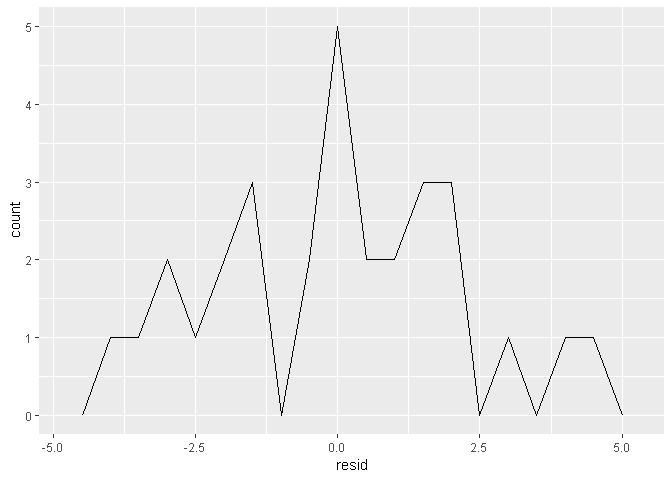<!-- -->

``` r
ggplot(sim1, aes(x, resid)) +
  geom_ref_line(h = 0) +
  geom_point()
```

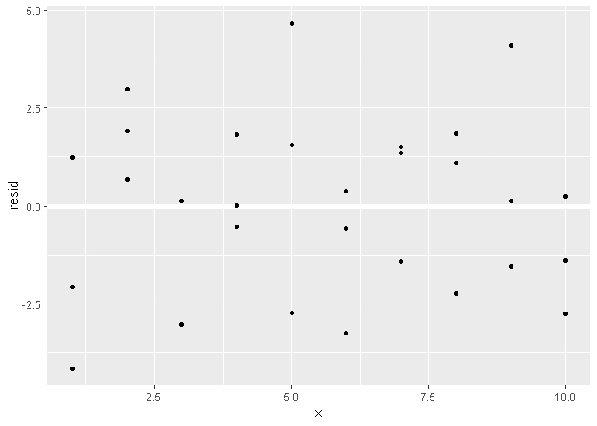<!-- -->

잔차의 평균값은 항상 0이다. 바로 위의 그래프를 본다면, 랜덤한 잔차가 잘 드러나며 이는 모델이 데이터셋에서 패턴을 잘
포착하였다는 것을 의미한다.

# 4\. 수식과 모델 모음

**이전에 facet\_wrap과 facet\_grid를 사용할 때 수식(formula)을 본 적이 있다.** R에서 수식은
특수한 동작을 하도록 하는 일반적인 방법을 제공한다. 변수의 값을 즉시 평가하기보다는 함수에 의해 해석될 수 있도록
수식을 보유한다.

**R에서 수식에서 함수로의 전환을 확인하고 싶다면 model\_matrix함수를 사용하면 된다.**

``` r
df <- tribble(~y, ~x1, ~x2,
              4, 2, 5,
              5, 1, 6)

model_matrix(df, y ~ x1)
```

    ## # A tibble: 2 x 2
    ##   `(Intercept)`    x1
    ##           <dbl> <dbl>
    ## 1             1     2
    ## 2             1     1

``` r
# y절편 없애기
model_matrix(df, y ~ x1 - 1)
```

    ## # A tibble: 2 x 1
    ##      x1
    ##   <dbl>
    ## 1     2
    ## 2     1

``` r
# 모델에 변수를 추가할 때마다 모델 매트릭스는 증가한다.
model_matrix(df, y ~ x1 + x2)
```

    ## # A tibble: 2 x 3
    ##   `(Intercept)`    x1    x2
    ##           <dbl> <dbl> <dbl>
    ## 1             1     2     5
    ## 2             1     1     6

이러한 수식 표기법은 **윌킨슨-로저스 표기법**이라고 불리며, 말 그대로 윌킨슨과 로저스가 처음 설명하였다.

## 4.1 범주형 변수

범주형 변수는 조금 복잡하다.

``` r
df <- tribble(~sex, ~response,
              "male", 1,
              "female", 2,
              "male", 1)

model_matrix(df, response ~ sex)
```

    ## # A tibble: 3 x 2
    ##   `(Intercept)` sexmale
    ##           <dbl>   <dbl>
    ## 1             1       1
    ## 2             1       0
    ## 3             1       1

R프로그램은 자체적으로 y = x\_0 + x\_1 \* sex\_male을 반환하였다. 여기서 sex\_male은 남성일 경우
1, 여성일 경우 0을 의미한다.

다음으로는, sim2 데이터의 예측값을 시각화하는 데 초점을 맞춰보자.

``` r
# 데이터 형태 시각화
ggplot(data =sim2) +
  geom_point(mapping = aes(x = x, y = y))
```

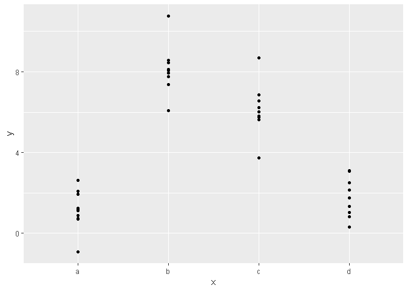<!-- -->

``` r
# 모델을 적합하고, 예측값 생성하기
mod2 <- lm(y ~ x, data = sim2)

grid <- sim2 %>% 
  data_grid(x) %>% 
  add_predictions(mod2)

grid
```

    ## # A tibble: 4 x 2
    ##   x      pred
    ##   <chr> <dbl>
    ## 1 a      1.15
    ## 2 b      8.12
    ## 3 c      6.13
    ## 4 d      1.91

``` r
# 그래프 그려보기
ggplot(data = sim2, mapping = aes(x)) +
  geom_point(mapping = aes(y = y)) +
  geom_point(data = grid,
             mapping = aes(y = pred),
             color = "red",
             size = 4)
```

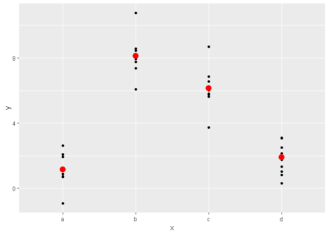<!-- -->

# 4.2 연속형과 범주형 변수의 상호작용

sim3 데이터는 범주형 예측 변수와 연속형 예측 변수를 포함한 데이터셋이다. 이 변수들은 간단한 플롯으로 시각화할 수 있다.

``` r
ggplot(data = sim3, mapping = aes(x = x1, y = y)) +
  geom_point(mapping = aes(color = x2))
```

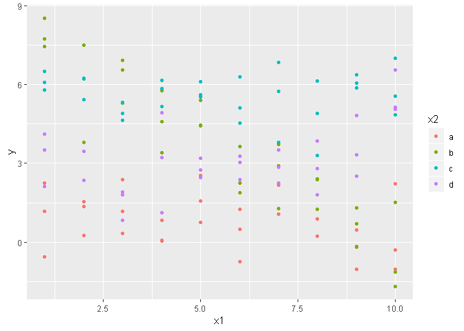<!-- -->

이 데이터에 적용할 수 있는 두 가지 모델이 있다.

``` r
# 다른 모든 변수와 독립적인 각 효과를 추정한다.
mod1 <- lm(y ~ x1 + x2, data = sim3)

# *을 사용할 경우 상호작용이라 불리는 항을 적합할 수 있다.
mod2 <- lm(y ~ x1 * x2, data = sim3)
```

\*를 사용한 예시의 경우에는 이를 수식으로 표현한다면 다음과 같다.

**y = a\_0 + a\_1 x a1 + a\_2 x a2 + a\_12 x a1 x a2**

이 모델을 시각화하려면 새로운 두 가지 수법이 필요하다.

  - 두 개의 예측 변수에 대해 data\_grid를 적용해야 한다. 이 함수는 x1과 x2의 고유한 값에 대한 모든 조합을
    생성한다.
  - 두 모델로 동시에 예측값을 생성하기 위해서 **행으로 각 예측값을 추가하는 gather\_predictions**를 사용할
    수 있다. gather\_predictions를 보완하는 함수는 **각각의 예측값을 새로운 열로 추가하는
    spread\_predictions**이다.

<!-- end list -->

``` r
grid <- sim3 %>% 
  data_grid(x1, x2) %>% 
  gather_predictions(mod1, mod2)

grid
```

    ## # A tibble: 80 x 4
    ##    model    x1 x2     pred
    ##    <chr> <int> <fct> <dbl>
    ##  1 mod1      1 a      1.67
    ##  2 mod1      1 b      4.56
    ##  3 mod1      1 c      6.48
    ##  4 mod1      1 d      4.03
    ##  5 mod1      2 a      1.48
    ##  6 mod1      2 b      4.37
    ##  7 mod1      2 c      6.28
    ##  8 mod1      2 d      3.84
    ##  9 mod1      3 a      1.28
    ## 10 mod1      3 b      4.17
    ## # ... with 70 more rows

**면 분할**을 사용해서 두 모델의 결과를 하나의 플롯에 시각화한다.

``` r
ggplot(data = sim3, mapping = aes(x = x1, y = y, color = x2)) +
  geom_point() +
  geom_line(data = grid, mapping = aes(y = pred)) +
  facet_wrap(~ model)
```

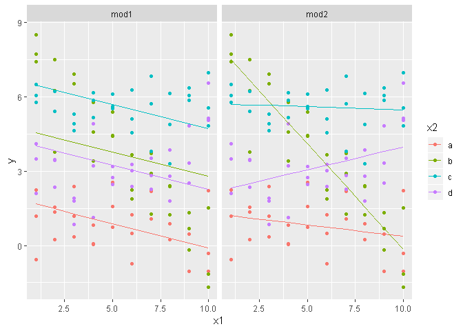<!-- -->

mod1의 경우에는 기울기가 같지만 y절편값이 제각각이고, mod2의 경우에는 기울기와 y절편값이 모두 다르다.

잔차를 통하여 어떤 모델이 더 나은 지 평가해볼 수 있을 것이다.

``` r
sim3 <- sim3 %>% 
  gather_residuals(mod1, mod2)


ggplot(data = sim3, mapping = aes(x1, resid, color = x2)) +
  geom_point() +
  facet_grid(model ~ x2)
```

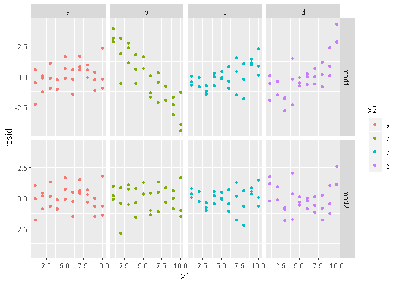<!-- -->

mod2의 잔차에서는 패턴이 거의 보이지 않는다. 반면에 mod1는 b에서 어떠한 요소를 놓쳤다는 것을 확인할 수 있었다.

## 4.3 연속형 변수의 상호작용

두 개의 연속 변수로 이루어진 모델을 살펴보기로 하자. 이전 예제와 거의 유사하게 진행된다.

``` r
mod1 <- lm(y ~ x1 + x2, data = sim4)
mod2 <- lm(y ~ x1 * x2, data = sim4)

grid <- sim4 %>% 
  data_grid(x1 = seq_range(x1, 5),
            x2 = seq_range(x2, 5)) %>% 
  gather_predictions(mod1, mod2)

grid
```

    ## # A tibble: 50 x 4
    ##    model    x1    x2   pred
    ##    <chr> <dbl> <dbl>  <dbl>
    ##  1 mod1   -1    -1    0.996
    ##  2 mod1   -1    -0.5 -0.395
    ##  3 mod1   -1     0   -1.79 
    ##  4 mod1   -1     0.5 -3.18 
    ##  5 mod1   -1     1   -4.57 
    ##  6 mod1   -0.5  -1    1.91 
    ##  7 mod1   -0.5  -0.5  0.516
    ##  8 mod1   -0.5   0   -0.875
    ##  9 mod1   -0.5   0.5 -2.27 
    ## 10 mod1   -0.5   1   -3.66 
    ## # ... with 40 more rows

``` r
# 참고! seq_range는 어떤 함수일까?
x <- c(1,2,3)
seq_range(x, 5)
```

    ## [1] 1.0 1.5 2.0 2.5 3.0

seq\_range는 연속형 변수의 그리드 서치에서 일반적으로 유용한 방법이다. 이 함수에는 다음 3가지의 유용한 인수가 있다.

  - pretty : TRUE는 보기 좋은 시퀀스, 테이블로 결과를 생성하려는 경우에 유용하다.
  - trim : 0.1은 꼬리값의 10%를 제거한다.변수가 꼬리가 긴 분포를 가지고 있으며, 중심 근처의 값을 생성하고자 하는
    경우에 유용하다.
  - expand = 0.1은 trim의 반대이다. 범위를 10% 확장해준다.

<!-- end list -->

``` r
# pretty 옵션
seq_range(c(0.0123, 0.923423), n = 5, pretty = TRUE)
```

    ## [1] 0.0 0.2 0.4 0.6 0.8 1.0

``` r
seq_range(c(0.0123, 0.923423), n = 5, pretty = FALSE)
```

    ## [1] 0.0123000 0.2400808 0.4678615 0.6956423 0.9234230

``` r
# trim 옵션
x1 <- rcauchy(100)
seq_range(x1, n = 5)
```

    ## [1] -150.274597  -71.189495    7.895606   86.980708  166.065810

``` r
seq_range(x1, n = 5, trim = 0.1)
```

    ## [1] -4.4939508 -0.1012371  4.2914766  8.6841904 13.0769041

``` r
# expand 옵션
x2 <- c(0, 1)
seq_range(x2, n = 5)
```

    ## [1] 0.00 0.25 0.50 0.75 1.00

``` r
seq_range(x2, n = 5, expand = 0.1)
```

    ## [1] -0.050  0.225  0.500  0.775  1.050

이어서, 모델을 시각화해보자. 2개의 연속형 예측 변수를 가지고 있으므로 3D 표면과 같은 모델을 상상해볼 수 있다.
**geom\_tile**을 사용하면 이를 나타낼 수 있다.

``` r
ggplot(data = grid, mapping = aes(x1, x2)) +
  geom_tile(mapping = aes(fill = pred)) +
  facet_wrap(~ model)
```

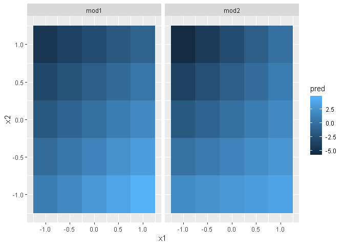<!-- -->

위 그림 상으로는 두 모델이 상당히 유사해보인다. 이번에는 다른 그림을 살펴보자. 한 변수를 여러 조각으로 나누어서, 각각을
예측값과 비교하는 것이다.

``` r
ggplot(grid, mapping = aes(x1, pred, color = x2, group = x2)) +
  geom_line() +
  facet_wrap(~ model)
```

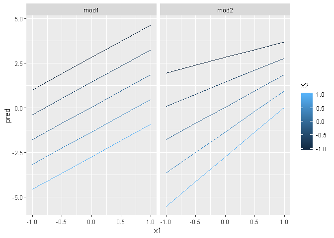<!-- -->

``` r
ggplot(grid, mapping = aes(x2, pred, color = x1, group = x1)) +
  geom_line() +
  facet_wrap(~ model)
```

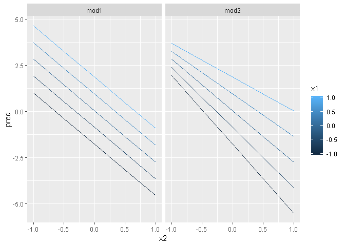<!-- -->

위 플롯은 두 개의 연속 변수 사이의 상호작용이 기본적으로 범주형과 연속형 변수의 상호작용과 같은 방식으로 동작함을 보여준다. 이
플롯에서의 상호작용은 고정된 오프셋이 없다는 것을 나타낸다. 즉, y를 예측하기 위해서는 x1과 x2를 동시에 고려해야 한다.

두 개의 연속 변수만으로 좋은 시각화는 어렵다. 하지만 그것은 합리적이다. 세 개 또는 그 이상의 변수들이 동시에 상호작용하는
방식에 대해서 이해하기가 쉬울 거라 예상하지는 않을 것이다. 모델은 완벽해야 할 필요가 없으며 단지 데이터를 더 잘
나타내는 데 도움을 주면 된다.

## 4.4 변환

모델의 수식(formula) 내에서 변환할 수도 있다. 예를 들어 본다면 다음과 같다.

``` r
df <- tribble(~y, ~x,
              1, 1,
              2, 2,
              3, 3)

# 1번
model_matrix(df, y ~ x^2 + x)
```

    ## # A tibble: 3 x 2
    ##   `(Intercept)`     x
    ##           <dbl> <dbl>
    ## 1             1     1
    ## 2             1     2
    ## 3             1     3

``` r
# 2번
model_matrix(df, y ~ I(x^2) + x)
```

    ## # A tibble: 3 x 3
    ##   `(Intercept)` `I(x^2)`     x
    ##           <dbl>    <dbl> <dbl>
    ## 1             1        1     1
    ## 2             1        4     2
    ## 3             1        9     3

1번의 경우에는 y = x \* x + x로 계산이 된다. 이때, x \* x는 x 자체의 상호작용과 동일하다. 또한 마찬가지로
“x + x” 는 x가 되며, 최종적으로는 y = a\_1 + a\_2 \* x가 된다.

2번의 경우에는 I를 통하여 묶어서 모델의 열거한 부분을 처리하지 않도록 하였다. 따라서 y = a\_1 + a\_2 \* x +
a\_3 \* x^2가 된다.

**이러한 변환 방식은 비선형 함수를 근사하는 데 유용하게 사용할 수 있다.** 만약 미적분 수업을 들었다면 테일러 정리에 대해
들어봤을 것이다. 이는 어떤 평활 함수도 다항식의 무한 합으로 근사시킬 수 있다는 정리이다.

즉 y = a\_1 + a\_2 \* x + a\_3 \* x^2 + … 으로 선형 함수를 임의의 평활 함수에 가깝게 만들 수
있다는 것을 의미한다. **손으로 시퀀스를 타이핑하는 것은 번거롭기 때문에 R에서는 도우미 함수인 poly를 제공한다.**

``` r
model_matrix(df, y ~ poly(x, 2))
```

    ## # A tibble: 3 x 3
    ##   `(Intercept)` `poly(x, 2)1` `poly(x, 2)2`
    ##           <dbl>         <dbl>         <dbl>
    ## 1             1     -7.07e- 1         0.408
    ## 2             1     -7.85e-17        -0.816
    ## 3             1      7.07e- 1         0.408

다만, poly를 사용할 때에는 유의해야 할 점이 있다. 데이터의 범위를 벗어나면 다항식이 급격하게 양의 무한대 또는 음의
무한대로 발산한다. 한 가지 안전한 대안은 본연의 스플라인(spline - 매끄러운 곡선)인
**splines::ns함수**를 사용하는 것이다.

``` r
library(splines)

model_matrix(df, y ~ ns(x, 2))
```

    ## # A tibble: 3 x 3
    ##   `(Intercept)` `ns(x, 2)1` `ns(x, 2)2`
    ##           <dbl>       <dbl>       <dbl>
    ## 1             1       0           0    
    ## 2             1       0.566      -0.211
    ## 3             1       0.344       0.771

비선형 함수를 근사할 때 어떻게 표현되는지 살펴보자.

``` r
sim5 <- tibble(x = seq(0, 3.5 * pi, length = 50),
               y = 4 * sin(x) + rnorm(length(x)))

sim5
```

    ## # A tibble: 50 x 2
    ##        x     y
    ##    <dbl> <dbl>
    ##  1 0      1.93
    ##  2 0.224  1.69
    ##  3 0.449  1.72
    ##  4 0.673  2.54
    ##  5 0.898  2.33
    ##  6 1.12   3.94
    ##  7 1.35   4.54
    ##  8 1.57   4.38
    ##  9 1.80   4.92
    ## 10 2.02   1.72
    ## # ... with 40 more rows

``` r
ggplot(sim5, aes(x, y)) +
  geom_point()
```

<!-- -->

``` r
# 5개의 모형을 적합
mod1 <- lm(y ~ ns(x, 1), data = sim5)
mod2 <- lm(y ~ ns(x, 2), data = sim5)
mod3 <- lm(y ~ ns(x, 3), data = sim5)
mod4 <- lm(y ~ ns(x, 4), data = sim5)
mod5 <- lm(y ~ ns(x, 5), data = sim5)


grid <- sim5 %>% 
  data_grid(x = seq_range(x, n = 50, expand = 0.1)) %>%
  gather_predictions(mod1, mod2, mod3, mod4, mod5, .pred = "y") # 예측값의 변수명을 y로 지정하겠다는 뜻이다. 예측값의 이름과 실제값의 이름을 통일하지 않을 경우, ggplot이 인식을 못하고 그래프를 그리는 것에 실패한다.


ggplot(sim5, aes(x, y)) +
  geom_point() +
  geom_line(data = grid, color = "red") +
  facet_wrap(~ model)
```

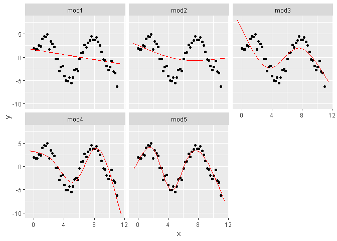<!-- -->

데이터 범위를 벗어나 추정하는 것은 명백히 좋지 않다.

# 5\. 결측값

모델링 함수는 결측값이 포함된 행을 삭제한다. options(na.action = na.warn)은 경고문을 표시해준다. 경고문을
표시하지 않으려면 na.caution = na.exclude로 설정한다.

``` r
mod <- lm(y ~ x, data = df, na.action = na.exclude)
```

# 6\. 다른 모델 모음

일반화 선형 모형(glm), 일반화 가법 모형(gam), 벌점 선형 모형(glmnet), 로버스트 선형 모형(rlm), 트리
모형(rpart)등이 있다. 쉽게 말하면 통계적인 기법들과 머신러닝 기법들이다.
