19장 : 모델 생성
================
huimin
2019 8 17

# 기초 설정

``` r
library(tidyverse)
```

    ## Warning: package 'tidyverse' was built under R version 3.6.1

    ## Registered S3 methods overwritten by 'ggplot2':
    ##   method         from 
    ##   [.quosures     rlang
    ##   c.quosures     rlang
    ##   print.quosures rlang

    ## Registered S3 method overwritten by 'rvest':
    ##   method            from
    ##   read_xml.response xml2

    ## -- Attaching packages -------------------------------- tidyverse 1.2.1 --

    ## √ ggplot2 3.1.1       √ purrr   0.3.2  
    ## √ tibble  2.1.1       √ dplyr   0.8.0.1
    ## √ tidyr   0.8.3       √ stringr 1.4.0  
    ## √ readr   1.3.1       √ forcats 0.4.0

    ## -- Conflicts ----------------------------------- tidyverse_conflicts() --
    ## x dplyr::filter() masks stats::filter()
    ## x dplyr::lag()    masks stats::lag()

``` r
library(readr)
library(modelr)
library(hexbin)
```

    ## Warning: package 'hexbin' was built under R version 3.6.1

# 1\. 들어가기

이번 장에서는 실제 데이터에 중점을 두고 데이터에 대한 이해를 돕기 위해 점진적으로 모델을 생성하는 방법을 보여준다.

**전 장과 마찬가지로 데이터의 패턴과 잔차로 분리한 모델을 들여다보면서 생각해볼 수 있는 점들을 활용할 것이다.**

데이터와 머릿속의 내재적인 지식을 정량적 모델의 명시적인 지식으로 전환하는 것이 우리의 목표이다. 이렇게 할 경우 새로운 도메인에
쉽게 적용할 수 있으며 다른 도메인에서 쉽게 사용하도록 해줄 것이다.

많은 기계학습 접근법은 단순히 모델의 예측력을 놓히는 것에만 초점을 맞춘다. 이 접근 방식은 블랙박스 모델을 생성하는 경향이 있어
모델이 예측값을 생성하는 데에는 훌륭하지만, 그 이유에 대해서는 알 수 없다. 이는 실제 지식을 모델에 적용하기가 어렵다.

# 2\. 낮은 품질의 다이아몬드가 더 비싼 이유는 무엇인가?

이 내용은 이미 전 장에서 살펴본 적이 있다. 낮은 품질의 다이아몬드(커팅, 색상, 투명도)가 더 높은 가격을 가진다는 것을
확인했다.

``` r
ggplot(diamonds, aes(cut, price)) + geom_boxplot()
```

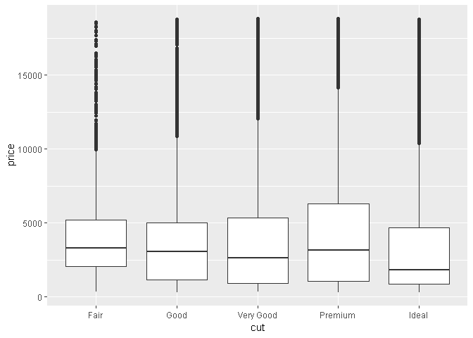<!-- -->

``` r
ggplot(diamonds, aes(color, price)) + geom_boxplot()
```

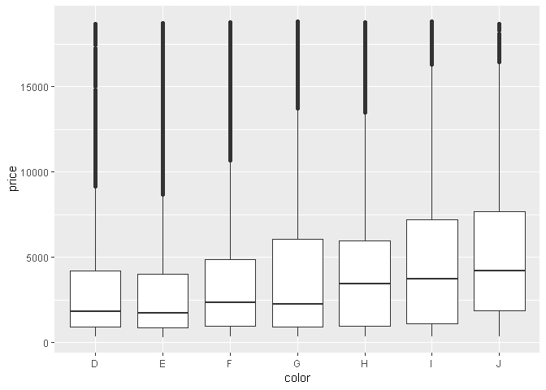<!-- -->

``` r
ggplot(diamonds, aes(clarity, price)) + geom_boxplot()
```

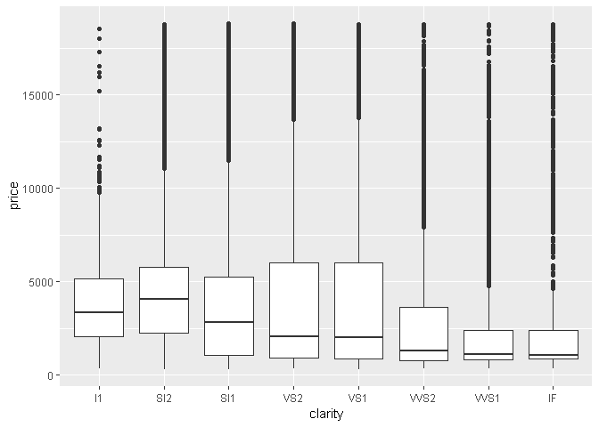<!-- -->

## 2.1 가격과 캐럿

중요한 혼란 변수인 다이아몬드의 무게(carat)가 존재하기 때문에 품질이 낮은 다이아몬드가 가격이 더 높은 것처럼 보인다.

``` r
ggplot(diamonds, aes(carat, price)) +
  geom_hex(bins = 50)
```

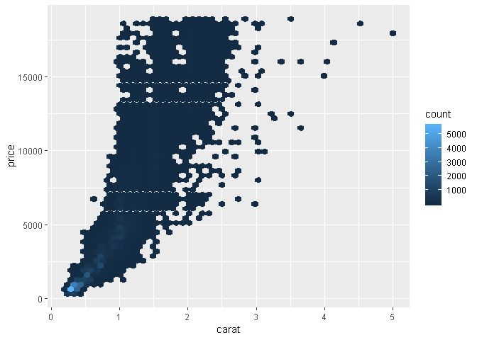<!-- -->

carat의 효과를 분리하는 모델을 적합하여 다이아몬드의 다른 속성이 상대적으로 price에 어떻게 영향을 주는지 쉽게 알 수
있다.

  - 2.5 캐럿보다 작은 다이아몬드(데이터의 99.7%)로 한정한다.
  - **캐럿과 가격 변수를 로그 변환한다.(패턴이 더 두드러진다.)**

<!-- end list -->

``` r
diamonds2 <- diamonds %>% 
  filter(carat <= 2.5) %>%
  mutate(lprice = log2(price),
         lcarat = log2(carat))


ggplot(diamonds2, aes(lcarat, lprice)) +
  geom_hex(bins = 50)
```

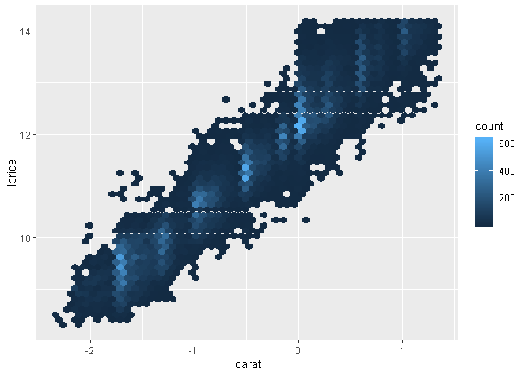<!-- -->

다음 단계로 넘어가서, 강한 선형 패턴을 제거해보자.

``` r
mod_diamonds <- lm(lprice ~ lcarat, data = diamonds2)

grid <- diamonds2 %>% 
  data_grid(carat = seq_range(carat, 20)) %>% 
  mutate(lcarat = log2(carat)) %>% 
  add_predictions(mod_diamonds, "lprice") %>% 
  mutate(price = 2 ^ lprice)


# 이제보니 aes 또한 광역 심미성으로 설정하면, 데이터가 다르더라도 서로 다른 데이터 내의 동일한 이름의 변수를 이용한다.
ggplot(diamonds2, aes(carat, price)) +
  geom_hex(bins = 50) +
  geom_line(data = grid, color = "red", size = 1)
```

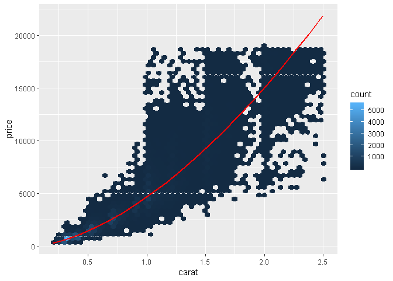<!-- -->

위의 그래프를 본다면, 크기가 큰 다이아몬드는 예측한 값보다 훨씬 저렴하다. 그것은 아마 데이터셋에는 19000달러가 넘는
다이아몬드가 존재하지 않기 때문이다.

이제 강한 선형 패턴을 제대로 제거했는지 확인하기 위해 잔차를 살펴볼 수 있다.

``` r
diamonds2 <- diamonds2 %>% 
  add_residuals(mod_diamonds, "lresid")

ggplot(data = diamonds2, aes(lcarat, lresid)) +
  geom_hex(bins = 50)
```

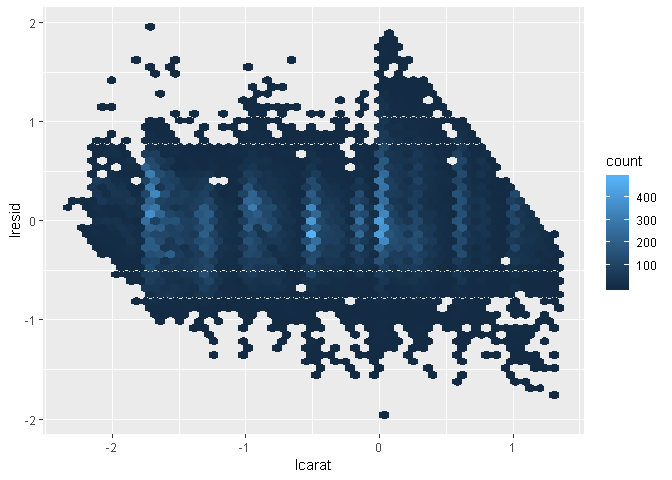<!-- -->

``` r
ggplot(diamonds2, aes(cut, lresid)) + geom_boxplot()
```

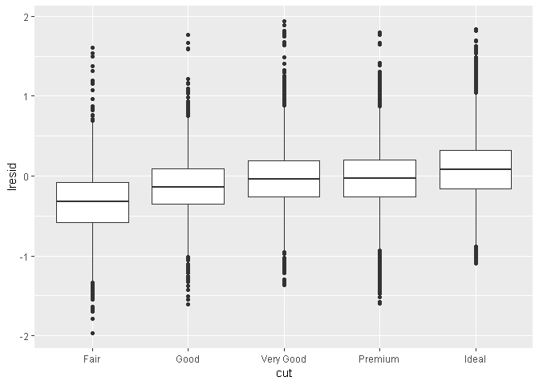<!-- -->

``` r
ggplot(diamonds2, aes(color, lresid)) + geom_boxplot()
```

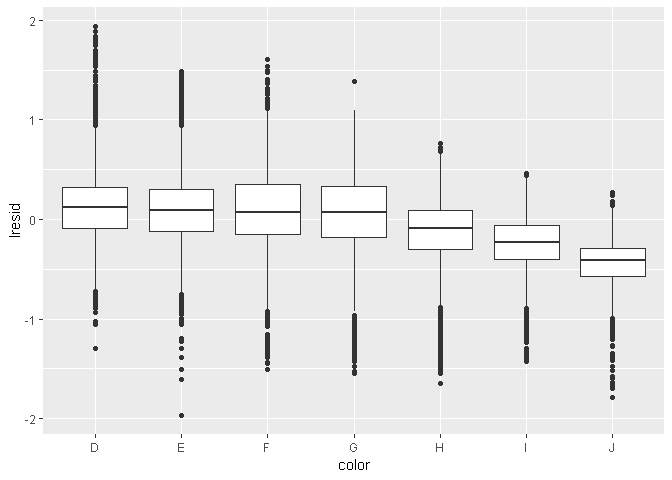<!-- -->

``` r
ggplot(diamonds2, aes(clarity, lresid)) + geom_boxplot()
```

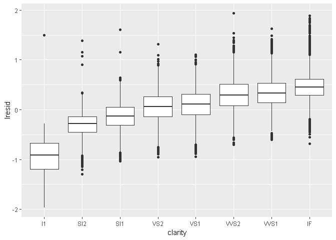<!-- -->

잔차를 통해 비교한 결과, 예상했던 변수들의 관계를 알 수 있다.

## 2.2 더 복잡한 모델

color, cut 및 clarity 변수를 모델에 포함하여 이 세 개의 범주형 변수의 효과를 나타내어 더 명시적인 모델을 만들
수도 있다.

``` r
mod_diamonds2 <- lm(lprice ~ lcarat + color + cut + clarity,
                    data = diamonds2)

grid <- diamonds2 %>% 
  data_grid(cut, .model = mod_diamonds2) %>% 
  add_predictions(mod_diamonds2)

grid
```

    ## # A tibble: 5 x 5
    ##   cut       lcarat color clarity  pred
    ##   <ord>      <dbl> <chr> <chr>   <dbl>
    ## 1 Fair      -0.515 G     VS2      11.2
    ## 2 Good      -0.515 G     VS2      11.3
    ## 3 Very Good -0.515 G     VS2      11.4
    ## 4 Premium   -0.515 G     VS2      11.4
    ## 5 Ideal     -0.515 G     VS2      11.4

``` r
ggplot(data = grid, aes(cut, pred)) +
  geom_point()
```

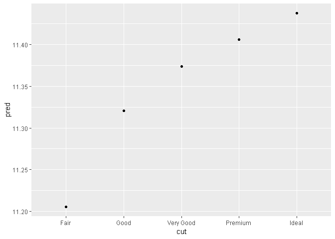<!-- -->

**위의 코드와 결과를 통해 알 수 있듯이, 명시적으로 제공되지 않은 변수를 모델이 필요로 한다면 data\_grid 함수가
자동으로 대표적인 값으로 채운다.**

연속형 변수의 경우 **중앙값**을 사용하고, 범주형 변수의 경우 **최빈값**을 사용한다.

``` r
diamonds2 <- diamonds2 %>% 
  add_residuals(mod_diamonds2, "lresid2")

ggplot(diamonds2, aes(lcarat, lresid2)) +
  geom_hex(bins = 50)
```

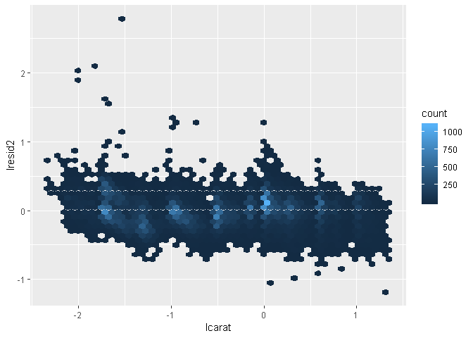<!-- -->

위 플롯은 잔차의 값이 큰 다이아몬드가 일부 존재한다는 것을 보여준다. 잔차가 2라는 것은 다이아몬드의 가격이 예상했던 가격의
4배라는 것을 뜻한다. 비정상적인 관측값을 개별적으로 탐색하면 유용할 때가 많다.

``` r
diamonds2 %>% 
  filter(abs(lresid2) > 1) %>% 
  add_predictions(mod_diamonds2) %>% 
  mutate(pred = round(2 ^ pred)) %>% 
  select(price, pred, carat:table, x:z) %>% 
  arrange(price)
```

    ## # A tibble: 16 x 11
    ##    price  pred carat cut       color clarity depth table     x     y     z
    ##    <int> <dbl> <dbl> <ord>     <ord> <ord>   <dbl> <dbl> <dbl> <dbl> <dbl>
    ##  1  1013   264 0.25  Fair      F     SI2      54.4    64  4.3   4.23  2.32
    ##  2  1186   284 0.25  Premium   G     SI2      59      60  5.33  5.28  3.12
    ##  3  1186   284 0.25  Premium   G     SI2      58.8    60  5.33  5.28  3.12
    ##  4  1262  2644 1.03  Fair      E     I1       78.2    54  5.72  5.59  4.42
    ##  5  1415   639 0.35  Fair      G     VS2      65.9    54  5.57  5.53  3.66
    ##  6  1415   639 0.35  Fair      G     VS2      65.9    54  5.57  5.53  3.66
    ##  7  1715   576 0.32  Fair      F     VS2      59.6    60  4.42  4.34  2.61
    ##  8  1776   412 0.290 Fair      F     SI1      55.8    60  4.48  4.41  2.48
    ##  9  2160   314 0.34  Fair      F     I1       55.8    62  4.72  4.6   2.6 
    ## 10  2366   774 0.3   Very Good D     VVS2     60.6    58  4.33  4.35  2.63
    ## 11  3360  1373 0.51  Premium   F     SI1      62.7    62  5.09  4.96  3.15
    ## 12  3807  1540 0.61  Good      F     SI2      62.5    65  5.36  5.29  3.33
    ## 13  3920  1705 0.51  Fair      F     VVS2     65.4    60  4.98  4.9   3.23
    ## 14  4368  1705 0.51  Fair      F     VVS2     60.7    66  5.21  5.11  3.13
    ## 15 10011  4048 1.01  Fair      D     SI2      64.6    58  6.25  6.2   4.02
    ## 16 10470 23622 2.46  Premium   E     SI2      59.7    59  8.82  8.76  5.25

# 3\. 일일 운항 횟수에 어떤 영향이 있는가?

항공편 데이터셋에 대해 비슷한 과정을 진행해보자. 생략. 궁금하면 367페이지부터 확인
