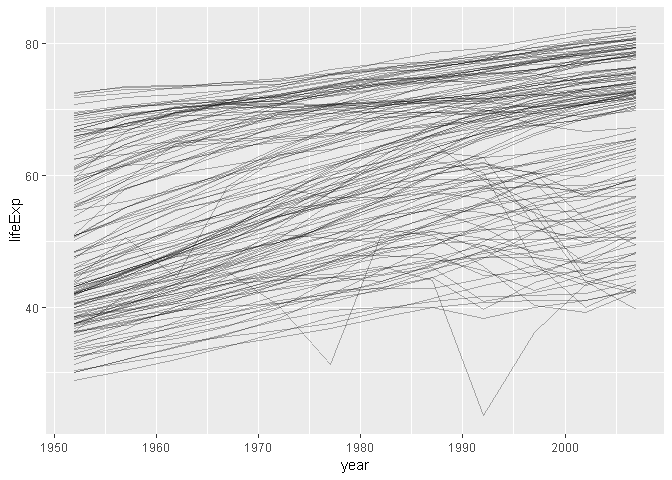
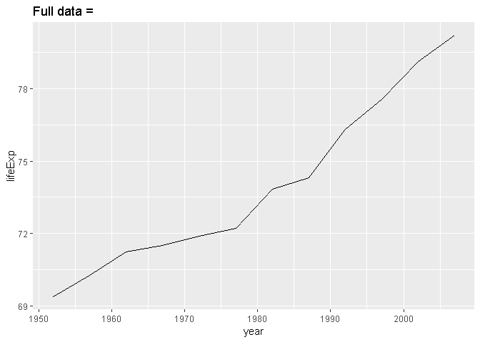
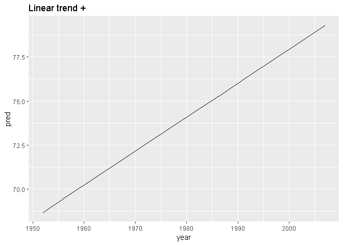
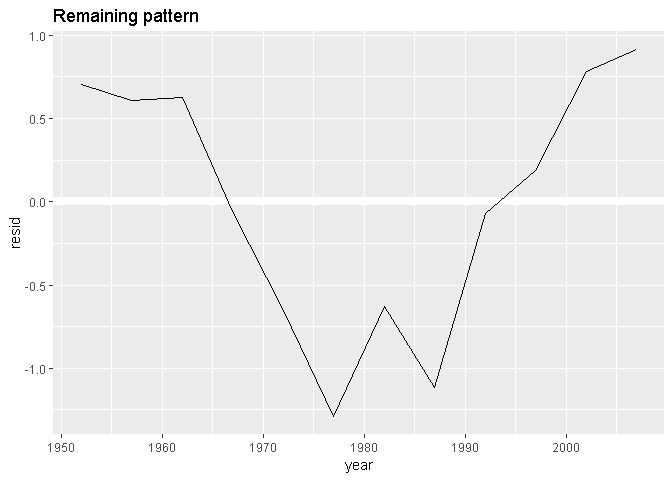
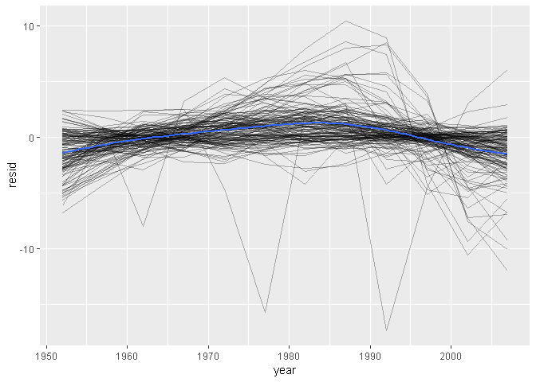
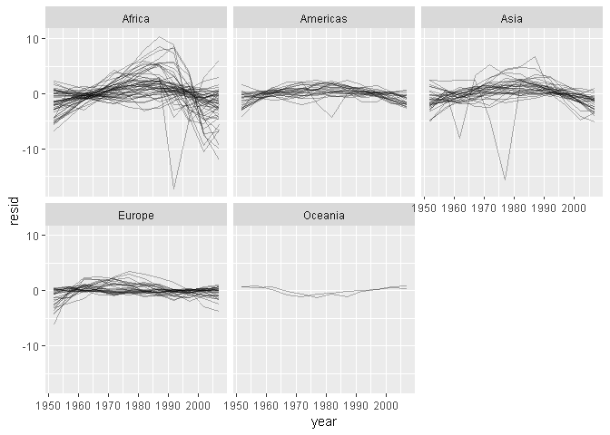
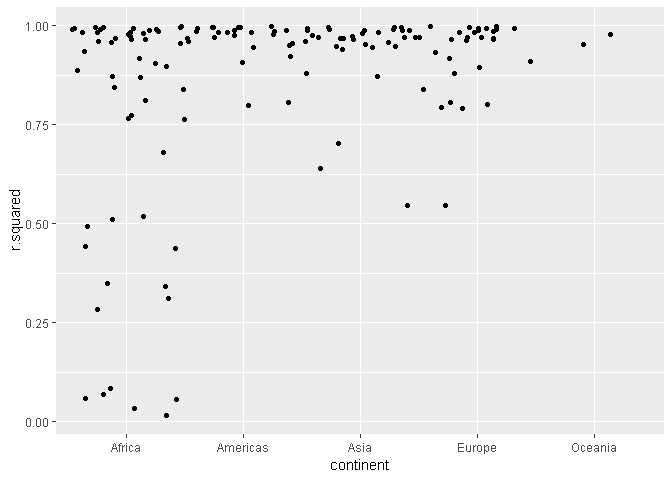
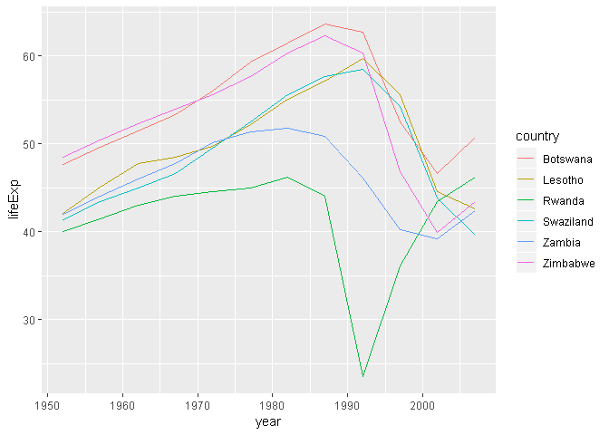

20장 : purrr와 broom을 활용한 모델
================
huimin
2019 8 18

# 기초 설정

``` r
library(tidyverse)
```

    ## Warning: package 'tidyverse' was built under R version 3.6.1

    ## Registered S3 methods overwritten by 'ggplot2':
    ##   method         from 
    ##   [.quosures     rlang
    ##   c.quosures     rlang
    ##   print.quosures rlang

    ## Registered S3 method overwritten by 'rvest':
    ##   method            from
    ##   read_xml.response xml2

    ## -- Attaching packages -------------------------------- tidyverse 1.2.1 --

    ## √ ggplot2 3.1.1       √ purrr   0.3.2  
    ## √ tibble  2.1.1       √ dplyr   0.8.0.1
    ## √ tidyr   0.8.3       √ stringr 1.4.0  
    ## √ readr   1.3.1       √ forcats 0.4.0

    ## -- Conflicts ----------------------------------- tidyverse_conflicts() --
    ## x dplyr::filter() masks stats::filter()
    ## x dplyr::lag()    masks stats::lag()

``` r
library(readr)
library(gapminder)
```

    ## Warning: package 'gapminder' was built under R version 3.6.1

``` r
library(modelr)
library(broom)
```

    ## 
    ## Attaching package: 'broom'

    ## The following object is masked from 'package:modelr':
    ## 
    ##     bootstrap

# 1\. 들어가기

많은 양의 모델을 쉽게 작업할 수 있도록 하는 세 가지 아이디어에 대해 학습한다.

  - 간단한 모델을 여러 개 사용하여 복잡한 데이터셋을 잘 이해한다.
  - 리스트 형식의 열을 사용하여 임의의 데이터 구조를 데이터프레임에 저장한다.
  - broom 패키지를 사용하여 모델을 타이디 데이터로 변환한다.

# 2\. gapminder 데이터

gapminder 데이터는 기대 수명과 GDP와 같은 통계값을 통해 시간의 경과에 따른 국가의 변천을 요약한 데이터이다.

``` r
str(gapminder)
```

    ## Classes 'tbl_df', 'tbl' and 'data.frame':    1704 obs. of  6 variables:
    ##  $ country  : Factor w/ 142 levels "Afghanistan",..: 1 1 1 1 1 1 1 1 1 1 ...
    ##  $ continent: Factor w/ 5 levels "Africa","Americas",..: 3 3 3 3 3 3 3 3 3 3 ...
    ##  $ year     : int  1952 1957 1962 1967 1972 1977 1982 1987 1992 1997 ...
    ##  $ lifeExp  : num  28.8 30.3 32 34 36.1 ...
    ##  $ pop      : int  8425333 9240934 10267083 11537966 13079460 14880372 12881816 13867957 16317921 22227415 ...
    ##  $ gdpPercap: num  779 821 853 836 740 ...

``` r
gapminder
```

    ## # A tibble: 1,704 x 6
    ##    country     continent  year lifeExp      pop gdpPercap
    ##    <fct>       <fct>     <int>   <dbl>    <int>     <dbl>
    ##  1 Afghanistan Asia       1952    28.8  8425333      779.
    ##  2 Afghanistan Asia       1957    30.3  9240934      821.
    ##  3 Afghanistan Asia       1962    32.0 10267083      853.
    ##  4 Afghanistan Asia       1967    34.0 11537966      836.
    ##  5 Afghanistan Asia       1972    36.1 13079460      740.
    ##  6 Afghanistan Asia       1977    38.4 14880372      786.
    ##  7 Afghanistan Asia       1982    39.9 12881816      978.
    ##  8 Afghanistan Asia       1987    40.8 13867957      852.
    ##  9 Afghanistan Asia       1992    41.7 16317921      649.
    ## 10 Afghanistan Asia       1997    41.8 22227415      635.
    ## # ... with 1,694 more rows

각 국가(country)별 기대 수명(lifeExp)은 시간(year)에 따라 어떻게 변하는가라는 질문에 대답하기 위해 세 가지
변수에 초점을 맞출 것이다.

``` r
gapminder %>% 
  ggplot(aes(year, lifeExp, group = country)) +
  geom_line(alpha = 0.3)
```

<!-- -->

전반적인 기대 수명이 꾸준히 증가하고 있는 것처럼 보인다. 그러나 모든 국가가 이러한 패턴을 따르는 것은 아니다. 어떻게 해야
이러한 예외 국가들을 보기 쉽게 만들까?

**가장 간단한 방법**은, 이전 장과 같은 접근 방식으로, **선형 추세 모델을 적합하고 잔차를 통하여 나머지 추세를 파악하는
것이다.**

``` r
nz <- filter(gapminder, country == "New Zealand")

nz %>% 
  ggplot(aes(year, lifeExp)) +
  geom_line() +
  ggtitle("Full data = ")
```

<!-- -->

``` r
nz_mod <- lm(lifeExp ~ year, data = nz)

nz %>% 
  add_predictions(nz_mod) %>% 
  ggplot(aes(year, pred)) +
  geom_line() +
  ggtitle("Linear trend + ")
```

<!-- -->

``` r
nz %>% 
  add_residuals(nz_mod) %>% 
  ggplot(aes(year, resid)) +
  geom_hline(yintercept = 0, color = "white", size = 3) +
  geom_line() +
  ggtitle("Remaining pattern")
```

<!-- -->

## 2.1 중첩된 데이터

purrr의 map 함수를 사용하여 위의 과정을 반복할 수도 있다.

``` r
# nest를 통해서 그룹화된 데이터 이외의 것들을 data라는 하나의 항목에 압축시켜 놓는 모양이다.
by_country <- gapminder %>% 
  group_by(country, continent) %>% 
  nest()

by_country
```

    ## # A tibble: 142 x 3
    ##    country     continent data             
    ##    <fct>       <fct>     <list>           
    ##  1 Afghanistan Asia      <tibble [12 x 4]>
    ##  2 Albania     Europe    <tibble [12 x 4]>
    ##  3 Algeria     Africa    <tibble [12 x 4]>
    ##  4 Angola      Africa    <tibble [12 x 4]>
    ##  5 Argentina   Americas  <tibble [12 x 4]>
    ##  6 Australia   Oceania   <tibble [12 x 4]>
    ##  7 Austria     Europe    <tibble [12 x 4]>
    ##  8 Bahrain     Asia      <tibble [12 x 4]>
    ##  9 Bangladesh  Asia      <tibble [12 x 4]>
    ## 10 Belgium     Europe    <tibble [12 x 4]>
    ## # ... with 132 more rows

continent와 country를 그룹화하였다. 이렇게 하면 그룹별(국가별)로 하나의 행과 다소 특이한 열을 가진 데이터프레임인
data가 생성된다. data는 데이터프레임의 리스트이다. 다소 복잡한 리스트이므로 보기에 약간 까다롭지만, 이러한 개체를 탐색할
수 있는 좋은 도구를 가지고 있다.

data 열에서 하나의 요소를 추출하면 해당 국가의 모든 데이터가 포함되어 있다는 것을 알 수 있다.

``` r
by_country$data[[1]]
```

    ## # A tibble: 12 x 4
    ##     year lifeExp      pop gdpPercap
    ##    <int>   <dbl>    <int>     <dbl>
    ##  1  1952    28.8  8425333      779.
    ##  2  1957    30.3  9240934      821.
    ##  3  1962    32.0 10267083      853.
    ##  4  1967    34.0 11537966      836.
    ##  5  1972    36.1 13079460      740.
    ##  6  1977    38.4 14880372      786.
    ##  7  1982    39.9 12881816      978.
    ##  8  1987    40.8 13867957      852.
    ##  9  1992    41.7 16317921      649.
    ## 10  1997    41.8 22227415      635.
    ## 11  2002    42.1 25268405      727.
    ## 12  2007    43.8 31889923      975.

## 2.2 리스트 - 열

이제 중첩된 데이터프레임을 생성했으므로, 모델을 적합해볼 수 있다. 다음과 같이 모델을 적합하는 함수가 있다.

``` r
country_model <- function(df) {
  
  lm(lifeExp ~ year, data = df)
  
}
```

map함수를 이용하여 각 요소에 대해 country\_model을 적용하면 된다.

``` r
# map함수를 이용한 모델 생성
models <- map(by_country$data, country_model)

# by_country에 새로운 변수로 추가
by_country$model <- models

by_country
```

    ## # A tibble: 142 x 4
    ##    country     continent data              model   
    ##    <fct>       <fct>     <list>            <list>  
    ##  1 Afghanistan Asia      <tibble [12 x 4]> <S3: lm>
    ##  2 Albania     Europe    <tibble [12 x 4]> <S3: lm>
    ##  3 Algeria     Africa    <tibble [12 x 4]> <S3: lm>
    ##  4 Angola      Africa    <tibble [12 x 4]> <S3: lm>
    ##  5 Argentina   Americas  <tibble [12 x 4]> <S3: lm>
    ##  6 Australia   Oceania   <tibble [12 x 4]> <S3: lm>
    ##  7 Austria     Europe    <tibble [12 x 4]> <S3: lm>
    ##  8 Bahrain     Asia      <tibble [12 x 4]> <S3: lm>
    ##  9 Bangladesh  Asia      <tibble [12 x 4]> <S3: lm>
    ## 10 Belgium     Europe    <tibble [12 x 4]> <S3: lm>
    ## # ... with 132 more rows

## 2.3 중첩 해제하기(Unnesting)

현재는 142개의 데이터프레임과 142개의 모델을 보유하고 있다. 잔차를 계산하기 위해 각 모델과 데이터 쌍에 대해
add\_residuals를 적용한다.

``` r
by_country <- by_country %>% 
  mutate(resids = map2(data, model, add_residuals))

by_country
```

    ## # A tibble: 142 x 5
    ##    country     continent data              model    resids           
    ##    <fct>       <fct>     <list>            <list>   <list>           
    ##  1 Afghanistan Asia      <tibble [12 x 4]> <S3: lm> <tibble [12 x 5]>
    ##  2 Albania     Europe    <tibble [12 x 4]> <S3: lm> <tibble [12 x 5]>
    ##  3 Algeria     Africa    <tibble [12 x 4]> <S3: lm> <tibble [12 x 5]>
    ##  4 Angola      Africa    <tibble [12 x 4]> <S3: lm> <tibble [12 x 5]>
    ##  5 Argentina   Americas  <tibble [12 x 4]> <S3: lm> <tibble [12 x 5]>
    ##  6 Australia   Oceania   <tibble [12 x 4]> <S3: lm> <tibble [12 x 5]>
    ##  7 Austria     Europe    <tibble [12 x 4]> <S3: lm> <tibble [12 x 5]>
    ##  8 Bahrain     Asia      <tibble [12 x 4]> <S3: lm> <tibble [12 x 5]>
    ##  9 Bangladesh  Asia      <tibble [12 x 4]> <S3: lm> <tibble [12 x 5]>
    ## 10 Belgium     Europe    <tibble [12 x 4]> <S3: lm> <tibble [12 x 5]>
    ## # ... with 132 more rows

데이터프레임 리스트를 어떻게 하면 플롯으로 나타낼 수 있는가? 우선 unnest를 이용하여 중첩된 데이터프레임을 일반
데이터프레임으로 돌려보자.

``` r
resids <- unnest(by_country, resids)
resids
```

    ## # A tibble: 1,704 x 7
    ##    country     continent  year lifeExp      pop gdpPercap   resid
    ##    <fct>       <fct>     <int>   <dbl>    <int>     <dbl>   <dbl>
    ##  1 Afghanistan Asia       1952    28.8  8425333      779. -1.11  
    ##  2 Afghanistan Asia       1957    30.3  9240934      821. -0.952 
    ##  3 Afghanistan Asia       1962    32.0 10267083      853. -0.664 
    ##  4 Afghanistan Asia       1967    34.0 11537966      836. -0.0172
    ##  5 Afghanistan Asia       1972    36.1 13079460      740.  0.674 
    ##  6 Afghanistan Asia       1977    38.4 14880372      786.  1.65  
    ##  7 Afghanistan Asia       1982    39.9 12881816      978.  1.69  
    ##  8 Afghanistan Asia       1987    40.8 13867957      852.  1.28  
    ##  9 Afghanistan Asia       1992    41.7 16317921      649.  0.754 
    ## 10 Afghanistan Asia       1997    41.8 22227415      635. -0.534 
    ## # ... with 1,694 more rows

이제 잔차를 플롯으로 나타낼 수 있다.

``` r
resids %>% 
  ggplot(aes(year, resid)) +
  geom_line(aes(group = country), alpha = 0.3) +
  geom_smooth(se = FALSE)
```

    ## `geom_smooth()` using method = 'gam' and formula 'y ~ s(x, bs = "cs")'

<!-- -->

폴롯을 면분할 할 수도 있다.

``` r
resids %>% 
  ggplot(aes(year, resid)) +
  geom_line(aes(group = country), alpha = 0.3) +
  facet_wrap(~ continent)
```

<!-- -->

아프리카 대륙의 플롯에서 매우 큰 잔차값을 일부 볼 수 있으며, 이는 그 값에 대해 우리의 모델이 잘 맞지 않는다는 흥미로운 점을
발견할 수 있다.

## 2.4 모델의 성능

모델의 성능에 대한 일반적인 측정값을 살펴볼 수 있다. broom 패키지는 모델을 타이디 데이터로 전환하는 일반적인 함수들을
제공한다. 모델의 성능 메트릭을 추출하기 위해 **broom의 glance함수**를 사용할 것이다. 이 함수는 모델에
적용하면 한 줄로 이루어진 데이터프레임이 생성된다.

``` r
broom::glance(nz_mod)
```

    ## # A tibble: 1 x 11
    ##   r.squared adj.r.squared sigma statistic p.value    df logLik   AIC   BIC
    ##       <dbl>         <dbl> <dbl>     <dbl>   <dbl> <int>  <dbl> <dbl> <dbl>
    ## 1     0.954         0.949 0.804      205. 5.41e-8     2  -13.3  32.6  34.1
    ## # ... with 2 more variables: deviance <dbl>, df.residual <int>

mutate와 unnest를 이용하여 국가별로 하나의 행이 존재하는 데이터프레임을 만들 수 있다.

``` r
by_country %>% 
  mutate(glance = map(model, broom::glance)) %>% 
  unnest(glance)
```

    ## # A tibble: 142 x 16
    ##    country continent data  model resids r.squared adj.r.squared sigma
    ##    <fct>   <fct>     <lis> <lis> <list>     <dbl>         <dbl> <dbl>
    ##  1 Afghan~ Asia      <tib~ <S3:~ <tibb~     0.948         0.942 1.22 
    ##  2 Albania Europe    <tib~ <S3:~ <tibb~     0.911         0.902 1.98 
    ##  3 Algeria Africa    <tib~ <S3:~ <tibb~     0.985         0.984 1.32 
    ##  4 Angola  Africa    <tib~ <S3:~ <tibb~     0.888         0.877 1.41 
    ##  5 Argent~ Americas  <tib~ <S3:~ <tibb~     0.996         0.995 0.292
    ##  6 Austra~ Oceania   <tib~ <S3:~ <tibb~     0.980         0.978 0.621
    ##  7 Austria Europe    <tib~ <S3:~ <tibb~     0.992         0.991 0.407
    ##  8 Bahrain Asia      <tib~ <S3:~ <tibb~     0.967         0.963 1.64 
    ##  9 Bangla~ Asia      <tib~ <S3:~ <tibb~     0.989         0.988 0.977
    ## 10 Belgium Europe    <tib~ <S3:~ <tibb~     0.995         0.994 0.293
    ## # ... with 132 more rows, and 8 more variables: statistic <dbl>,
    ## #   p.value <dbl>, df <int>, logLik <dbl>, AIC <dbl>, BIC <dbl>,
    ## #   deviance <dbl>, df.residual <int>

그렇지만 여전히 모든 리스트-열을 포함하고 있으므로 이는 우리가 원하는 결과물이 아니다. 이것은 unnest를 단일 행의
데이터프레임에 적용했을 때의 기본 동작이다. 이 열을 숨기기 위해서는 **.drop = TRUE**를 사용하면
된다.

``` r
glance <- by_country %>% 
  mutate(glance = map(model, broom::glance)) %>% 
  unnest(glance, .drop = TRUE)

glance
```

    ## # A tibble: 142 x 13
    ##    country continent r.squared adj.r.squared sigma statistic  p.value    df
    ##    <fct>   <fct>         <dbl>         <dbl> <dbl>     <dbl>    <dbl> <int>
    ##  1 Afghan~ Asia          0.948         0.942 1.22      181.  9.84e- 8     2
    ##  2 Albania Europe        0.911         0.902 1.98      102.  1.46e- 6     2
    ##  3 Algeria Africa        0.985         0.984 1.32      662.  1.81e-10     2
    ##  4 Angola  Africa        0.888         0.877 1.41       79.1 4.59e- 6     2
    ##  5 Argent~ Americas      0.996         0.995 0.292    2246.  4.22e-13     2
    ##  6 Austra~ Oceania       0.980         0.978 0.621     481.  8.67e-10     2
    ##  7 Austria Europe        0.992         0.991 0.407    1261.  7.44e-12     2
    ##  8 Bahrain Asia          0.967         0.963 1.64      291.  1.02e- 8     2
    ##  9 Bangla~ Asia          0.989         0.988 0.977     930.  3.37e-11     2
    ## 10 Belgium Europe        0.995         0.994 0.293    1822.  1.20e-12     2
    ## # ... with 132 more rows, and 5 more variables: logLik <dbl>, AIC <dbl>,
    ## #   BIC <dbl>, deviance <dbl>, df.residual <int>

이를 이용하여 잘 맞지 않는 모델을 찾을 수 있다.

``` r
glance %>% 
  arrange(r.squared)
```

    ## # A tibble: 142 x 13
    ##    country continent r.squared adj.r.squared sigma statistic p.value    df
    ##    <fct>   <fct>         <dbl>         <dbl> <dbl>     <dbl>   <dbl> <int>
    ##  1 Rwanda  Africa       0.0172      -0.0811   6.56     0.175  0.685      2
    ##  2 Botswa~ Africa       0.0340      -0.0626   6.11     0.352  0.566      2
    ##  3 Zimbab~ Africa       0.0562      -0.0381   7.21     0.596  0.458      2
    ##  4 Zambia  Africa       0.0598      -0.0342   4.53     0.636  0.444      2
    ##  5 Swazil~ Africa       0.0682      -0.0250   6.64     0.732  0.412      2
    ##  6 Lesotho Africa       0.0849      -0.00666  5.93     0.927  0.358      2
    ##  7 Cote d~ Africa       0.283        0.212    3.93     3.95   0.0748     2
    ##  8 South ~ Africa       0.312        0.244    4.74     4.54   0.0588     2
    ##  9 Uganda  Africa       0.342        0.276    3.19     5.20   0.0457     2
    ## 10 Congo,~ Africa       0.348        0.283    2.43     5.34   0.0434     2
    ## # ... with 132 more rows, and 5 more variables: logLik <dbl>, AIC <dbl>,
    ## #   BIC <dbl>, deviance <dbl>, df.residual <int>

좋지 않은 모델은 아프리카 대륙에서 나타난다. 이 플롯으로 다시 확인해보자.

``` r
glance %>% 
  ggplot(aes(continent, r.squared)) +
  geom_jitter(width = 0.5)
```

<!-- -->

또한, r.squared가 작은 국가를 제거한 데이터를 플롯으로 나타낼 수 있다.

``` r
bad_fit <- filter(glance, r.squared < 0.25)

gapminder %>% 
  semi_join(bad_fit, by = "country") %>% 
  ggplot(aes(year, lifeExp, color = country)) +
  geom_line()
```

<!-- -->

# 3\. 리스트-열

리스트는 벡터이므로, 데이터 프레임의 열로 사용하는 것은 타당한 방법이다. 하지만, 기존의 베이스 R에서는 리스트를 요소로 가지는
열을 만들기란 쉽지 않다.

``` r
data.frame(x = list(1:3, 3:5))
```

    ##   x.1.3 x.3.5
    ## 1     1     3
    ## 2     2     4
    ## 3     3     5

위의 코드와 결과에서 알 수 있듯이, 요소가 아닌, 열로 들어가버린다.

I함수를 사용한다면 이를 막을 수는 있지만, 다음과 같이 제대로 출력되지 않는다.

``` r
data.frame(x = I(list(1:3, 3:5)),
           y = c("1, 2", "3, 4, 5"))
```

    ##         x       y
    ## 1 1, 2, 3    1, 2
    ## 2 3, 4, 5 3, 4, 5

tibble은 입력값을 수정하지 않고도 더 나은 출력 방법을 제공하여 이 문제를 해결할 수 있다.

``` r
tibble(x = list(1:3, 3:5),
       y = c("1, 2", "3, 4, 5"))
```

    ## # A tibble: 2 x 2
    ##   x         y      
    ##   <list>    <chr>  
    ## 1 <int [3]> 1, 2   
    ## 2 <int [3]> 3, 4, 5

tribble은 필요한 리스트를 자동으로 생성할 수 있는 더 간단한 방법이다.

``` r
tribble(~x, ~y,
        1:3, "1, 2",
        3:5, "3, 4, 5")
```

    ## # A tibble: 2 x 2
    ##   x         y      
    ##   <list>    <chr>  
    ## 1 <int [3]> 1, 2   
    ## 2 <int [3]> 3, 4, 5

리스트열은 중급 데이터 구조로 가장 유용하다. 대부분의 R 함수가 원자 벡터 또는 데이터프레임에서 동작하기 때문에 리스트열로
작업하기 어렵다. 그렇기 때문에 약간의 번거로움이 따를 수밖에 없다.

일반적으로 리스트열 파이프 라인에는 효과적인 측면이 세 가지이다.

  - 394p의 내용과 같이, nest, summarize + list, 또는 mutate + map 함수 중 하나를 사용하여
    리스트열을 생성한다.
  - map, map2 또는 pmap으로 변형하여 다른 중간 리스트열을 만든다.예를 들어 이전 사례에서 데이터프레임의 리스트열을
    변형하여 모델의 리스트열을 생성하였다.
  - 399p의 리스트열 단순화하기의 내용과 같이 리스트열을 데이터프레임 또는 원자 벡터로 다시 단순화한다.

# 4\. 리스트-열 생성하기

늘 하는 식으로 tibble을 사용하는 것이 아닌, 다음의 세 가지 방법 중 한 가지를 사용하여 일반 열에서 리스트열을 생성할
것이다.

  - tidyr::nest함수를 사용하여 그룹화된 데이터프레임을 데이터프레임의 리스트열을 포함하는 중첩된 데이터로 변환한다.
  - mutate와 벡터화 함수를 통해 리스트를 반환한다.
  - 여러 결과를 반환하는 summarize와 요약 함수를 사용한다.

또는 tibble::enframe함수를 사용하여 명명된 리스트에서 생성할 수 있다.

## 4.1 중첩을 사용하여 생성하기

nest 함수는 중첩된 데이터프레임을 생성한다. 중첩된 데이터프레임의 각 행은 메타 관측값을 나타낸다. 다른 열은 관측값을
정의하는 변수를 제공하고 데이터프레임의 리스트열은 메타 관측값을 구성하는 개별 관측값을 제공한다.

``` r
gapminder %>% 
  group_by(country, continent) %>% 
  nest()
```

    ## # A tibble: 142 x 3
    ##    country     continent data             
    ##    <fct>       <fct>     <list>           
    ##  1 Afghanistan Asia      <tibble [12 x 4]>
    ##  2 Albania     Europe    <tibble [12 x 4]>
    ##  3 Algeria     Africa    <tibble [12 x 4]>
    ##  4 Angola      Africa    <tibble [12 x 4]>
    ##  5 Argentina   Americas  <tibble [12 x 4]>
    ##  6 Australia   Oceania   <tibble [12 x 4]>
    ##  7 Austria     Europe    <tibble [12 x 4]>
    ##  8 Bahrain     Asia      <tibble [12 x 4]>
    ##  9 Bangladesh  Asia      <tibble [12 x 4]>
    ## 10 Belgium     Europe    <tibble [12 x 4]>
    ## # ... with 132 more rows

그룹화되지 않은 데이터프레임에서도 중첩하고자 하는 열을 지정하면 사용할 수 있다.

``` r
gapminder %>% 
  nest(year:gdpPercap)
```

    ## # A tibble: 142 x 3
    ##    country     continent data             
    ##    <fct>       <fct>     <list>           
    ##  1 Afghanistan Asia      <tibble [12 x 4]>
    ##  2 Albania     Europe    <tibble [12 x 4]>
    ##  3 Algeria     Africa    <tibble [12 x 4]>
    ##  4 Angola      Africa    <tibble [12 x 4]>
    ##  5 Argentina   Americas  <tibble [12 x 4]>
    ##  6 Australia   Oceania   <tibble [12 x 4]>
    ##  7 Austria     Europe    <tibble [12 x 4]>
    ##  8 Bahrain     Asia      <tibble [12 x 4]>
    ##  9 Bangladesh  Asia      <tibble [12 x 4]>
    ## 10 Belgium     Europe    <tibble [12 x 4]>
    ## # ... with 132 more rows

## 4.2 벡터화 함수에서 생성하기

몇가지 유용한 함수는 원자 벡터를 입력하여 리스트를 반환한다. 예를들어 stringr::str\_split은 문자형 벡터를
사용하여 문제형 벡터의 리스트를 반환한다. mutate함수 안에서 이를 사용하면 리스트열을 얻을 수 있다.

``` r
df <- tribble(~x1,
              "a,b,c",
              "d,e,f,g")

# 문자형의 리스트열 생성
df %>% 
  mutate(x2 = stringr::str_split(x1, ","))
```

    ## # A tibble: 2 x 2
    ##   x1      x2       
    ##   <chr>   <list>   
    ## 1 a,b,c   <chr [3]>
    ## 2 d,e,f,g <chr [4]>

``` r
# unnest함수를 통해 벡터 리스트를 다룬다.
df %>% 
  mutate(x2 = stringr::str_split(x1, ",")) %>% 
  unnest()
```

    ## # A tibble: 7 x 2
    ##   x1      x2   
    ##   <chr>   <chr>
    ## 1 a,b,c   a    
    ## 2 a,b,c   b    
    ## 3 a,b,c   c    
    ## 4 d,e,f,g d    
    ## 5 d,e,f,g e    
    ## 6 d,e,f,g f    
    ## 7 d,e,f,g g

이 패턴의 또 다른 예제는 purrr의 map, map2, pmap 함수를 사용하는 것이다.

``` r
sim <- tribble(~f, ~params,
               "runif", list(min = -1, max = -1),
               "rnorm", list(sd = 5),
               "rpois", list(lambda = 10))

sim %>% 
  mutate(sims = invoke_map(f, params, n = 10))
```

    ## # A tibble: 3 x 3
    ##   f     params     sims      
    ##   <chr> <list>     <list>    
    ## 1 runif <list [2]> <dbl [10]>
    ## 2 rnorm <list [1]> <dbl [10]>
    ## 3 rpois <list [1]> <int [10]>

## 4.3 다중값 요약에서 생성하기

summarize의 한 가지 제약은 단일 값을 반환하는 요약 함수로만 동작한다는 것이다. 즉, 임의 길이의 벡터를 반환하는
quantile과 같은 함수와 사용할 수 없다.

``` r
# 에러가 발생한다.
# mtcars %>% 
#   group_by(cyl) %>% 
#   summarise(q = quantile(mpg))
```

그렇지만 결과를 리스트에 넣을 수 있다. 각각의 요약은 길이가 1인 리스트이므로 summarize 규칙에 따른다.

``` r
mtcars %>% 
  group_by(cyl) %>% 
  summarize(q = list(quantile(mpg)))
```

    ## # A tibble: 3 x 2
    ##     cyl q        
    ##   <dbl> <list>   
    ## 1     4 <dbl [5]>
    ## 2     6 <dbl [5]>
    ## 3     8 <dbl [5]>

unnest를 이용하여 유용한 결과를 얻기 위해서는 확률값을 포착해야 한다.

``` r
probs <- c(0.01, 0.25, 0.5, 0.75, 0.99)

mtcars %>% 
  group_by(cyl) %>% 
  summarize(p = list(probs), q = list(quantile(mpg, probs))) %>% 
  unnest()
```

    ## # A tibble: 15 x 3
    ##      cyl     p     q
    ##    <dbl> <dbl> <dbl>
    ##  1     4  0.01  21.4
    ##  2     4  0.25  22.8
    ##  3     4  0.5   26  
    ##  4     4  0.75  30.4
    ##  5     4  0.99  33.8
    ##  6     6  0.01  17.8
    ##  7     6  0.25  18.6
    ##  8     6  0.5   19.7
    ##  9     6  0.75  21  
    ## 10     6  0.99  21.4
    ## 11     8  0.01  10.4
    ## 12     8  0.25  14.4
    ## 13     8  0.5   15.2
    ## 14     8  0.75  16.2
    ## 15     8  0.99  19.1

``` r
# 참고~ quantile은 무슨 함수?
x <- c(1,2,3,4,5,6,7,8,10,50,11100)
quantile(x)
```

    ##      0%     25%     50%     75%    100% 
    ##     1.0     3.5     6.0     9.0 11100.0

## 4.4 명명된 리스트에서 생성하기

리스트의 내용과 요소, 둘 다 반복하고자 할 때는 어떻게 할 것인가? 모든 것을 하나의 객체로 묶으려고 하는 대신 데이터프레임을
만드는 것이 더 쉽다.

하나의 열은 요소, 다른 하나의 열은 리스트를 포함할 수 있다. 리스트에서 이러한 데이터프레임을 만드는 쉬운 방법은
**tibble::enframe**을 사용하는 것이다.

``` r
x <- list(a = 1:5,
          b = 3:4,
          c = 5:6)

df <- enframe(x)
df
```

    ## # A tibble: 3 x 2
    ##   name  value    
    ##   <chr> <list>   
    ## 1 a     <int [5]>
    ## 2 b     <int [2]>
    ## 3 c     <int [2]>

이제 이름과 값을 동시에 반복하고자 한다면 map2를 사용할 수 있다.

``` r
df %>% 
  mutate(smry = map2_chr(name, value, ~stringr::str_c(.x, " : ", .y[1])))
```

    ## # A tibble: 3 x 3
    ##   name  value     smry 
    ##   <chr> <list>    <chr>
    ## 1 a     <int [5]> a : 1
    ## 2 b     <int [2]> b : 3
    ## 3 c     <int [2]> c : 5

참고로 위의 map코드는 요약문이 사용되었다. .x는 name, .y는 value를 뜻한다. 물결 표시(\~)를 사용함으로써,
요약문을 사용하겠다는 뜻이 되는 것이다.

## 4.5 연습문제(398p)

``` r
# 다음 코드는 왜 유용한가?
mtcars %>% 
  group_by(cyl) %>% 
  summarize_each(funs(list))
```

    ## Warning: funs() is soft deprecated as of dplyr 0.8.0
    ## please use list() instead
    ## 
    ## # Before:
    ## funs(name = f(.)
    ## 
    ## # After: 
    ## list(name = ~f(.))
    ## This warning is displayed once per session.

    ## # A tibble: 3 x 11
    ##     cyl mpg    disp   hp     drat   wt     qsec   vs     am     gear  carb 
    ##   <dbl> <list> <list> <list> <list> <list> <list> <list> <list> <lis> <lis>
    ## 1     4 <dbl ~ <dbl ~ <dbl ~ <dbl ~ <dbl ~ <dbl ~ <dbl ~ <dbl ~ <dbl~ <dbl~
    ## 2     6 <dbl ~ <dbl ~ <dbl ~ <dbl ~ <dbl ~ <dbl ~ <dbl ~ <dbl ~ <dbl~ <dbl~
    ## 3     8 <dbl ~ <dbl ~ <dbl ~ <dbl ~ <dbl ~ <dbl ~ <dbl ~ <dbl ~ <dbl~ <dbl~

``` r
# 모든 열을 리스트열로 바꾸어준다.
```

# 5\. 리스트열 단순화하기

리스트열을 일반 열 또는 열의 집합으로 단순화를 해야 데이터 처리 및 시각화 기술을 적용할 수 있다.

  - 단일 값을 원하는 경우 map\_lgl, map\_int, map\_dbl, map\_chr에 mutate를 사용하여 원자
    벡터를 생성한다.
  - 많은 값을 원하는 경우 unnest를 사용하여 리스트열을 일반 열로 다시 변환하고 필요한 만큼 행을 반복한다.

## 5.1 리스트를 벡터로 만들기

리스트 열을 원자 벡터로 줄일 수 있다면 리스트 열은 일반 열이 된다.

``` r
df <- tribble(~x,
              letters[1:5],
              1:3,
              runif(5))

df %>% mutate(type = map_chr(x, typeof),
              length = map_int(x, length))
```

    ## # A tibble: 3 x 3
    ##   x         type      length
    ##   <list>    <chr>      <int>
    ## 1 <chr [5]> character      5
    ## 2 <int [3]> integer        3
    ## 3 <dbl [5]> double         5

이는 tbl print 방법에서 얻은 것과 같은 기본 정보지만, 여기에서는 필터링 용도로 사용할 수 있다. **다차원적인
리스트에서 작동하지 않는 부분을 필터링하고자 할 때 유용한 기법이다.**

map\_xxx 단축어를 기억하자. map\_chr를 이용하여 x의 각 요소에 대해 apple에 저장된 문자열을 추출할 수 있다.
이는 중첩된 리스트를 일반 열로 분리할 때 유용하다. 리스트의 요소가 누락된 경우 NULL을 반환하는 대신 사용할 값을 제공하는
.null 인수를 사용하자.

``` r
df <- tribble(~x,
              list(a = 1, b = 2),
              list(a = 2, c = 4))

df %>% mutate(a = map_dbl(x, "a"),
              b = map_dbl(x, "b", .null = NA_real_))
```

    ## # A tibble: 2 x 3
    ##   x              a     b
    ##   <list>     <dbl> <dbl>
    ## 1 <list [2]>     1     2
    ## 2 <list [2]>     2    NA

## 5.2 중첩 해제하기

unnest는 리스트열의 각 요소를 한 줄씩 일반 열로 반복하며 동작한다. 예를 들어 다음 예제는 첫 번째 행은 4번 반복하고 두
번째 행은 한 번만 반복한다.

``` r
tibble(x = 1:2,
       y = list(1:4, 1)) %>% 
  unnest(y)
```

    ## # A tibble: 5 x 2
    ##       x     y
    ##   <int> <dbl>
    ## 1     1     1
    ## 2     1     2
    ## 3     1     3
    ## 4     1     4
    ## 5     2     1

즉, 이는 다른 수의 요소가 포함된 두 개의 열을 동시에 중첩 해제할 수 없다는 것을 의미한다.

``` r
df1 <- tribble(~x, ~y, ~z,
               1, c("a","b"), 1:2,
               2, "c", 3)

df1 %>% unnest(y, z)
```

    ## # A tibble: 3 x 3
    ##       x y         z
    ##   <dbl> <chr> <dbl>
    ## 1     1 a         1
    ## 2     1 b         2
    ## 3     2 c         3

``` r
df2 <- tribble(~x, ~y, ~z,
               1, "a", 1:2,
               2, c("b","c"), 3)


# 오류발생 df2 %>% unnest(y, z)
```

데이터프레임의 리스트열을 중첩 해체할 때도 같은 원칙이 적용된다. 각 행의 모든 데이터프레임이 같은 개수의 행을 가지고 있다면
여러 개의 리스트열을 중첩 해체할 수도 있다.

# 6\. broom으로 타이디 데이터 만들기

broom 패키지는 모델을 타이디 데이터프레임으로 변환할 수 있는 세 가지의 일반적인 도구를 제공한다.

  - broom::glance는 각 모델에 대한 행을 반환한다. 모델 요약(성능의 척도)이 표시된다.
  - broom::tidy는 모델의 각 계수에 대한 행을 반환한다. 각 열은 추정값 또는 변동성에 대한 정보를 제공한다.
  - broom::augment(model, data)는 data의 각 행에 잔차와 같은 영향 통계량을 추가하여 반환한다.

broom이 지원하는 모델의 목록은 **<http://github.com/tidyverse/broom>** 을 참고하자.
